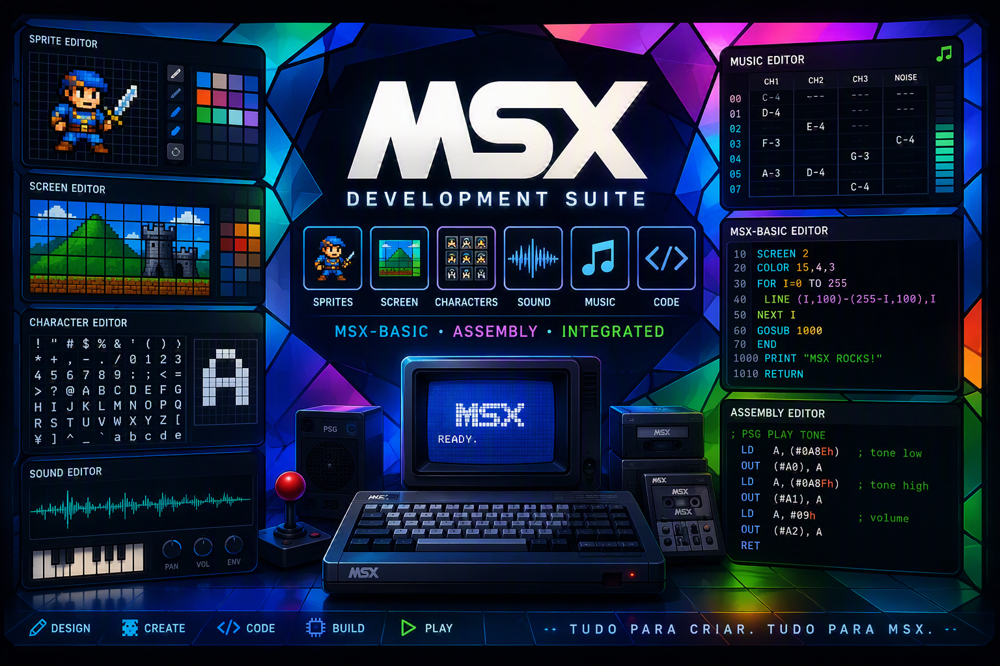
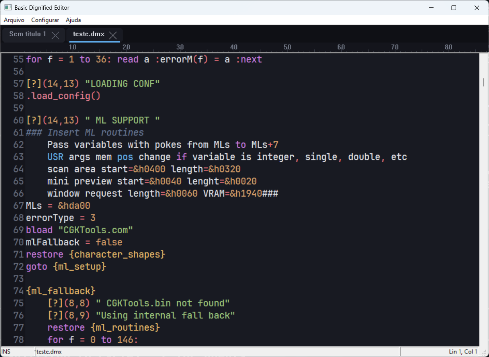
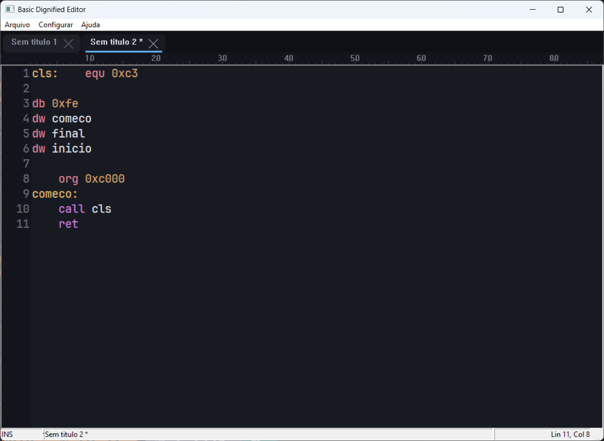
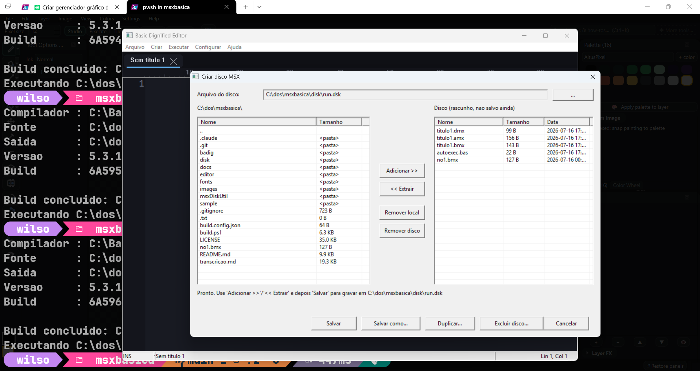
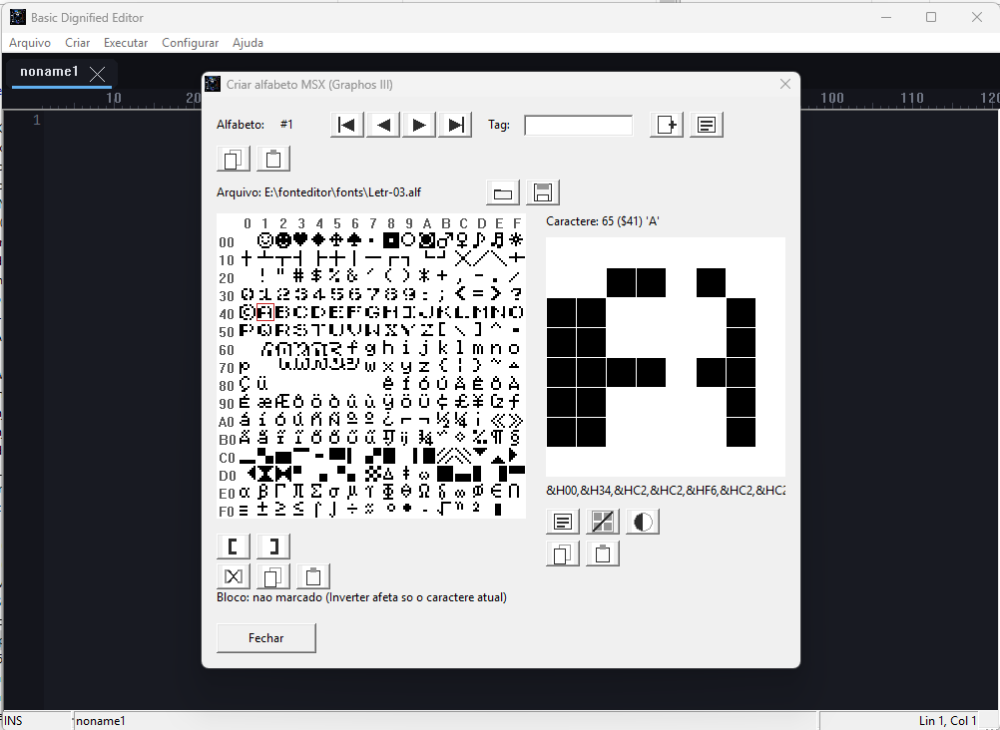
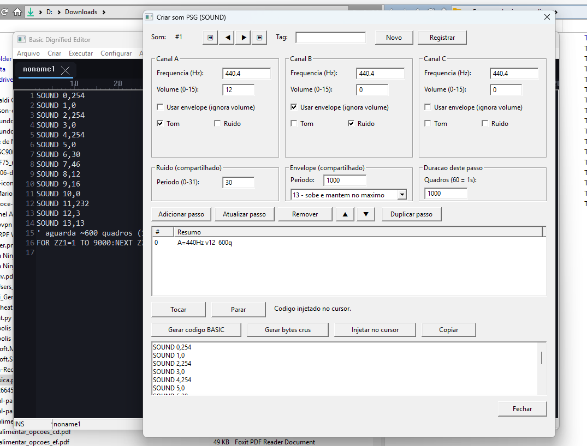
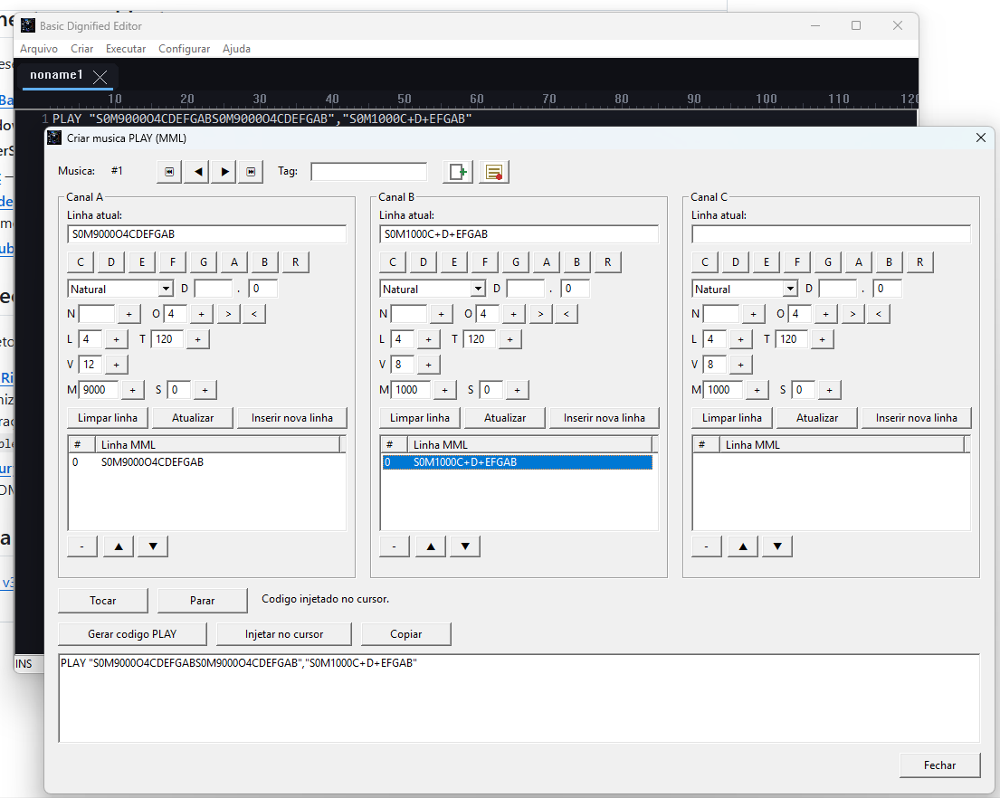

# MSX BASIC + Z80 IDE

**Versão atual: 5.9.5** — versão e build (data/hora UTC de compilação, em hexadecimal) são embutidas
no executável pelo `build.ps1` e exibidas em `Ajuda → Sobre...`.

IDE nativa em **PureBasic** para desenvolvimento em MSX BASIC (dialeto "Dignified", sem números de
linha) e Z80 assembly, construída em torno de um editor com highlighting via Scintilla e um
pré-processador/tokenizador reescritos nativamente — sem depender de Python instalado na máquina do
usuário final.

> Documento vivo. O detalhe completo da especificação (escopo, decisões de arquitetura, módulos
> planejados) está em [`docs/SPEC.md`](docs/SPEC.md) — é a fonte de verdade do projeto. Para
> compilar, executar e usar o editor de texto (atalhos estilo WordStar/JOE), veja
> [`docs/MANUAL.md`](docs/MANUAL.md).

## Sobre o projeto

O ponto de partida foi um editor de texto simples para MSX BASIC. A ideia é fazer ele crescer até
virar uma IDE completa cobrindo todo o fluxo de desenvolvimento para MSX: BASIC + assembly Z80 +
assets gráficos/sonoros + build + debug direto no emulador, tudo num único executável PureBasic
autocontido (Windows/Linux), sem exigir Python nem outras dependências externas em tempo de execução.

O dialeto de entrada é o **Basic Dignified** (labels em vez de números de linha, includes, macros,
proto-funções, etc.), inspirado e compatível com o [Basic Dignified Suite](#agradecimentos) original em
Python — que serve de referência de comportamento a ser portada, não de dependência de runtime.

## O que já temos

- **Editor** (`editor/BadigEditor.pb`) — `ScintillaGadget` com lexer próprio para o dialeto Dignified
  e outro para **Z80 Assembly** (`.asm`, dialeto do assembler
  [N80/Nestor80](https://github.com/Konamiman/Nestor80)), abas customizadas (fechar, hover, arrastar
  visual), régua de colunas, margem de números de linha dinâmica, tema claro/escuro e estilo de abas
  moderno/clássico configuráveis. Menu **Arquivo → Novo** (`.dmx`) e **Novo Assembly** (`.asm`,
  `Ctrl+Shift+N`) — cada aba detecta e lembra seu próprio tipo.

  
- **Pré-processador Dignified nativo** (`editor/DignifiedPreprocessor.pbi`) — **cobre 100% do escopo
  do `badig.py` original**: labels, loop labels, `EXIT`, `DEFINE` recursivo, `DECLARE` com redução
  automática de nomes longos, comentários/blocos de comentário, `TRUE`/`FALSE`, operadores compostos,
  proto-funções `FUNC`/`RET`, conversão `?`/`PRINT`, strip `THEN`/`GOTO`, tradução Unicode→charset
  nativo MSX, maiusculização, tamanho de TAB configurável, **`INCLUDE` recursivo** (namespace de
  label/loop/função isolado por arquivo, variáveis compartilhadas) e **remtags**
  (`##BB:arguments=`/`export_file=`/`help=`). Testado de ponta a ponta contra código de produção real
  (não só exemplos sintéticos — ver [`sample/teste.dmx`](sample/teste.dmx), ~900 linhas) e contra
  fixtures de `INCLUDE`/remtags. O `.exe` do editor não depende mais de Python em nenhum fluxo (menus
  legados removidos).
- **Tokenizador MSX-BASIC nativo** (`editor/MsxTokenizer.pbi`) — converte ASCII clássico em binário
  `.bmx`, validado byte a byte contra o tokenizador Python original.
- **Rodar no openMSX** (`RunOnOpenMSX()` em `editor/BadigEditor.pb`) — com a opção "Abrir o openMSX e
  rodar o código após gerar" marcada, tokenizar monta um disquete `.dsk` (`.dmx`+`.amx`+`.bmx` mais um
  `AUTOEXEC.BAS` de autorun) e abre o openMSX já rodando o programa, com a máquina/extensão
  configuradas. Rotinas de disco `.dsk` (FAT12) vendorizadas de `msxDiskUtil/MSXDisk.pbi` — compiladas
  direto no executável do editor, sem depender de processo externo para montar o disco.
- **Telas de configuração nativas**:
  - `Configurar → Basic Dignified...` (`editor/BadigSettings.pbi`) — três abas: pré-processador/
    tokenizador, opções específicas do MSX, e **Emulador** (caminho do openMSX, máquina/extensão com
    botão de busca automática em `share/machines`/`share/extensions`, opção de rodar após gerar).
    Diretório de instalação do toolchain com botão para baixar o Basic Dignified Suite direto do
    GitHub (`git clone` ou `.zip`), tudo persistido em JSON.
  - `Configurar → Editor...` (`editor/EditorSettings.pbi`) — fonte (só monoespaçadas, com suporte a
    pasta de fontes customizadas carregadas em memória), tema, estilo de abas, caminho de instalação do
    editor.
- **CLI de teste de regressão** (`editor/tools/DigTestCli.pb`) — roda o pipeline completo
  (Dignified → ASCII → tokenizado) fora do editor, para validar mudanças no pré-processador/tokenizador.
- **Gerenciador de disco MSX** — `MSXDisk.pbi` (FAT12, vendorizado de `msxDiskUtil`) agora também é
  exposto de duas formas prontas para uso, além de montar o disco de "rodar no openMSX":
  - **CLI embutida** (`BadigEditor.exe --diskmanipulator <create|list|add|extract|delete> disco.dsk
    ...`) — mesma sintaxe do `msxdisk.exe` original, roda e sai sem abrir janela nenhuma.
  - **Menu Criar → Disco...** (`editor/DiskManagerGui.pbi`) — gerenciador gráfico com dois painéis
    (estilo Norton/Total Commander): esquerda é o sistema de arquivos local, direita é o conteúdo do
    disco. Botões **Adicionar >>**/**<< Extrair** sempre copiam (nunca apagam a origem); **Remover
    local**/**Remover disco** excluem de verdade, com confirmação. Todas as operações acontecem numa
    cópia de rascunho temporária — o `.dsk` escolhido só é gravado de fato em **Salvar**/**Salvar
    como...**/**Duplicar...**; **Cancelar** descarta a sessão sem tocar nele.

  
- **Sistema de projeto** (`editor/ProjectDB.pbi`) — um projeto MSX inteiro (por enquanto, Sprites; os
  demais tipos de conteúdo ganham tabela quando tiverem editor próprio) vive num único arquivo SQLite
  (`.msxproject`). Ao abrir sem nenhum parâmetro de linha de comando, a IDE já cria/usa de cara um
  projeto implícito **"noname.msxproject"** num arquivo temporário — tudo que for registrado vai
  sendo gravado nele sem precisar criar um projeto antes. **Arquivo → Novo projeto...** troca para um
  projeto novo e vazio num local escolhido (oferece salvar o atual primeiro, se tiver conteúdo não
  salvo); **Arquivo → Abrir projeto...** abre um `.msxproject` já existente. **Arquivo → Salvar
  projeto**/**Salvar projeto como...** salvam o projeto atual (o primeiro reaproveita o caminho já
  escolhido, sem diálogo; o segundo sempre pergunta um caminho novo, permitindo salvar uma cópia com
  outro nome) — extensão `.msxproject` é acrescentada automaticamente se não digitada. Ao sair, se o
  projeto implícito tiver conteúdo registrado e ainda não tiver sido salvo num arquivo permanente, a
  IDE pergunta se quer salvar (e onde, com nome definitivo) antes de fechar. O projeto também guarda
  uma cópia sempre atualizada do conteúdo de cada aba de texto já salva em disco e o diretório de
  trabalho (pasta do último arquivo salvo, ou o diretório corrente enquanto nada foi salvo ainda).
- **Editor de sprites** (`editor/SpriteEditorGui.pbi`, menu **Criar → Sprite...**) — grade clicável
  8×8 ou 16×16 com a **palheta original de 16 cores do MSX1** (TMS9918), e radios **MSX1** (sprite
  inteiro com uma única cor) / **MSX2** (uma cor por linha, aplicada automaticamente conforme o
  sprite é pintado). Ferramentas com ícone próprio: lápis, borracha, pincel (bloco 2×2), balde de
  preenchimento, reta, retângulo e elipse/círculo (vazios ou cheios) — as ferramentas de dois pontos
  mostram prévia ao vivo da forma e um marcador piscando no primeiro ponto, com **Esc** ou o botão
  direito do mouse cancelando sem traçar nada. Botões de rotacionar (com quebra nas bordas) e
  deslocar (sem quebra) nas quatro direções, inverter e limpar. Cada sprite é numerado, tem uma tag
  (nome curto, até 16 caracteres) e fica gravado no projeto atual via o botão **Registrar**; **Novo**
  cria o próximo sprite em sequência, os botões de navegação vão para o primeiro/anterior/próximo/
  último sprite já registrado, e **Copiar**/**Colar** duplicam um sprite para outro número.

  
- **Editor de alfabetos** (`editor/CharsetEditorGui.pbi`, menu **Criar → Alfabeto...**) — edita charsets
  no formato **`.ALF` do Graphos III**: 256 caracteres de 8×8 pixels (2048 bytes), binário MSX clássico
  com cabeçalho de 7 bytes (tipo `&HFE`, endereços inicial/final/execução — carregado originalmente em
  `&H9200`, a Pattern Generator Table da VRAM). Tabela com os 256 caracteres (16 por linha, cabeçalho
  hex de linha/coluna, miniatura de cada glifo) — clicar num caractere carrega seus pixels numa grade
  8×8 bem ampliada, onde dá pra ligar/apagar cada pixel (clique ou arrastar); **Registrar** grava os
  pixels editados de volta no caractere selecionado e atualiza a miniatura na tabela. **Carregar do
  Graphos III...**/**Salvar como...** leem e gravam `.alf` (extensão acrescentada automaticamente se não
  digitada) — carregar sempre importa como um alfabeto novo (nunca sobrescreve um já registrado).
  **Copiar**/**Colar** de um caractere isolado, de um **alfabeto inteiro** (Copiar alfabeto/Colar
  alfabeto) ou de um **intervalo marcado** (Marcar início/Marcar fim de bloco + Copiar bloco/Colar
  bloco) — todos com área de transferência da própria sessão. Com um intervalo marcado, o botão
  **Inverter** passa a inverter todos os caracteres do intervalo de uma vez direto no alfabeto (sem
  bloco marcado, afeta só o caractere atual) — combinado com Copiar/Colar bloco, permite duplicar um
  conjunto de caracteres (ex.: A..Z para a..z) e inverter só a cópia, tendo as duas versões lado a lado.
  Todos os botões de ação são **ícones monocromáticos** desenhados em memória (sem arquivo externo),
  com dica ao passar o mouse explicando cada função. Também integrado ao **sistema de projeto**, igual
  ao editor de sprites: um projeto pode ter vários alfabetos, com barra própria de número/tag/
  **Primeiro**/**Anterior**/**Próximo**/**Último**/**Registrar alfabeto**/**Novo alfabeto** (numera
  automaticamente e sempre parte do charset padrão do MSX, nunca em branco). Esse charset padrão vem de
  um **"projeto 0"** interno (`ProjectDB::EnsureDefaultsOpen()`) — um banco SQLite à parte, sempre em
  memória, nunca salvo, semeado com `alfabetos\msx.alf` **embutido no próprio `.exe`**
  (`editor/DefaultCharsetMsx.pbi`). Ganhou **11 botões de efeito** (todos com **Desfazer**/**Refazer**
  próprios, pilha de até 50 níveis): **All** (marca o alfabeto inteiro como bloco de uma vez),
  **Espelhar horizontal/vertical**, **Girar 90°**, **Apagar**, **Estreitar** (condensa o glifo em 3
  colunas, útil pra caber 64 colunas de texto onde só caberiam 32), **Itálico** (desloca linhas
  progressivamente), **Negrito**, **Largo** (+ variantes **Bold esquerda/direita** e **Largo bold**,
  que combinam alargar com engrossar) — todos seguindo o mesmo padrão dual já usado pelo Inverter: sem
  bloco marcado afetam só o caractere atual (precisa de "Registrar"), com bloco/All aplicam direto em
  todo o intervalo.

  
- **Editor de alfabetos Aquarela** (`editor/AquarelaCharsetEditorGui.pbi`, menu **Criar → Alfabeto
  Aquarela...**) — edita o formato `.FNT` do **Aquarela**, outro editor de fonte MSX (alternativa ao
  Graphos III acima), com engenharia reversa completa documentada em `docs/reference/aquarela.md`.
  Diferente do editor Graphos III, é uma ferramenta **autocontida baseada em arquivo** (Novo/Abrir/
  Salvar/Salvar como), sem integração com o sistema de projeto. Glifo real **16×16** (2 planos de 16
  bytes — coluna esquerda e direita —, cada registro de 32 bytes começando 7 bytes depois do início
  nominal, confirmado pixel a pixel contra o Aquarela rodando de verdade num emulador). **46
  caracteres editáveis** (grade de 8 colunas × 6 linhas): `A-Z`, `&`, `?`, `!`, `"`, `0-9`, `.`, `:`,
  `-`, `(`, `)`, `,` — ordem confirmada por teste real do usuário. Salva sempre no formato de 2304
  bytes (72 registros), preenchendo o restante com o byte de posição-vazia padrão. Botões de ícone
  **Registrar**/**Limpar**/**Inverter**/**Copiar**/**Colar**, mesmo estilo visual do editor Graphos
  III.
- **Editor de som PSG** (`editor/PsgSynth.pbi` + `editor/PsgEditorGui.pbi`, menu **Criar → Som
  (PSG)...**) — editor de efeitos sonoros para o chip de som do MSX (AY-3-8910/YM2149), espelhando
  registrador por registrador o comando `SOUND` do MSX-BASIC. Painel com os 3 canais **A/B/C**
  (frequência em Hz, volume 0-15, "usar envelope", liga/desliga tom e ruído no mixer), **ruído**
  (período compartilhado) e **envelope** (período + as 10 formas de hardware nomeadas). Um "som" é um
  **mini-sequenciador de passos** — cada passo guarda os 14 registradores + uma duração em quadros,
  permitindo desenhar efeitos que variam ao longo do tempo (tiro, explosão etc.), com botões
  **Adicionar/Atualizar/Remover/Mover/Duplicar passo**. **Tocar**/**Parar** sintetizam a sequência
  inteira em PCM (motor próprio por acumulador de fase — osciladores de tom, LFSR de ruído de 17 bits,
  gerador de envelope, tabela de volume logarítmica de 16 níveis) e tocam via `.wav` temporário, sem
  depender de nenhuma biblioteca externa. **Gerar código BASIC** produz `SOUND n,valor` prontos
  (só os registradores que mudaram a cada passo) e **Gerar bytes crus** produz um bloco `DATA` para uma
  futura rotina Z80; **Injetar no cursor**/**Copiar** colocam o código gerado direto na aba de texto
  ativa ou na área de transferência. Integrado ao sistema de projeto, mesma barra de número/tag/
  navegação/Registrar/Novo dos editores de sprite e alfabeto.

  
- **Editor de música MML** (`editor/MmlSynth.pbi` + `editor/MmlEditorGui.pbi`, menu **Criar → Música
  (PLAY)...**) — editor de MML (Music Macro Language) para o comando `PLAY` do MSX-BASIC, cobrindo os
  3 canais **A/B/C em paralelo**. Cada canal tem uma "linha atual" editável que os botões vão
  preenchendo — notas **A-G** (sustenido/bemol, duração, pontos de aumento), **pausa (R)**, **nota
  absoluta por número (N)**, **oitava (O, 1-8, com `>`/`<`)**, **duração padrão (L)**, **andamento
  (T)**, **volume (V)** e o **modulador/padrão de envelope (M/S)** — mesmo hardware de envelope
  compartilhado do editor de som. **Inserir nova linha** fecha a linha atual como uma entrada na lista
  do canal (mesmo espírito "sequenciador" do editor de som); **Atualizar**/**Remover**/**Mover** editam
  as linhas já inseridas. **Tocar**/**Parar** sintetizam os 3 canais juntos — o motor reaproveita quase
  integralmente o `PsgSynth.pbi` do editor de som (mesmo chip, mesmo gerador de envelope compartilhado),
  só parseando o MML e mesclando cronologicamente os 3 canais num único fluxo de registradores.
  **Gerar código PLAY** monta o `PLAY "...","...","..."` final (concatenação literal do que foi
  montado); **Injetar no cursor**/**Copiar** colocam o código na aba ativa ou na área de transferência.
  Integrado ao sistema de projeto, mesma barra de número/tag/navegação/Registrar/Novo dos demais
  editores — os botões de ícone (**Novo**/**Registrar**) são os mesmos desenhos já usados no editor de
  sprites, reaproveitados para ficar visualmente uniforme em toda a IDE.

  

Ainda não implementado (ver [Lacunas conhecidas](docs/SPEC.md#lacunas-conhecidas-a-preencher-em-conversas-futuras)
e [Próximos passos](docs/SPEC.md#próximos-passos-em-aberto) em `docs/SPEC.md`): motor do assembler Z80
em si (o editor já edita `.asm` com syntax highlight, mas não monta nada ainda), editor de tile (além do
charset/fonte 8×8), demais editores visuais (LINE/CIRCLE/DRAW, tracker) e sua integração ao sistema de
projeto, extensão NestorBASIC, saída via `msxbas2rom`, controle do openMSX via socket/XML em tempo real
(input simulado, detecção de erro com retorno à linha no editor — hoje só "gerar disco e abrir o
openMSX" está pronto, sem comunicação de volta da emulação para a IDE).

## Changelog resumido

- **2026-07-13** — Projeto criado; editor base migrado para repositório git com `badig/` como
  submódulo. Pré-processador Dignified e tokenizador MSX-BASIC nativos escritos em PureBasic
  (`DignifiedPreprocessor.pbi`, `MsxTokenizer.pbi`), incluindo proto-funções `FUNC`/`RET`. Primeira
  tela de configuração nativa (`BadigSettings.pbi`). Documentação de referência completa extraída do
  código-fonte Python original em `docs/reference/`.
- **2026-07-14** — Corrigido bug de charset que truncava a saída `.bmx` com caracteres especiais
  (box-drawing, acentos, gregas) em strings. Reforma visual do editor: abas customizadas em formato
  "chip", régua de colunas, tema escuro. Pré-processador nativo ganhou conversão `?`/`PRINT`, strip
  `THEN`/`GOTO`, tradução Unicode→MSX e maiusculização — agora lendo a configuração da tela de opções
  em vez de usar valores fixos.
- **2026-07-15** — Nova tela `Configurar → Editor...` (fonte, tema claro/escuro, estilo de abas,
  fontes customizadas, caminho de instalação). Diretório de instalação do Basic Dignified Suite
  configurável, com botão para baixar o toolchain direto do GitHub (`git clone` ou `.zip`). Botão de
  download de fontes Nerd Fonts direto de `nerdfonts.com` (lista ao vivo, seleção individual ou em
  lote). Script `build.ps1` para compilar via `pbcompiler.exe` (caminho configurável com `-C`/
  `--compiler`, `-R`/`--run` para executar após compilar, `-H`/`--help` para a lista de opções),
  embutindo versão (`5.1.3`) e build (data/hora UTC da compilação em hex) no executável, exibidas em
  `Ajuda → Sobre...`. Editor ganhou teclado estilo WordStar/JOE
  (`WordStarKeys.pbi` — movimento do cursor, apagar texto, bloco marcado com destaque persistente,
  salvar/abrir/fechar, desfazer/refazer; `Ctrl+S` deixou de ser "salvar" e virou "cursor para a
  esquerda", como no WordStar de verdade). Tela de ajuda embutida (`Ctrl+K H`, fecha com qualquer
  tecla) e barra de status no rodapé (modo/prefixo de comando pendente, nome do arquivo, linha e
  coluna). Novo `docs/MANUAL.md` com o guia de uso da IDE. Mais tarde no mesmo dia: `INCLUDE`
  recursivo e remtags (`##BB:...`) implementados no pré-processador nativo, fechando 100% do escopo
  do `badig.py` original — os menus e o código do caminho Python (`SaveTokenized()`,
  `BadigCfg_BuildCliArgs()`) foram removidos, o `.exe` do editor não invoca mais Python em nenhum
  fluxo.
- **2026-07-16** — Botões de busca de máquina/extensão do openMSX (aba "Emulador", listam
  `share/machines`/`share/extensions` a partir do caminho do executável configurado). Opção "Abrir o
  openMSX e rodar o código após gerar" ganhou implementação real: monta um disquete `.dsk` com o
  programa gerado mais um `AUTOEXEC.BAS` de autorun e abre o openMSX direto nele (rotinas de disco
  vendorizadas de `msxDiskUtil/MSXDisk.pbi`, compiladas no próprio executável). Menu **Arquivo → Novo
  Assembly** (`Ctrl+Shift+N`) cria abas `.asm` com syntax highlight do dialeto
  [N80/Nestor80](https://github.com/Konamiman/Nestor80) (mnemônicos, registradores, diretivas,
  literais numéricos em qualquer radix). Versão embutida no executável atualizada para `5.3.1`. Mais
  tarde no mesmo dia: `MSXDisk.pbi` ganhou uma **CLI embutida** (`--diskmanipulator`, mesma sintaxe do
  `msxdisk.exe` original) e um **gerenciador gráfico** completo (menu **Criar → Disco...**, dois
  painéis estilo Norton/Total Commander, botões Adicionar/Extrair sempre por cópia e Remover
  local/disco com confirmação, tudo sobre uma cópia de rascunho — só grava no disco escolhido em
  Salvar/Salvar como/Duplicar, Cancelar descarta sem tocar nele).
- **2026-07-18** — Novo **editor de sprites** (menu **Criar → Sprite...**, `editor/SpriteEditorGui.pbi`):
  grade 8×8/16×16, palheta MSX1 de 16 cores fixas, modos MSX1/MSX2 (uma cor por sprite vs. uma cor por
  linha, aplicados automaticamente), ferramentas com ícone (lápis, borracha, pincel, balde, reta,
  retângulo, elipse — com prévia ao vivo, marcador piscando e cancelamento por Esc/botão direito),
  rotacionar/deslocar, inverter, limpar. Junto veio um **sistema de projeto** novo
  (`editor/ProjectDB.pbi`): cada projeto MSX é um arquivo SQLite único (`.msxproject`); sem nenhum
  parâmetro na linha de comando a IDE já abre um projeto implícito `noname.msxproject` num arquivo
  temporário, com **Arquivo → Novo projeto...**/**Abrir projeto...** para trocar de projeto (oferecendo
  salvar o atual antes, se tiver conteúdo não salvo) e aviso automático ao sair perguntando onde salvar
  em definitivo. O editor de sprites já usa esse sistema: cada sprite tem número sequencial e uma tag
  (até 16 caracteres), com botões **Registrar**/**Novo**/navegação (primeiro/anterior/próximo/último)/
  **Copiar**/**Colar**. Validado com um novo harness de console (`editor/tools/ProjectDBTestCli.pb`)
  cobrindo round-trip completo dos dados (criar, salvar, listar, recarregar byte a byte, promover para
  arquivo permanente, reabrir). Nome padrão de aba sem título mudou de "Sem titulo N" para "nonameN".
  Versão embutida no executável atualizada para `5.5.3`.
- **2026-07-19** — Novos itens **Arquivo → Salvar projeto** / **Salvar projeto como...**: salvar
  reaproveita o caminho já escolhido (sem diálogo, já que o `ProjectDB` grava cada sprite na hora via
  SQLite); "salvar como" sempre pergunta um caminho novo, sugerindo o atual, permitindo salvar uma
  cópia do projeto com outro nome. `OfferSaveProject()` (usado em "Novo projeto..."/ao sair) passou a
  reaproveitar essa mesma rotina em vez de duplicar a lógica de salvar. Se o nome digitado no diálogo
  não tiver extensão, `.msxproject` é acrescentado automaticamente. O projeto SQLite ganhou duas
  novidades: uma cópia sempre atualizada do conteúdo de cada aba de texto já salva em disco (tabela
  `documents`, sincronizada a cada "Salvar"/"Salvar como" de uma aba — além do arquivo `.dmx`/`.amx`/
  `.asm`/tokenizado que já ia pro disco) e o diretório de trabalho (`working_dir`, a pasta do último
  arquivo salvo, ou o diretório corrente enquanto nada foi salvo ainda). Harness `ProjectDBTestCli`
  ganhou cobertura pra essas duas novidades, incluindo round-trip através de `SaveAs`/`OpenExisting`.
  Mais tarde no mesmo dia: novo **editor de alfabetos** (menu **Criar → Alfabeto...**,
  `editor/CharsetEditorGui.pbi`) para o formato `.ALF` do Graphos III (256 caracteres 8×8 = 2048 bytes,
  binário MSX com cabeçalho de 7 bytes carregado em `&H9200`) — tabela com os 256 caracteres (16 por
  linha, cabeçalho hex de linha/coluna), grade grande editável (clique/arrastar liga-desliga pixel),
  botão **Registrar** grava os pixels de volta no caractere e atualiza a miniatura na tabela,
  **Abrir...**/**Salvar como...** leem/gravam `.alf` (extensão automática), carrega
  `alfabetos\msx.alf` como padrão ao abrir. Ainda mais tarde no mesmo dia: **integração com o sistema de
  projeto**, igual ao editor de sprites — tabela `alphabets` no `.msxproject`, barra própria com número/
  tag/**Primeiro**/**Anterior**/**Próximo**/**Último**/**Registrar alfabeto**/**Novo alfabeto** (sempre
  parte do charset padrão do MSX, nunca em branco). Esse padrão passou a vir de um **"projeto 0"**
  interno — segundo banco SQLite, sempre `:memory:`, nunca salvo, semeado com `alfabetos\msx.alf`
  **embutido no `.exe`** (`editor/DefaultCharsetMsx.pbi`, gerado a partir do `.alf` real). Harness
  `ProjectDBTestCli` ganhou cobertura completa de alfabetos, incluindo um teste que compara os bytes
  embutidos contra o arquivo `.alf` real no disco. Versão embutida no executável atualizada para
  `5.7.3` (padrão de `build.ps1` e do fallback de compilação direta em `BadigEditor.pb`), fechando o
  dia de trabalho no editor de alfabetos e no sistema de projeto. Documentação revisada:
  `docs/MANUAL.md` ganhou a seção **Editor de alfabetos** e as novas opções de projeto (Salvar
  projeto/Salvar projeto como..., cópia das abas de texto, diretório de trabalho); a tabela de
  parâmetros do `build.ps1` no manual também foi corrigida (estava documentando nomes de flag
  desatualizados, `-Version`/`-SourceFile`/`-OutputExe`, em vez dos reais `-V`/`-i`/`-o`).

- **2026-07-21** — Editor de alfabetos: o botão genérico "Abrir..." virou **"Carregar do Graphos
  III..."** — além de deixar explícito que o botão importa um `.alf` real do Graphos III, importar
  agora sempre cria um **alfabeto novo** no projeto (numeração automática, igual a "Novo alfabeto") em
  vez de sobrescrever silenciosamente o alfabeto atualmente selecionado; depois de carregar, **Registrar
  alfabeto** grava a importação no `.msxproject`, permitindo vários alfabetos Graphos III diferentes no
  mesmo projeto. Também: **ícone do aplicativo** (`msxbasica.ico`) embutido no `.exe` via `/ICON` do
  `pbcompiler.exe` (novo passo em `build.ps1`) — aparece no Windows Explorer/propriedades do arquivo —
  e reaplicado em tempo de execução (`App_ApplyWindowIcon()`, `editor/BadigEditor.pb`, extraído do
  próprio processo via `ExtractIconEx`, sem depender do `.ico` sobreviver ao lado do `.exe`) em toda
  janela top-level do editor (principal, sprite, alfabeto, disco, configurações, download de fontes),
  cobrindo barra de título/menu de sistema, barra de tarefas e Alt+Tab. Versão embutida no executável
  atualizada para `5.7.4`.

- **2026-07-21 (mais tarde no mesmo dia)** — Editor de alfabetos ganhou clipboard e edição em lote:
  **Copiar/Colar** de um único caractere (área de transferência da sessão, funciona entre caracteres do
  mesmo alfabeto ou de alfabetos diferentes) e **Copiar alfabeto/Colar alfabeto** (os 256 caracteres de
  uma vez, para duplicar um alfabeto inteiro para outro número). Também: **Marcar início de bloco** /
  **Marcar fim de bloco** / **Limpar bloco** — marcam um intervalo de caracteres na tabela (contorno
  azul, ex.: A..Z); com um intervalo marcado, o botão **Inverter** passa a inverter todos os caracteres
  do intervalo de uma vez direto no alfabeto em memória, em vez de só o caractere selecionado (sem
  bloco marcado, "Inverter" continua afetando só o caractere atual, como antes). Verificado por
  compilação limpa, screenshot da janela (layout das novas linhas de botões sem sobreposição) e um
  teste ao vivo do fluxo de marcar bloco + inverter (confirmado via texto de status "Bloco:
  $00..$00 (1 caracteres)" e os bytes do caractere virando `&HFF` após inverter) — clique sintético no
  canvas da tabela para selecionar um caractere específico não se mostrou confiável neste ambiente de
  teste (mesma limitação já registrada para os editores de sprite/alfabeto em sessões anteriores), mas
  a lógica de marcação/inversão de bloco em si foi confirmada funcionando. Versão embutida no
  executável atualizada para `5.7.5`.

- **2026-07-21 (ainda mais tarde no mesmo dia)** — Editor de alfabetos ganhou **Copiar bloco**/**Colar
  bloco**, ao lado de "Limpar bloco": copiam/colam o **intervalo inteiro** marcado (não um caractere
  só). "Colar bloco" cola a partir do caractere selecionado na tabela e remarca o destino como o novo
  bloco, permitindo inverter na sequência sem remarcar — fluxo pedido: marcar A..Z, Copiar bloco,
  selecionar "a", Colar bloco (a..z passam a ter os desenhos de A..Z), Inverter (só a..z) — resultado:
  A..Z normal e a..z invertido, dois conjuntos prontos no mesmo alfabeto. Versão embutida no executável
  atualizada para `5.7.6`.

- **2026-07-21 (fim do dia)** — Todos os botões do editor de alfabetos viraram **ícones
  monocromáticos** desenhados em memória (34×26, cinza sobre branco, sem depender de arquivo externo —
  mesma técnica já usada no editor de sprites, `SpriteEd_CreateXxxIcon`), com dica ao passar o mouse
  explicando cada função: setas de navegação, página+"+" (Novo alfabeto), ficha (Registrar), duas
  folhas (Copiar), prancheta (Colar), pasta (Carregar do Graphos III), disquete (Salvar como),
  colchetes `[`/`]` (Marcar início/fim de bloco), colchetes riscados (Limpar bloco), grade riscada
  (Limpar caractere) e círculo meio preto/meio branco (Inverter). Vários botões de escopo diferente
  (caractere/alfabeto/bloco) reaproveitam o mesmo desenho — só a posição na janela e o tooltip mudam.
  A troca encolheu a janela de ~732px para ~606px de largura. Verificado por compilação limpa,
  screenshots (geral + recortes ampliados de cada grupo de ícones) e um clique real confirmando que os
  botões de imagem continuam disparando os mesmos eventos de antes. Versão embutida no executável
  atualizada para `5.7.7`.

- **2026-07-21 (à noite)** — Novo **editor de som PSG** (menu **Criar → Som (PSG)...**,
  `editor/PsgSynth.pbi` + `editor/PsgEditorGui.pbi`): motor de emulação do AY-3-8910/YM2149 escrito do
  zero (osciladores de tom por acumulador de fase, LFSR de ruído de 17 bits, gerador de envelope com as
  10 formas de hardware, tabela de volume logarítmica de 16 níveis), validado por harness de console
  (`editor/tools/PsgTestCli.pb` — frequência medida bate com a esperada, volume 0 é silêncio). Um "som"
  é um mini-sequenciador de passos (cada um com os 14 registradores do `SOUND` + duração em quadros),
  editável na janela com **Adicionar/Atualizar/Remover/Mover/Duplicar passo**, **Tocar**/**Parar**
  (renderiza para `.wav` temporário e toca) e geração de código (**Gerar código BASIC**/**Gerar bytes
  crus**, com **Injetar no cursor**/**Copiar**). Integrado ao sistema de projeto (tabela `psg_sounds`,
  mesma barra de projeto dos editores de sprite/alfabeto) — coberto por round-trip em
  `editor/tools/ProjectDBTestCli.pb`. Durante o desenvolvimento apareceu um bug real de corrupção de
  heap: `ReDim` no PureBasic só redimensiona a **última** dimensão de um array multi-dimensional, então
  guardar os registradores como matriz 2D (passos × registradores) quebrava ao carregar do projeto —
  corrigido serializando como array 1D achatado. Logo em seguida, teste ao vivo revelou que os campos
  numéricos (Volume, período de ruído/envelope, duração) usavam `SpinGadget` (campo com setinhas ▲▼) e o
  texto do campo nunca atualizava visualmente ao clicar nas setas (confirmado enviando a mensagem nativa
  `UDM_SETPOS32` direto no controle: o valor mudava por dentro, mas a tela continuava mostrando o número
  antigo) — substituídos por campos de texto simples, digitáveis, resolvendo tanto o "spin não funciona"
  quanto o "sem som" (volume ficava preso em 0 sem o usuário conseguir ver/confirmar o ajuste). Versão
  embutida no executável atualizada para `5.9.3`.

- **2026-07-21 (madrugada)** — Novo **editor de música MML** (menu **Criar → Música (PLAY)...**,
  `editor/MmlSynth.pbi` + `editor/MmlEditorGui.pbi`): cobre o dialeto MML do MSX-BASIC completo (notas
  A-G com sustenido/bemol, `L` duração, 8 oitavas `O`/`>`/`<`, pausa `R`, andamento `T`, volume `V`,
  nota absoluta `N`, envelope `M`/`S`, ponto de aumento `.`). O motor reaproveita quase 100% do
  `PsgSynth.pbi` do editor de som — mesmo chip, mesmo gerador de envelope compartilhado pelos 3 canais
  — só adicionando um parser MML por canal e uma mesclagem cronológica dos 3 canais independentes num
  único fluxo de registradores do PSG (chamando `PsgSynth_RenderStep()` sem alterar). UI com os 3 canais
  em paralelo, cada um com uma "linha atual" editável preenchida por botões, lista de linhas por canal
  e a mesma barra de projeto (Registrar/Novo/navegação) dos demais editores. Persistência em nova
  tabela `mml_songs` no `.msxproject`, coberta por round-trip em `ProjectDBTestCli.pb`. Validado por
  `editor/tools/MmlTestCli.pb` (frequências de nota corretas, duração/pontos batendo com a matemática
  esperada, `N` batendo com `O`+nota equivalente) e ao vivo via mensagens do Windows (nunca cursor
  real). Preencheu o módulo 8 do `docs/SPEC.md`, que estava marcado como "Gap" (sem nenhuma
  especificação registrada).

  Logo em seguida, dois ajustes pedidos depois de ver a janela funcionando: **disposição dos botões**
  compactada (notas + pausa numa fileira só; os antigos botões largos "Definir O"/"Definir L"/"Definir
  T"/"Definir V"/"Definir M"/"Definir S"/"Inserir N" viraram um ícone "+" ao lado de cada campo — a
  letra do campo já diz o comando MML; campos relacionados como N+O, L+T e M+S passaram a dividir a
  mesma fileira) — a janela encolheu de ~820px pra ~740px de altura; e os botões **Novo**/**Registrar**
  do editor de música (e também do editor de som, pra ficar uniforme) trocados de texto para os mesmos
  ícones já desenhados no editor de sprites (`SpriteEd_CreateNewSpriteIcon`/`CreateRegisterIcon`,
  reaproveitados sem duplicar nenhum desenho). Nessa checagem apareceu um bug real de
  `HasUnsavedContent()` (a função que decide se avisa "salvar antes de sair"): só contava a tabela de
  sprites, então um projeto só com alfabetos, sons ou músicas nunca disparava o aviso — risco real de
  perder esse conteúdo ao fechar sem salvar. Corrigido somando as 4 tabelas (`sprites`+`alphabets`+
  `psg_sounds`+`mml_songs`). Versão embutida no executável atualizada para `5.9.5`.
- **2026-07-23** — Novo **editor de alfabetos Aquarela** (menu **Criar → Alfabeto Aquarela...**,
  `editor/AquarelaCharsetEditorGui.pbi`): edita o formato `.FNT` de outro editor de fonte MSX
  (alternativa ao Graphos III), com engenharia reversa completa registrada em
  `docs/reference/aquarela.md`. Descoberta principal da sessão: cada registro de 32 bytes **não**
  começa no byte `N×32` do arquivo como a fórmula inicial supunha, mas 7 bytes depois — confirmado
  comparando pixel a pixel a decodificação contra uma screenshot real do Aquarela rodando num
  emulador (sem esse ajuste, cada glifo aparecia com um "floreio" desconexo no topo, na real a ponta
  final do caractere anterior vazando pro caractere seguinte). Glifo real 16×16 (2 planos de 16 bytes,
  coluna esquerda/direita), ferramenta autocontida baseada em arquivo (Novo/Abrir/Salvar/Salvar como),
  sem integração com o sistema de projeto. Tabela inicial cobria 32 caracteres (A-Z + `& ? ! "` +
  `0 1`) — ampliada depois pra **46 caracteres** (`A-Z`, `& ? ! "`, `0-9`, `. : - ( ) ,`), a ordem
  completa confirmada por teste real do usuário e por `LOGO.FNT` (fonte 8×8 completa do disco
  original do Aquarela, que lê perfeitamente até bem depois dos 46 glifos "oficiais").
- **2026-07-23 (mais tarde no mesmo dia)** — Editor de alfabetos Graphos III ganhou **11 botões de
  efeito** novos, todos seguindo o mesmo padrão dual já usado pelo "Inverter" (sem bloco marcado,
  afeta só o caractere em edição; com bloco marcado — ou o novo botão **All** — aplica direto em todo
  o intervalo, sem precisar de "Registrar" por caractere): **All** (marca o alfabeto inteiro de uma
  vez), **Desfazer**/**Refazer** (pilha de instantâneos do alfabeto inteiro, até 50 níveis, zerada ao
  trocar de alfabeto), **Espelhar horizontal**/**Espelhar vertical**, **Girar 90°** (sentido horário),
  **Apagar** (mesmo efeito de "Limpar", com o modo dual), **Estreitar** (condensa as 5 colunas da
  metade esquerda do glifo em 3, truque clássico de MSX pra caber 64 colunas de texto onde só
  caberiam 32), **Itálico** (desloca as linhas do glifo progressivamente — 2 bits nas 2 primeiras, 1
  bit nas 3 seguintes, nenhuma nas 3 últimas), **Negrito** (OR de cada linha com ela mesma deslocada 1
  bit, engrossando os traços) e **Largo** (funde as colunas 0-2 do original com as colunas 3-7 do
  original deslocado, esticando o glifo). Duas rodadas de refinamento a pedido do usuário: os efeitos
  Largo tiveram uma variante "Largo (direita)" que virou, depois de uma correção do próprio pedido,
  **Bold (esquerda)** e **Bold (direita)** (engrossam um lado específico do glifo via OR em vez de só
  deslocar); e **Largo (bold)**, literalmente `Bold(Largo(x))`, reaproveitando as duas transformações
  já existentes em vez de uma fórmula de bits nova. Ícones novos (seta circular, setas de espelhar/
  esticar, quadrado com arco de rotação, barras de itálico/negrito, retângulo pontilhado do "All")
  reaproveitam os mesmos helpers de triângulo preenchido (`CharEd_DrawFilledHTri`/`DrawFilledVTri`)
  extraídos do desenho da seta de navegação já existente.

## Ferramentas e ambiente

Projeto desenvolvido com:

- **[PureBasic](https://www.purebasic.com/) 6.4** — linguagem/compilador da IDE (Windows e Linux).
- **Windows** e **Ubuntu** — desenvolvido e testado nos dois sistemas.
- **PowerShell** — automação, build e scripts no ambiente Windows.
- **[Helix](https://helix-editor.com/)** — editor de texto modal usado no dia a dia de edição de
  código.
- **[Claude](https://claude.com/claude-code)** (Anthropic) — par de programação via Claude Code,
  usado para boa parte da implementação, revisão e documentação do projeto.
- **[GitHub](https://github.com/)** — versionamento e hospedagem do repositório.

## Agradecimentos

Este projeto não existiria sem o trabalho de:

- **[Fred Rique (farique1)](https://github.com/farique1)**, autor do
  [**Basic Dignified Suite**](https://github.com/farique1/basic-dignified) — o dialeto Dignified, o
  motor de pré-processamento e o tokenizador MSX-BASIC originais (em Python) foram a especificação de
  comportamento e a maior fonte de inspiração para tudo que foi reescrito nativamente aqui. O código de
  teste de regressão do projeto (`sample/teste.dmx`, "Change Graph Kit") também é obra dele.
- **[Amaury Carvalho](https://github.com/amaurycarvalho)**, autor do
  [**msxbas2rom**](https://github.com/amaurycarvalho/msxbas2rom) — compilador MSX BASIC → ROM que
  inspira o back-end de geração de ROM planejado para esta IDE.

## Licença

[GNU GPL v3](LICENSE).
