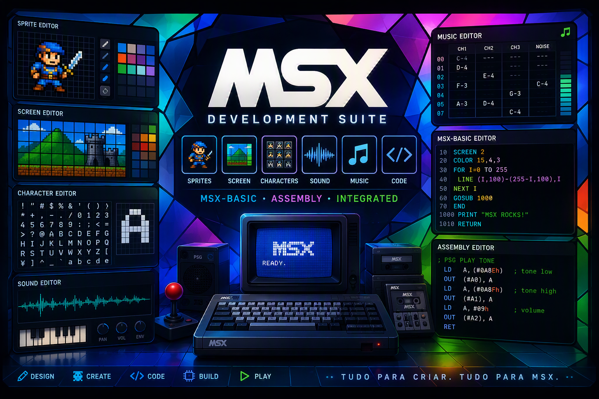
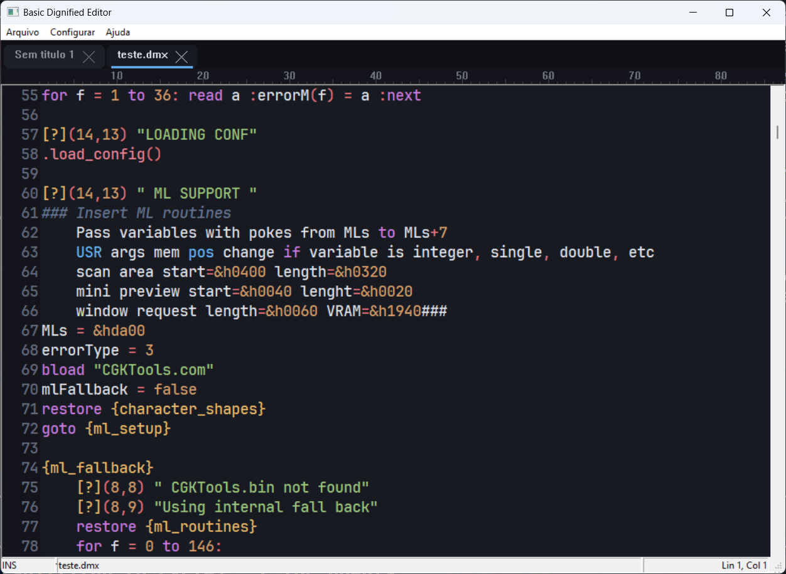
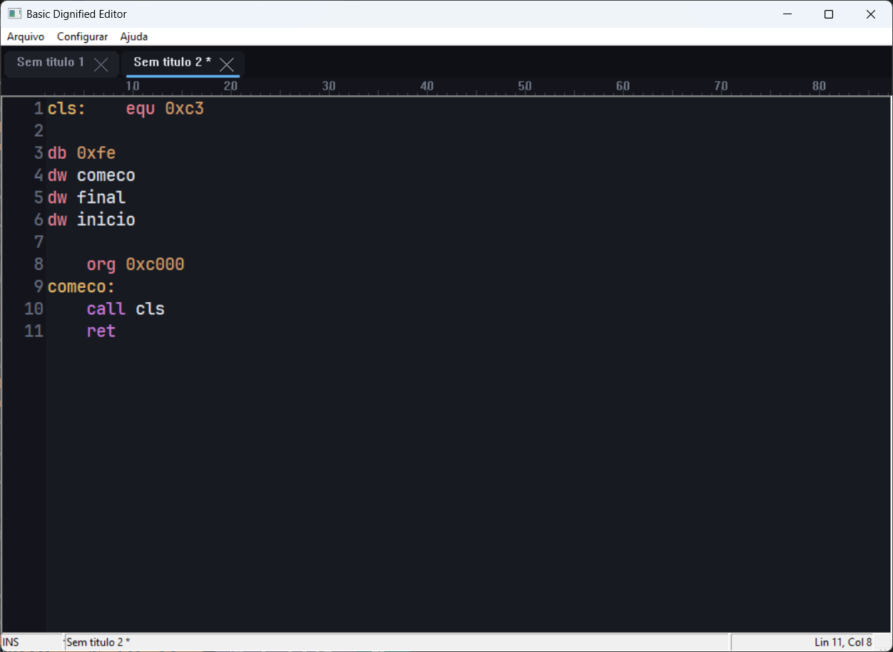
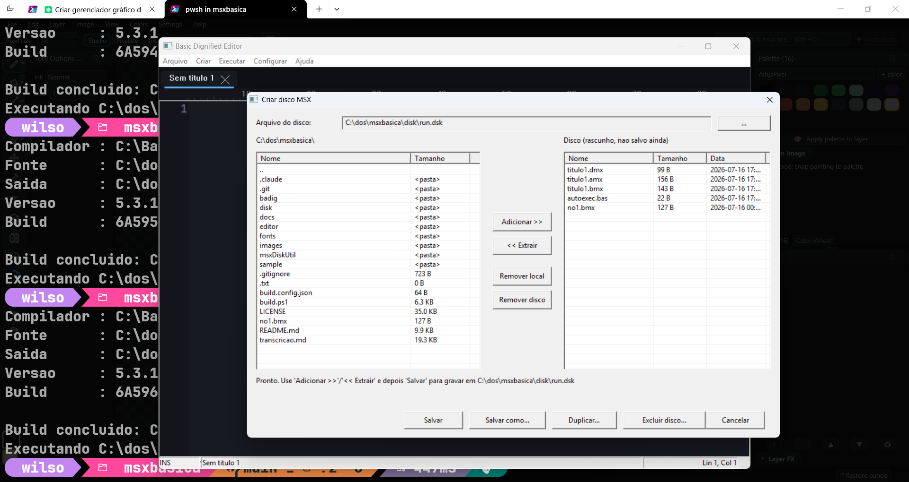
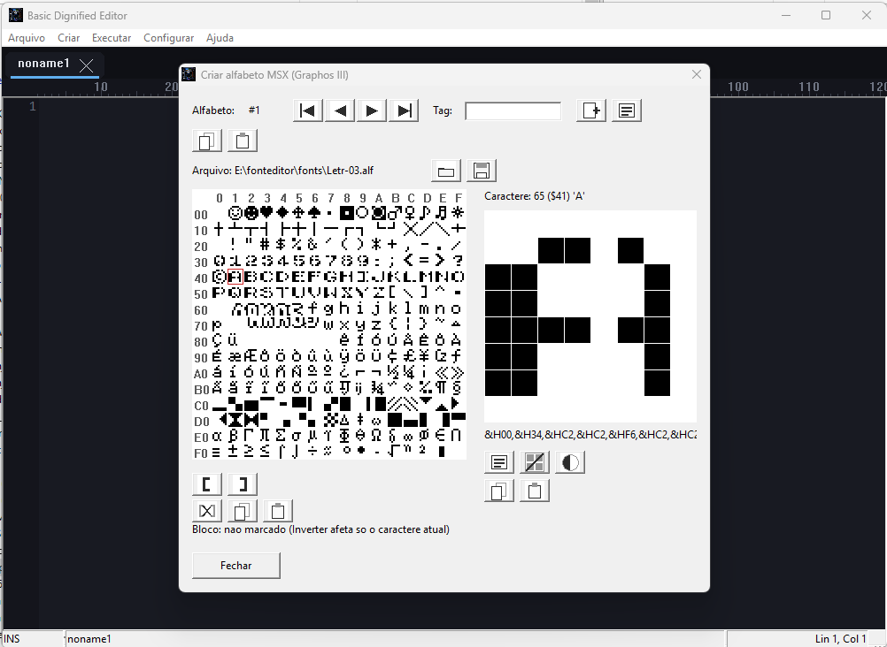

# MSX BASIC + Z80 IDE

**Versão atual: 7.3.3** — versão e build (data/hora UTC de compilação, em hexadecimal) são embutidas
no executável pelo `build.ps1` e exibidas em `Ajuda → Sobre...`.

IDE nativa em **PureBasic** para desenvolvimento em MSX BASIC (dialeto "Dignified", sem números de
linha) e Z80 assembly, construída em torno de um editor com highlighting via Scintilla e um
pré-processador/tokenizador reescritos nativamente — sem depender de Python instalado na máquina do
usuário final.

> Documento vivo. O detalhe completo da especificação (escopo, decisões de arquitetura, módulos
> planejados) está em [`docs/SPEC.md`](docs/SPEC.md) — é a fonte de verdade do projeto. Para
> compilar, executar e usar o editor de texto (atalhos estilo WordStar/JOE), veja
> [`docs/MANUAL.md`](docs/MANUAL.md).

## Sobre o projeto

O ponto de partida foi um editor de texto simples para MSX BASIC. A ideia é fazer ele crescer até
virar uma IDE completa cobrindo todo o fluxo de desenvolvimento para MSX: BASIC + assembly Z80 +
assets gráficos/sonoros + build + debug direto no emulador, tudo num único executável PureBasic
autocontido (Windows/Linux), sem exigir Python nem outras dependências externas em tempo de execução.

O dialeto de entrada é o **Basic Dignified** (labels em vez de números de linha, includes, macros,
proto-funções, etc.), inspirado e compatível com o [Basic Dignified Suite](#agradecimentos) original em
Python — que serve de referência de comportamento a ser portada, não de dependência de runtime.

## O que já temos

- **Editor** (`editor/BadigEditor.pb`) — `ScintillaGadget` com lexer próprio para o dialeto Dignified
  e outro para **Z80 Assembly** (`.asm`, dialeto do assembler
  [N80/Nestor80](https://github.com/Konamiman/Nestor80)), abas customizadas (fechar, hover, arrastar
  visual), régua de colunas, margem de números de linha dinâmica, tema claro/escuro e estilo de abas
  moderno/clássico configuráveis. Menu **Arquivo → Novo** (`.dmx`) e **Novo Assembly** (`.asm`,
  `Ctrl+Shift+N`) — cada aba detecta e lembra seu próprio tipo.

  
- **Pré-processador Dignified nativo** (`editor/DignifiedPreprocessor.pbi`) — **cobre 100% do escopo
  do `badig.py` original**: labels, loop labels, `EXIT`, `DEFINE` recursivo, `DECLARE` com redução
  automática de nomes longos, comentários/blocos de comentário, `TRUE`/`FALSE`, operadores compostos,
  proto-funções `FUNC`/`RET`, conversão `?`/`PRINT`, strip `THEN`/`GOTO`, tradução Unicode→charset
  nativo MSX, maiusculização, tamanho de TAB configurável, **`INCLUDE` recursivo** (namespace de
  label/loop/função isolado por arquivo, variáveis compartilhadas) e **remtags**
  (`##BB:arguments=`/`export_file=`/`help=`). Testado de ponta a ponta contra código de produção real
  (não só exemplos sintéticos — ver [`sample/teste.dmx`](sample/teste.dmx), ~900 linhas) e contra
  fixtures de `INCLUDE`/remtags. O `.exe` do editor não depende mais de Python em nenhum fluxo (menus
  legados removidos).
- **Tokenizador MSX-BASIC nativo** (`editor/MsxTokenizer.pbi`) — converte ASCII clássico em binário
  `.bmx`, validado byte a byte contra o tokenizador Python original.
- **Rodar no openMSX** (`RunOnOpenMSX()` em `editor/BadigEditor.pb`) — com a opção "Abrir o openMSX e
  rodar o código após gerar" marcada, tokenizar monta um disquete `.dsk` (`.dmx`+`.amx`+`.bmx` mais um
  `AUTOEXEC.BAS` de autorun) e abre o openMSX já rodando o programa, com a máquina/extensão
  configuradas. Rotinas de disco `.dsk` (FAT12) vendorizadas de `msxDiskUtil/MSXDisk.pbi` — compiladas
  direto no executável do editor, sem depender de processo externo para montar o disco.
- **Telas de configuração nativas**:
  - `Configurar → Basic Dignified...` (`editor/BadigSettings.pbi`) — três abas: pré-processador/
    tokenizador, opções específicas do MSX, e **Emulador** (caminho do openMSX, máquina/extensão com
    botão de busca automática em `share/machines`/`share/extensions`, opção de rodar após gerar).
    Diretório de instalação do toolchain com botão para baixar o Basic Dignified Suite direto do
    GitHub (`git clone` ou `.zip`), tudo persistido em JSON.
  - `Configurar → Editor...` (`editor/EditorSettings.pbi`) — fonte (só monoespaçadas, com suporte a
    pasta de fontes customizadas carregadas em memória), tema, estilo de abas, caminho de instalação do
    editor.
- **CLI de teste de regressão** (`editor/tools/DigTestCli.pb`) — roda o pipeline completo
  (Dignified → ASCII → tokenizado) fora do editor, para validar mudanças no pré-processador/tokenizador.
- **Gerenciador de disco MSX** — `MSXDisk.pbi` (FAT12, vendorizado de `msxDiskUtil`) agora também é
  exposto de duas formas prontas para uso, além de montar o disco de "rodar no openMSX":
  - **CLI embutida** (`BadigEditor.exe --diskmanipulator <create|list|add|extract|delete> disco.dsk
    ...`) — mesma sintaxe do `msxdisk.exe` original, roda e sai sem abrir janela nenhuma.
  - **Menu Criar → Disco...** (`editor/DiskManagerGui.pbi`) — gerenciador gráfico com dois painéis
    (estilo Norton/Total Commander): esquerda é o sistema de arquivos local, direita é o conteúdo do
    disco. Botões **Adicionar >>**/**<< Extrair** sempre copiam (nunca apagam a origem); **Remover
    local**/**Remover disco** excluem de verdade, com confirmação. Todas as operações acontecem numa
    cópia de rascunho temporária — o `.dsk` escolhido só é gravado de fato em **Salvar**/**Salvar
    como...**/**Duplicar...**; **Cancelar** descarta a sessão sem tocar nele.

  
- **Sistema de projeto** (`editor/ProjectDB.pbi`) — um projeto MSX inteiro (por enquanto, Sprites; os
  demais tipos de conteúdo ganham tabela quando tiverem editor próprio) vive num único arquivo SQLite
  (`.msxproject`). Ao abrir sem nenhum parâmetro de linha de comando, a IDE já cria/usa de cara um
  projeto implícito **"noname.msxproject"** num arquivo temporário — tudo que for registrado vai
  sendo gravado nele sem precisar criar um projeto antes. **Arquivo → Novo projeto...** troca para um
  projeto novo e vazio num local escolhido (oferece salvar o atual primeiro, se tiver conteúdo não
  salvo); **Arquivo → Abrir projeto...** abre um `.msxproject` já existente. **Arquivo → Salvar
  projeto**/**Salvar projeto como...** salvam o projeto atual (o primeiro reaproveita o caminho já
  escolhido, sem diálogo; o segundo sempre pergunta um caminho novo, permitindo salvar uma cópia com
  outro nome) — extensão `.msxproject` é acrescentada automaticamente se não digitada. Ao sair, se o
  projeto implícito tiver conteúdo registrado e ainda não tiver sido salvo num arquivo permanente, a
  IDE pergunta se quer salvar (e onde, com nome definitivo) antes de fechar. O projeto também guarda
  uma cópia sempre atualizada do conteúdo de cada aba de texto já salva em disco e o diretório de
  trabalho (pasta do último arquivo salvo, ou o diretório corrente enquanto nada foi salvo ainda).
- **Editor de sprites** (`editor/SpriteEditorGui.pbi`, menu **Criar → Sprite...**) — grade clicável
  8×8 ou 16×16 com a **palheta original de 16 cores do MSX1** (TMS9918), e radios **MSX1** (sprite
  inteiro com uma única cor) / **MSX2** (uma cor por linha, aplicada automaticamente conforme o
  sprite é pintado). Ferramentas com ícone próprio: lápis, borracha, pincel (bloco 2×2), balde de
  preenchimento, reta, retângulo e elipse/círculo (vazios ou cheios) — as ferramentas de dois pontos
  mostram prévia ao vivo da forma e um marcador piscando no primeiro ponto, com **Esc** ou o botão
  direito do mouse cancelando sem traçar nada. Botões de rotacionar (com quebra nas bordas) e
  deslocar (sem quebra) nas quatro direções, inverter e limpar. Cada sprite é numerado, tem uma tag
  (nome curto, até 16 caracteres) e fica gravado no projeto atual via o botão **Registrar**; **Novo**
  cria o próximo sprite em sequência, os botões de navegação vão para o primeiro/anterior/próximo/
  último sprite já registrado, e **Copiar**/**Colar** duplicam um sprite para outro número.

  
- **Editor de alfabetos** (`editor/CharsetEditorGui.pbi`, menu **Criar → Alfabeto...**) — edita charsets
  no formato **`.ALF` do Graphos III**: 256 caracteres de 8×8 pixels (2048 bytes), binário MSX clássico
  com cabeçalho de 7 bytes (tipo `&HFE`, endereços inicial/final/execução — carregado originalmente em
  `&H9200`, a Pattern Generator Table da VRAM). Tabela com os 256 caracteres (16 por linha, cabeçalho
  hex de linha/coluna, miniatura de cada glifo) — clicar num caractere carrega seus pixels numa grade
  8×8 bem ampliada, onde dá pra ligar/apagar cada pixel (clique ou arrastar); **Registrar** grava os
  pixels editados de volta no caractere selecionado e atualiza a miniatura na tabela. **Carregar do
  Graphos III...**/**Salvar como...** leem e gravam `.alf` (extensão acrescentada automaticamente se não
  digitada) — carregar sempre importa como um alfabeto novo (nunca sobrescreve um já registrado).
  **Copiar**/**Colar** de um caractere isolado, de um **alfabeto inteiro** (Copiar alfabeto/Colar
  alfabeto) ou de um **intervalo marcado** (Marcar início/Marcar fim de bloco + Copiar bloco/Colar
  bloco) — todos com área de transferência da própria sessão. Com um intervalo marcado, o botão
  **Inverter** passa a inverter todos os caracteres do intervalo de uma vez direto no alfabeto (sem
  bloco marcado, afeta só o caractere atual) — combinado com Copiar/Colar bloco, permite duplicar um
  conjunto de caracteres (ex.: A..Z para a..z) e inverter só a cópia, tendo as duas versões lado a lado.
  Todos os botões de ação são **ícones monocromáticos** desenhados em memória (sem arquivo externo),
  com dica ao passar o mouse explicando cada função. Também integrado ao **sistema de projeto**, igual
  ao editor de sprites: um projeto pode ter vários alfabetos, com barra própria de número/tag/
  **Primeiro**/**Anterior**/**Próximo**/**Último**/**Registrar alfabeto**/**Novo alfabeto** (numera
  automaticamente e sempre parte do charset padrão do MSX, nunca em branco). Esse charset padrão vem de
  um **"projeto 0"** interno (`ProjectDB::EnsureDefaultsOpen()`) — um banco SQLite à parte, sempre em
  memória, nunca salvo, semeado com `alfabetos\msx.alf` **embutido no próprio `.exe`**
  (`editor/DefaultCharsetMsx.pbi`). Ganhou **11 botões de efeito** (todos com **Desfazer**/**Refazer**
  próprios, pilha de até 50 níveis): **All** (marca o alfabeto inteiro como bloco de uma vez),
  **Espelhar horizontal/vertical**, **Girar 90°**, **Apagar**, **Estreitar** (condensa o glifo em 3
  colunas, útil pra caber 64 colunas de texto onde só caberiam 32), **Itálico** (desloca linhas
  progressivamente), **Negrito**, **Largo** (+ variantes **Bold esquerda/direita** e **Largo bold**,
  que combinam alargar com engrossar) — todos seguindo o mesmo padrão dual já usado pelo Inverter: sem
  bloco marcado afetam só o caractere atual (precisa de "Registrar"), com bloco/All aplicam direto em
  todo o intervalo.

  
- **Editor de alfabetos Aquarela** (`editor/AquarelaCharsetEditorGui.pbi`, menu **Criar → Alfabeto
  Aquarela...**) — edita o formato `.FNT` do **Aquarela**, outro editor de fonte MSX (alternativa ao
  Graphos III acima), com engenharia reversa completa documentada em `docs/reference/aquarela.md`.
  Diferente do editor Graphos III, é uma ferramenta **autocontida baseada em arquivo** (Novo/Abrir/
  Salvar/Salvar como), sem integração com o sistema de projeto. Glifo real **16×16** (2 planos de 16
  bytes — coluna esquerda e direita —, cada registro de 32 bytes começando 7 bytes depois do início
  nominal, confirmado pixel a pixel contra o Aquarela rodando de verdade num emulador). **46
  caracteres editáveis** (grade de 8 colunas × 6 linhas): `A-Z`, `&`, `?`, `!`, `"`, `0-9`, `.`, `:`,
  `-`, `(`, `)`, `,` — ordem confirmada por teste real do usuário. Salva sempre no formato de 2304
  bytes (72 registros), preenchendo o restante com o byte de posição-vazia padrão. Botões de ícone
  **Registrar**/**Limpar**/**Inverter**/**Copiar**/**Colar**, mesmo estilo visual do editor Graphos
  III.
- **Editor de som PSG** (`editor/PsgSynth.pbi` + `editor/PsgEditorGui.pbi`, menu **Criar → Som
  (PSG)...**) — editor de efeitos sonoros para o chip de som do MSX (AY-3-8910/YM2149), espelhando
  registrador por registrador o comando `SOUND` do MSX-BASIC. Painel com os 3 canais **A/B/C**
  (frequência em Hz, volume 0-15, "usar envelope", liga/desliga tom e ruído no mixer), **ruído**
  (período compartilhado) e **envelope** (período + as 10 formas de hardware nomeadas). Um "som" é um
  **mini-sequenciador de passos** — cada passo guarda os 14 registradores + uma duração em quadros,
  permitindo desenhar efeitos que variam ao longo do tempo (tiro, explosão etc.), com botões
  **Adicionar/Atualizar/Remover/Mover/Duplicar passo**. **Tocar**/**Parar** sintetizam a sequência
  inteira em PCM (motor próprio por acumulador de fase — osciladores de tom, LFSR de ruído de 17 bits,
  gerador de envelope, tabela de volume logarítmica de 16 níveis) e tocam via `.wav` temporário, sem
  depender de nenhuma biblioteca externa. **Gerar código BASIC** produz `SOUND n,valor` prontos
  (só os registradores que mudaram a cada passo) e **Gerar bytes crus** produz um bloco `DATA` para uma
  futura rotina Z80; **Injetar no cursor**/**Copiar** colocam o código gerado direto na aba de texto
  ativa ou na área de transferência. Integrado ao sistema de projeto, mesma barra de número/tag/
  navegação/Registrar/Novo dos editores de sprite e alfabeto.

  
- **Editor de música MML** (`editor/MmlSynth.pbi` + `editor/MmlEditorGui.pbi`, menu **Criar → Música
  (PLAY)...**) — editor de MML (Music Macro Language) para o comando `PLAY` do MSX-BASIC, cobrindo os
  3 canais **A/B/C em paralelo**. Cada canal tem uma "linha atual" editável que os botões vão
  preenchendo — notas **A-G** (sustenido/bemol, duração, pontos de aumento), **pausa (R)**, **nota
  absoluta por número (N)**, **oitava (O, 1-8, com `>`/`<`)**, **duração padrão (L)**, **andamento
  (T)**, **volume (V)** e o **modulador/padrão de envelope (M/S)** — mesmo hardware de envelope
  compartilhado do editor de som. **Inserir nova linha** fecha a linha atual como uma entrada na lista
  do canal (mesmo espírito "sequenciador" do editor de som); **Atualizar**/**Remover**/**Mover** editam
  as linhas já inseridas. **Tocar**/**Parar** sintetizam os 3 canais juntos — o motor reaproveita quase
  integralmente o `PsgSynth.pbi` do editor de som (mesmo chip, mesmo gerador de envelope compartilhado),
  só parseando o MML e mesclando cronologicamente os 3 canais num único fluxo de registradores.
  **Gerar código PLAY** monta o `PLAY "...","...","..."` final (concatenação literal do que foi
  montado); **Injetar no cursor**/**Copiar** colocam o código na aba ativa ou na área de transferência.
  Integrado ao sistema de projeto, mesma barra de número/tag/navegação/Registrar/Novo dos demais
  editores — os botões de ícone (**Novo**/**Registrar**) são os mesmos desenhos já usados no editor de
  sprites, reaproveitados para ficar visualmente uniforme em toda a IDE.

  
- **Editor de DRAW Screen 2** (`editor/Screen2Synth.pbi` + `editor/Screen2EditorGui.pbi`, menu **Criar
  → Draw Screen 2...**) — editor gráfico WYSIWYG para o modo **SCREEN 2** (TMS9918 Graphics II,
  256×192), com simulação **fiel ao hardware** do color clash (1 par tinta/fundo por faixa de 8×1
  pixels — pintar 2 cores na mesma faixa faz a faixa inteira "puxar" pra última cor gravada, igual ao
  MSX de verdade, sem lógica de detecção extra: o motor só reproduz o mesmo comportamento da ROM).
  Sete abas de ferramenta — **PSET**/**PRESET** (clique no canvas já liga/apaga o pixel na cor
  selecionada), **LINE** (reta/caixa/caixa cheia, dois cliques: ponto inicial e final, com **linha
  elástica** acompanhando o mouse antes do segundo clique), **CIRCLE** (círculo ou elipse, primeiro
  ponto centro/canto, segundo raio/canto oposto, também com previa elástica), **PAINT** (preenchimento
  por vizinhança), **DRAW** (interpretador completo da mini-linguagem de tartaruga do MSX-BASIC —
  `U D L R E F G H`, `B`/`N`, `M`, `C`, `S`, `A`/`TA`, com rotação exata em passos de 90° e
  arredondamento correto pra ângulos livres) e **TEXTO** (escreve usando um alfabeto do banco do
  projeto — ver editor de alfabetos acima — com um **quadro elástico arrastável** que mostra o texto de
  verdade nas cores escolhidas seguindo o mouse: move de 8 em 8 pixels por padrão para encaixar no grid
  de tiles, ou pixel a pixel segurando **Ctrl**; clique fixa o texto, botão direito cancela). Suporta os
  parâmetros **STEP** (coordenadas relativas ao cursor gráfico, como no MSX-BASIC real) em todos os
  comandos que aceitam, e `LINE -(x,y)` (sem ponto inicial, usa o cursor gráfico como ponto de partida).
  Cada ferramenta com clique-para-adicionar tem seu **mini buffer** próprio (lista filtrada + botão
  Remover, some do canvas junto). Paleta MSX1 completa (16 cores fixas) para Tinta/Fundo. **Gerar
  código** produz `PSET`/`PRESET`/`LINE`/`CIRCLE`/`PAINT`/`DRAW` prontos (mais o carregador `DATA`+
  `VPOKE` do alfabeto e `LOCATE`/`PRINT` para texto alinhado ao grid de 8px — texto posicionado livre
  por pixel vira uma sequência de `PSET`/`PRESET`, já que `LOCATE` só aceita célula de caractere
  inteira); **Injetar no cursor**/**Copiar** como nos demais editores. Integrado ao sistema de projeto
  (tabela `screens`, mesma barra de número/tag/navegação/Registrar/Novo/Copiar/Colar dos outros
  editores) — guarda a **lista de comandos**, não o framebuffer, para poder reordenar/editar depois de
  recarregar.

  
- **Graphos III — edição de telas SCREEN 2** (`editor/GraphosScreenGui.pbi`, menu **Criar → Graphos III
  Screen 2...**) — réplica do editor de vídeo clássico do MSX **Graphos III** (Renato Degiovani, 1987;
  manual completo lido de `graphos/graphos.txt`). Cada função do Graphos III original vira uma opção
  **separada** dentro de "Criar" (o editor de alfabetos do Graphos III já existe, ver **Alfabeto Graphos
  III...** acima) e os antigos menus por tecla de função (F1-F5: DESENHO/TEXTO/TELA/AJUSTE/MISCELANEA)
  viram botões/ícones, no mesmo espírito do editor de sprites. **Fase 1** (esta versão): canvas 256×192
  com **color clash idêntico ao MSX de verdade** (reaproveita 100% do motor já validado do editor "Draw
  Screen 2...", `Screen2Synth.pbi` — zero lógica de clash nova), paleta INK/PAPER, **TRAÇO** (Lápis/
  Borracha com arrastar contínuo, alternância mutuamente exclusiva) e **LIMPA TELA**. Resto do menu
  DESENHO (BLOCO/LINHA/RETÂNGULO/RAIO/CÍRCULO/PINTURA/SPRAY/FILL), TEXTO, AJUSTE, MISCELÂNEA (ZOOM/
  SHAPE/CORTE/GRID), shapes e os formatos de arquivo nativos (`.SCR`/`.LAY`/`.VTC`+`.ATC`) ficam para
  os próximos cortes.
- **Assembler Z80 nativo** (`editor/Z80Asm.pbi`, menu **Executar → Montar Assembly (.bin)...**,
  `Ctrl+F5`) — compatível com **M80/L80** (Microsoft MACRO-80/LINK-80), especificação de comportamento
  portada do [**Nestor80**](https://github.com/Konamiman/Nestor80) (assembler C# moderno 100%
  compatível M80/L80). Avaliador de expressão (RPN, precedência idêntica ao Nestor80/M80 —
  `HIGH`/`LOW`/`NOT`/relacionais), tabela de opcodes Z80 completa (documentados + `IXH`/`IXL`/`IYH`/
  `IYL` indocumentados comuns), driver de 2 passes, diretivas de dados (`DB`/`DW`/`DS`/`DC`/`DZ`),
  condicionais (`IF`/`IFDEF`/`IF1`/`IF2`/etc.) e macros básicas (`MACRO`/`ENDM`/`EXITM`/`LOCAL`).
  Validado **byte a byte** contra o próprio `N80.exe` (compilado localmente como oráculo de teste) —
  `sample/teste_opcodes.asm` e `sample/teste2_macros.asm` são a suíte de regressão oficial. Além da
  saída absoluta (`.bin`, **Executar → Montar Assembly (.bin)...**), o motor gera saída **relocável
  `.REL`** de verdade (`ASEG`/`CSEG`/`DSEG`/`COMMON`/`PUBLIC`/`EXTRN`, formato estendido Nestor80,
  validado byte a byte contra o `N80.exe`), agora exposta no editor via **Executar → Montar Assembly
  relocável (.REL)...**. **Linker** (`editor/Z80Link.pbi`, Linkstor80-equivalente — linka múltiplos
  `.REL` e resolve `.REQUEST`/biblioteca com linkagem estática seletiva) e **gerenciador de biblioteca**
  (`editor/Z80Lib.pbi`, Libstor80-equivalente — `create`/`add`/`list`/`remove`), ambos validados byte a
  byte contra `LK80.exe`/`LB80.exe` reais, têm janela própria no editor: **Executar → Linkar (.REL) →
  binário...** (`editor/Z80LinkGui.pbi`) e **Criar → Biblioteca Z80 (.LIB)...** (`editor/Z80LibGui.pbi`).
  A saída (montagem absoluta ou link) passa por um escolhedor comum (`editor/Z80OutputGui.pbi`): `.bin`
  solto no PC (com ou sem cabeçalho MSX BLOAD), **`.COM` (MSX-DOS)** pronto pra rodar **independente do
  MSX-BASIC** (binário cru sem cabeçalho, avisa se o fonte não foi montado pra `0100h`), **disco MSX
  (`.dsk`)** pronto pra rodar via `AUTOEXEC.BAS` (`BLOAD"...",R`, reaproveitando `MSXDisk.pbi`) ou
  **listing BASIC** (`FOR`/`READ`/`POKE` + `DATA` em hexa, mesmo espírito do "Gerar bytes crus" do
  editor de som PSG). Uma nova tabela
  `asm_builds` no sistema de projeto (`ProjectDB.pbi`) guarda o metadado da última exportação de
  binário/disco por origem (caminho do `.asm` ou, numa sessão de link, a lista de `.rel` escolhida).
  **Assembly Sub Project** (**Criar → Assembly Sub Project...**, `editor/Z80SubProject.pbi` motor +
  `editor/Z80SubProjectGui.pbi` janela) — um "Makefile primitivo": lista ordenada de `.asm` (cada um
  vira `.REL` na hora do build) mais bibliotecas referenciadas via `.REQUEST`, botão **Montar tudo
  (Build)...** monta tudo de uma vez e manda pro mesmo escolhedor de saída; botão **Gerar biblioteca a
  partir dos .ASM selecionados...** empacota um subconjunto numa `.LIB`/`.REL` e oferece adicioná-la de
  volta à lista. Registrado no `.msxproject` (tabela `asm_subprojects`), mesma barra de projeto
  (número/tag/navegação/Novo/Registrar) dos demais editores. Detalhe completo do processo de
  implementação em [`docs/resumo-asm.md`](docs/resumo-asm.md).

Ainda não implementado (ver [Lacunas conhecidas](docs/SPEC.md#lacunas-conhecidas-a-preencher-em-conversas-futuras)
e [Próximos passos](docs/SPEC.md#próximos-passos-em-aberto) em `docs/SPEC.md`): `--code`/`--data`/
`--align-*`/detecção de sobreposição de segmento/saída Intel HEX no linker, editor de tile (além do
charset/fonte 8×8), tracker, outros modos de tela além do SCREEN 2 (SCREEN 1/5/7/8) reaproveitando o
mesmo motor gráfico, extensão NestorBASIC, saída via `msxbas2rom`, controle do openMSX via socket/XML em
tempo real (input simulado, detecção de erro com retorno à linha no editor — hoje só "gerar disco e
abrir o openMSX" está pronto, sem comunicação de volta da emulação para a IDE).

## Changelog resumido

- **2026-07-13** — Projeto criado; editor base migrado para repositório git com `badig/` como
  submódulo. Pré-processador Dignified e tokenizador MSX-BASIC nativos escritos em PureBasic
  (`DignifiedPreprocessor.pbi`, `MsxTokenizer.pbi`), incluindo proto-funções `FUNC`/`RET`. Primeira
  tela de configuração nativa (`BadigSettings.pbi`). Documentação de referência completa extraída do
  código-fonte Python original em `docs/reference/`.
- **2026-07-14** — Corrigido bug de charset que truncava a saída `.bmx` com caracteres especiais
  (box-drawing, acentos, gregas) em strings. Reforma visual do editor: abas customizadas em formato
  "chip", régua de colunas, tema escuro. Pré-processador nativo ganhou conversão `?`/`PRINT`, strip
  `THEN`/`GOTO`, tradução Unicode→MSX e maiusculização — agora lendo a configuração da tela de opções
  em vez de usar valores fixos.
- **2026-07-15** — Nova tela `Configurar → Editor...` (fonte, tema claro/escuro, estilo de abas,
  fontes customizadas, caminho de instalação). Diretório de instalação do Basic Dignified Suite
  configurável, com botão para baixar o toolchain direto do GitHub (`git clone` ou `.zip`). Botão de
  download de fontes Nerd Fonts direto de `nerdfonts.com` (lista ao vivo, seleção individual ou em
  lote). Script `build.ps1` para compilar via `pbcompiler.exe` (caminho configurável com `-C`/
  `--compiler`, `-R`/`--run` para executar após compilar, `-H`/`--help` para a lista de opções),
  embutindo versão (`5.1.3`) e build (data/hora UTC da compilação em hex) no executável, exibidas em
  `Ajuda → Sobre...`. Editor ganhou teclado estilo WordStar/JOE
  (`WordStarKeys.pbi` — movimento do cursor, apagar texto, bloco marcado com destaque persistente,
  salvar/abrir/fechar, desfazer/refazer; `Ctrl+S` deixou de ser "salvar" e virou "cursor para a
  esquerda", como no WordStar de verdade). Tela de ajuda embutida (`Ctrl+K H`, fecha com qualquer
  tecla) e barra de status no rodapé (modo/prefixo de comando pendente, nome do arquivo, linha e
  coluna). Novo `docs/MANUAL.md` com o guia de uso da IDE. Mais tarde no mesmo dia: `INCLUDE`
  recursivo e remtags (`##BB:...`) implementados no pré-processador nativo, fechando 100% do escopo
  do `badig.py` original — os menus e o código do caminho Python (`SaveTokenized()`,
  `BadigCfg_BuildCliArgs()`) foram removidos, o `.exe` do editor não invoca mais Python em nenhum
  fluxo.
- **2026-07-16** — Botões de busca de máquina/extensão do openMSX (aba "Emulador", listam
  `share/machines`/`share/extensions` a partir do caminho do executável configurado). Opção "Abrir o
  openMSX e rodar o código após gerar" ganhou implementação real: monta um disquete `.dsk` com o
  programa gerado mais um `AUTOEXEC.BAS` de autorun e abre o openMSX direto nele (rotinas de disco
  vendorizadas de `msxDiskUtil/MSXDisk.pbi`, compiladas no próprio executável). Menu **Arquivo → Novo
  Assembly** (`Ctrl+Shift+N`) cria abas `.asm` com syntax highlight do dialeto
  [N80/Nestor80](https://github.com/Konamiman/Nestor80) (mnemônicos, registradores, diretivas,
  literais numéricos em qualquer radix). Versão embutida no executável atualizada para `5.3.1`. Mais
  tarde no mesmo dia: `MSXDisk.pbi` ganhou uma **CLI embutida** (`--diskmanipulator`, mesma sintaxe do
  `msxdisk.exe` original) e um **gerenciador gráfico** completo (menu **Criar → Disco...**, dois
  painéis estilo Norton/Total Commander, botões Adicionar/Extrair sempre por cópia e Remover
  local/disco com confirmação, tudo sobre uma cópia de rascunho — só grava no disco escolhido em
  Salvar/Salvar como/Duplicar, Cancelar descarta sem tocar nele).
- **2026-07-18** — Novo **editor de sprites** (menu **Criar → Sprite...**, `editor/SpriteEditorGui.pbi`):
  grade 8×8/16×16, palheta MSX1 de 16 cores fixas, modos MSX1/MSX2 (uma cor por sprite vs. uma cor por
  linha, aplicados automaticamente), ferramentas com ícone (lápis, borracha, pincel, balde, reta,
  retângulo, elipse — com prévia ao vivo, marcador piscando e cancelamento por Esc/botão direito),
  rotacionar/deslocar, inverter, limpar. Junto veio um **sistema de projeto** novo
  (`editor/ProjectDB.pbi`): cada projeto MSX é um arquivo SQLite único (`.msxproject`); sem nenhum
  parâmetro na linha de comando a IDE já abre um projeto implícito `noname.msxproject` num arquivo
  temporário, com **Arquivo → Novo projeto...**/**Abrir projeto...** para trocar de projeto (oferecendo
  salvar o atual antes, se tiver conteúdo não salvo) e aviso automático ao sair perguntando onde salvar
  em definitivo. O editor de sprites já usa esse sistema: cada sprite tem número sequencial e uma tag
  (até 16 caracteres), com botões **Registrar**/**Novo**/navegação (primeiro/anterior/próximo/último)/
  **Copiar**/**Colar**. Validado com um novo harness de console (`editor/tools/ProjectDBTestCli.pb`)
  cobrindo round-trip completo dos dados (criar, salvar, listar, recarregar byte a byte, promover para
  arquivo permanente, reabrir). Nome padrão de aba sem título mudou de "Sem titulo N" para "nonameN".
  Versão embutida no executável atualizada para `5.5.3`.
- **2026-07-19** — Novos itens **Arquivo → Salvar projeto** / **Salvar projeto como...**: salvar
  reaproveita o caminho já escolhido (sem diálogo, já que o `ProjectDB` grava cada sprite na hora via
  SQLite); "salvar como" sempre pergunta um caminho novo, sugerindo o atual, permitindo salvar uma
  cópia do projeto com outro nome. `OfferSaveProject()` (usado em "Novo projeto..."/ao sair) passou a
  reaproveitar essa mesma rotina em vez de duplicar a lógica de salvar. Se o nome digitado no diálogo
  não tiver extensão, `.msxproject` é acrescentado automaticamente. O projeto SQLite ganhou duas
  novidades: uma cópia sempre atualizada do conteúdo de cada aba de texto já salva em disco (tabela
  `documents`, sincronizada a cada "Salvar"/"Salvar como" de uma aba — além do arquivo `.dmx`/`.amx`/
  `.asm`/tokenizado que já ia pro disco) e o diretório de trabalho (`working_dir`, a pasta do último
  arquivo salvo, ou o diretório corrente enquanto nada foi salvo ainda). Harness `ProjectDBTestCli`
  ganhou cobertura pra essas duas novidades, incluindo round-trip através de `SaveAs`/`OpenExisting`.
  Mais tarde no mesmo dia: novo **editor de alfabetos** (menu **Criar → Alfabeto...**,
  `editor/CharsetEditorGui.pbi`) para o formato `.ALF` do Graphos III (256 caracteres 8×8 = 2048 bytes,
  binário MSX com cabeçalho de 7 bytes carregado em `&H9200`) — tabela com os 256 caracteres (16 por
  linha, cabeçalho hex de linha/coluna), grade grande editável (clique/arrastar liga-desliga pixel),
  botão **Registrar** grava os pixels de volta no caractere e atualiza a miniatura na tabela,
  **Abrir...**/**Salvar como...** leem/gravam `.alf` (extensão automática), carrega
  `alfabetos\msx.alf` como padrão ao abrir. Ainda mais tarde no mesmo dia: **integração com o sistema de
  projeto**, igual ao editor de sprites — tabela `alphabets` no `.msxproject`, barra própria com número/
  tag/**Primeiro**/**Anterior**/**Próximo**/**Último**/**Registrar alfabeto**/**Novo alfabeto** (sempre
  parte do charset padrão do MSX, nunca em branco). Esse padrão passou a vir de um **"projeto 0"**
  interno — segundo banco SQLite, sempre `:memory:`, nunca salvo, semeado com `alfabetos\msx.alf`
  **embutido no `.exe`** (`editor/DefaultCharsetMsx.pbi`, gerado a partir do `.alf` real). Harness
  `ProjectDBTestCli` ganhou cobertura completa de alfabetos, incluindo um teste que compara os bytes
  embutidos contra o arquivo `.alf` real no disco. Versão embutida no executável atualizada para
  `5.7.3` (padrão de `build.ps1` e do fallback de compilação direta em `BadigEditor.pb`), fechando o
  dia de trabalho no editor de alfabetos e no sistema de projeto. Documentação revisada:
  `docs/MANUAL.md` ganhou a seção **Editor de alfabetos** e as novas opções de projeto (Salvar
  projeto/Salvar projeto como..., cópia das abas de texto, diretório de trabalho); a tabela de
  parâmetros do `build.ps1` no manual também foi corrigida (estava documentando nomes de flag
  desatualizados, `-Version`/`-SourceFile`/`-OutputExe`, em vez dos reais `-V`/`-i`/`-o`).

- **2026-07-21** — Editor de alfabetos: o botão genérico "Abrir..." virou **"Carregar do Graphos
  III..."** — além de deixar explícito que o botão importa um `.alf` real do Graphos III, importar
  agora sempre cria um **alfabeto novo** no projeto (numeração automática, igual a "Novo alfabeto") em
  vez de sobrescrever silenciosamente o alfabeto atualmente selecionado; depois de carregar, **Registrar
  alfabeto** grava a importação no `.msxproject`, permitindo vários alfabetos Graphos III diferentes no
  mesmo projeto. Também: **ícone do aplicativo** (`msxbasica.ico`) embutido no `.exe` via `/ICON` do
  `pbcompiler.exe` (novo passo em `build.ps1`) — aparece no Windows Explorer/propriedades do arquivo —
  e reaplicado em tempo de execução (`App_ApplyWindowIcon()`, `editor/BadigEditor.pb`, extraído do
  próprio processo via `ExtractIconEx`, sem depender do `.ico` sobreviver ao lado do `.exe`) em toda
  janela top-level do editor (principal, sprite, alfabeto, disco, configurações, download de fontes),
  cobrindo barra de título/menu de sistema, barra de tarefas e Alt+Tab. Versão embutida no executável
  atualizada para `5.7.4`.

- **2026-07-21 (mais tarde no mesmo dia)** — Editor de alfabetos ganhou clipboard e edição em lote:
  **Copiar/Colar** de um único caractere (área de transferência da sessão, funciona entre caracteres do
  mesmo alfabeto ou de alfabetos diferentes) e **Copiar alfabeto/Colar alfabeto** (os 256 caracteres de
  uma vez, para duplicar um alfabeto inteiro para outro número). Também: **Marcar início de bloco** /
  **Marcar fim de bloco** / **Limpar bloco** — marcam um intervalo de caracteres na tabela (contorno
  azul, ex.: A..Z); com um intervalo marcado, o botão **Inverter** passa a inverter todos os caracteres
  do intervalo de uma vez direto no alfabeto em memória, em vez de só o caractere selecionado (sem
  bloco marcado, "Inverter" continua afetando só o caractere atual, como antes). Verificado por
  compilação limpa, screenshot da janela (layout das novas linhas de botões sem sobreposição) e um
  teste ao vivo do fluxo de marcar bloco + inverter (confirmado via texto de status "Bloco:
  $00..$00 (1 caracteres)" e os bytes do caractere virando `&HFF` após inverter) — clique sintético no
  canvas da tabela para selecionar um caractere específico não se mostrou confiável neste ambiente de
  teste (mesma limitação já registrada para os editores de sprite/alfabeto em sessões anteriores), mas
  a lógica de marcação/inversão de bloco em si foi confirmada funcionando. Versão embutida no
  executável atualizada para `5.7.5`.

- **2026-07-21 (ainda mais tarde no mesmo dia)** — Editor de alfabetos ganhou **Copiar bloco**/**Colar
  bloco**, ao lado de "Limpar bloco": copiam/colam o **intervalo inteiro** marcado (não um caractere
  só). "Colar bloco" cola a partir do caractere selecionado na tabela e remarca o destino como o novo
  bloco, permitindo inverter na sequência sem remarcar — fluxo pedido: marcar A..Z, Copiar bloco,
  selecionar "a", Colar bloco (a..z passam a ter os desenhos de A..Z), Inverter (só a..z) — resultado:
  A..Z normal e a..z invertido, dois conjuntos prontos no mesmo alfabeto. Versão embutida no executável
  atualizada para `5.7.6`.

- **2026-07-21 (fim do dia)** — Todos os botões do editor de alfabetos viraram **ícones
  monocromáticos** desenhados em memória (34×26, cinza sobre branco, sem depender de arquivo externo —
  mesma técnica já usada no editor de sprites, `SpriteEd_CreateXxxIcon`), com dica ao passar o mouse
  explicando cada função: setas de navegação, página+"+" (Novo alfabeto), ficha (Registrar), duas
  folhas (Copiar), prancheta (Colar), pasta (Carregar do Graphos III), disquete (Salvar como),
  colchetes `[`/`]` (Marcar início/fim de bloco), colchetes riscados (Limpar bloco), grade riscada
  (Limpar caractere) e círculo meio preto/meio branco (Inverter). Vários botões de escopo diferente
  (caractere/alfabeto/bloco) reaproveitam o mesmo desenho — só a posição na janela e o tooltip mudam.
  A troca encolheu a janela de ~732px para ~606px de largura. Verificado por compilação limpa,
  screenshots (geral + recortes ampliados de cada grupo de ícones) e um clique real confirmando que os
  botões de imagem continuam disparando os mesmos eventos de antes. Versão embutida no executável
  atualizada para `5.7.7`.

- **2026-07-21 (à noite)** — Novo **editor de som PSG** (menu **Criar → Som (PSG)...**,
  `editor/PsgSynth.pbi` + `editor/PsgEditorGui.pbi`): motor de emulação do AY-3-8910/YM2149 escrito do
  zero (osciladores de tom por acumulador de fase, LFSR de ruído de 17 bits, gerador de envelope com as
  10 formas de hardware, tabela de volume logarítmica de 16 níveis), validado por harness de console
  (`editor/tools/PsgTestCli.pb` — frequência medida bate com a esperada, volume 0 é silêncio). Um "som"
  é um mini-sequenciador de passos (cada um com os 14 registradores do `SOUND` + duração em quadros),
  editável na janela com **Adicionar/Atualizar/Remover/Mover/Duplicar passo**, **Tocar**/**Parar**
  (renderiza para `.wav` temporário e toca) e geração de código (**Gerar código BASIC**/**Gerar bytes
  crus**, com **Injetar no cursor**/**Copiar**). Integrado ao sistema de projeto (tabela `psg_sounds`,
  mesma barra de projeto dos editores de sprite/alfabeto) — coberto por round-trip em
  `editor/tools/ProjectDBTestCli.pb`. Durante o desenvolvimento apareceu um bug real de corrupção de
  heap: `ReDim` no PureBasic só redimensiona a **última** dimensão de um array multi-dimensional, então
  guardar os registradores como matriz 2D (passos × registradores) quebrava ao carregar do projeto —
  corrigido serializando como array 1D achatado. Logo em seguida, teste ao vivo revelou que os campos
  numéricos (Volume, período de ruído/envelope, duração) usavam `SpinGadget` (campo com setinhas ▲▼) e o
  texto do campo nunca atualizava visualmente ao clicar nas setas (confirmado enviando a mensagem nativa
  `UDM_SETPOS32` direto no controle: o valor mudava por dentro, mas a tela continuava mostrando o número
  antigo) — substituídos por campos de texto simples, digitáveis, resolvendo tanto o "spin não funciona"
  quanto o "sem som" (volume ficava preso em 0 sem o usuário conseguir ver/confirmar o ajuste). Versão
  embutida no executável atualizada para `5.9.3`.

- **2026-07-21 (madrugada)** — Novo **editor de música MML** (menu **Criar → Música (PLAY)...**,
  `editor/MmlSynth.pbi` + `editor/MmlEditorGui.pbi`): cobre o dialeto MML do MSX-BASIC completo (notas
  A-G com sustenido/bemol, `L` duração, 8 oitavas `O`/`>`/`<`, pausa `R`, andamento `T`, volume `V`,
  nota absoluta `N`, envelope `M`/`S`, ponto de aumento `.`). O motor reaproveita quase 100% do
  `PsgSynth.pbi` do editor de som — mesmo chip, mesmo gerador de envelope compartilhado pelos 3 canais
  — só adicionando um parser MML por canal e uma mesclagem cronológica dos 3 canais independentes num
  único fluxo de registradores do PSG (chamando `PsgSynth_RenderStep()` sem alterar). UI com os 3 canais
  em paralelo, cada um com uma "linha atual" editável preenchida por botões, lista de linhas por canal
  e a mesma barra de projeto (Registrar/Novo/navegação) dos demais editores. Persistência em nova
  tabela `mml_songs` no `.msxproject`, coberta por round-trip em `ProjectDBTestCli.pb`. Validado por
  `editor/tools/MmlTestCli.pb` (frequências de nota corretas, duração/pontos batendo com a matemática
  esperada, `N` batendo com `O`+nota equivalente) e ao vivo via mensagens do Windows (nunca cursor
  real). Preencheu o módulo 8 do `docs/SPEC.md`, que estava marcado como "Gap" (sem nenhuma
  especificação registrada).

  Logo em seguida, dois ajustes pedidos depois de ver a janela funcionando: **disposição dos botões**
  compactada (notas + pausa numa fileira só; os antigos botões largos "Definir O"/"Definir L"/"Definir
  T"/"Definir V"/"Definir M"/"Definir S"/"Inserir N" viraram um ícone "+" ao lado de cada campo — a
  letra do campo já diz o comando MML; campos relacionados como N+O, L+T e M+S passaram a dividir a
  mesma fileira) — a janela encolheu de ~820px pra ~740px de altura; e os botões **Novo**/**Registrar**
  do editor de música (e também do editor de som, pra ficar uniforme) trocados de texto para os mesmos
  ícones já desenhados no editor de sprites (`SpriteEd_CreateNewSpriteIcon`/`CreateRegisterIcon`,
  reaproveitados sem duplicar nenhum desenho). Nessa checagem apareceu um bug real de
  `HasUnsavedContent()` (a função que decide se avisa "salvar antes de sair"): só contava a tabela de
  sprites, então um projeto só com alfabetos, sons ou músicas nunca disparava o aviso — risco real de
  perder esse conteúdo ao fechar sem salvar. Corrigido somando as 4 tabelas (`sprites`+`alphabets`+
  `psg_sounds`+`mml_songs`). Versão embutida no executável atualizada para `5.9.5`.
- **2026-07-23** — Novo **editor de alfabetos Aquarela** (menu **Criar → Alfabeto Aquarela...**,
  `editor/AquarelaCharsetEditorGui.pbi`): edita o formato `.FNT` de outro editor de fonte MSX
  (alternativa ao Graphos III), com engenharia reversa completa registrada em
  `docs/reference/aquarela.md`. Descoberta principal da sessão: cada registro de 32 bytes **não**
  começa no byte `N×32` do arquivo como a fórmula inicial supunha, mas 7 bytes depois — confirmado
  comparando pixel a pixel a decodificação contra uma screenshot real do Aquarela rodando num
  emulador (sem esse ajuste, cada glifo aparecia com um "floreio" desconexo no topo, na real a ponta
  final do caractere anterior vazando pro caractere seguinte). Glifo real 16×16 (2 planos de 16 bytes,
  coluna esquerda/direita), ferramenta autocontida baseada em arquivo (Novo/Abrir/Salvar/Salvar como),
  sem integração com o sistema de projeto. Tabela inicial cobria 32 caracteres (A-Z + `& ? ! "` +
  `0 1`) — ampliada depois pra **46 caracteres** (`A-Z`, `& ? ! "`, `0-9`, `. : - ( ) ,`), a ordem
  completa confirmada por teste real do usuário e por `LOGO.FNT` (fonte 8×8 completa do disco
  original do Aquarela, que lê perfeitamente até bem depois dos 46 glifos "oficiais").
- **2026-07-23 (mais tarde no mesmo dia)** — Editor de alfabetos Graphos III ganhou **11 botões de
  efeito** novos, todos seguindo o mesmo padrão dual já usado pelo "Inverter" (sem bloco marcado,
  afeta só o caractere em edição; com bloco marcado — ou o novo botão **All** — aplica direto em todo
  o intervalo, sem precisar de "Registrar" por caractere): **All** (marca o alfabeto inteiro de uma
  vez), **Desfazer**/**Refazer** (pilha de instantâneos do alfabeto inteiro, até 50 níveis, zerada ao
  trocar de alfabeto), **Espelhar horizontal**/**Espelhar vertical**, **Girar 90°** (sentido horário),
  **Apagar** (mesmo efeito de "Limpar", com o modo dual), **Estreitar** (condensa as 5 colunas da
  metade esquerda do glifo em 3, truque clássico de MSX pra caber 64 colunas de texto onde só
  caberiam 32), **Itálico** (desloca as linhas do glifo progressivamente — 2 bits nas 2 primeiras, 1
  bit nas 3 seguintes, nenhuma nas 3 últimas), **Negrito** (OR de cada linha com ela mesma deslocada 1
  bit, engrossando os traços) e **Largo** (funde as colunas 0-2 do original com as colunas 3-7 do
  original deslocado, esticando o glifo). Duas rodadas de refinamento a pedido do usuário: os efeitos
  Largo tiveram uma variante "Largo (direita)" que virou, depois de uma correção do próprio pedido,
  **Bold (esquerda)** e **Bold (direita)** (engrossam um lado específico do glifo via OR em vez de só
  deslocar); e **Largo (bold)**, literalmente `Bold(Largo(x))`, reaproveitando as duas transformações
  já existentes em vez de uma fórmula de bits nova. Ícones novos (seta circular, setas de espelhar/
  esticar, quadrado com arco de rotação, barras de itálico/negrito, retângulo pontilhado do "All")
  reaproveitam os mesmos helpers de triângulo preenchido (`CharEd_DrawFilledHTri`/`DrawFilledVTri`)
  extraídos do desenho da seta de navegação já existente.
- **2026-07-24** — Novo **editor de DRAW Screen 2** (menu **Criar → Draw Screen 2...**,
  `editor/Screen2Synth.pbi` motor + `editor/Screen2EditorGui.pbi` janela): editor gráfico WYSIWYG para
  SCREEN 2 com simulação fiel do color clash (1 par tinta/fundo por faixa de 8×1 pixels — o motor
  reproduz o comportamento real da ROM sem lógica extra de detecção). Sete ferramentas — PSET/PRESET
  (clique liga/apaga na hora), LINE (reta/caixa/caixa cheia), CIRCLE (círculo/elipse), PAINT
  (preenchimento), DRAW (interpretador completo da mini-linguagem de tartaruga do MSX-BASIC — `U D L R
  E F G H B N M C S A TA`, rotação exata em passos de 90° e arredondamento correto pra ângulos livres)
  e TEXTO (alfabetos do banco do projeto). Motor verificado por harness `editor/tools/Screen2TestCli.pb`
  (69 casos, incluindo o clash proposital de PAINT). Sessão evoluiu em fases dentro do mesmo dia: (1)
  motor + harness; (2) janela completa com os 7 painéis, paleta MSX1, lista de comandos e geração de
  código; (3) UX — clique no canvas já adiciona PSET/PRESET, gesto de 2 cliques com **linha elástica**
  para LINE/CIRCLE, mini buffers por ferramenta; (4) suporte a **STEP** (coordenadas relativas ao cursor
  gráfico, como no MSX-BASIC real) em todos os comandos que aceitam, e `LINE -(x,y)` (sem ponto inicial)
  — exigiu adicionar um "cursor gráfico" simulado (`Scr2_CursorX/Y`) que o motor atualiza depois de cada
  comando, igual ao MSX de verdade; (5) ferramenta TEXTO redesenhada de campos de coluna/linha para um
  **quadro elástico arrastável** com o texto real renderizado, movendo de 8 em 8 pixels (grid de tiles)
  ou pixel a pixel com Ctrl — como texto fora do grid não cabe em `LOCATE`/`PRINT` (que só endereça
  célula de caractere inteira), a geração de código ganhou um caminho alternativo que "queima" o glifo
  pixel a pixel via `PSET`/`PRESET` nesse caso. Bug pego e corrigido antes de qualquer build: uma
  primeira versão do resolvedor de STEP usava `*Ponteiro.Integer` com `\i` para devolver dois valores por
  ponteiro — sintaxe de dereferência inválida em PureBasic (`\campo` exige ponteiro tipado pra
  `Structure`, não tipo básico); substituída por duas funções `.i` com `ProcedureReturn`, mesmo padrão
  de out-param por `Global` já usado no resto do projeto. Versão embutida no executável atualizada para
  `7.1.1`.
- **2026-07-24 (mesmo dia, sessão seguinte)** — **Assembler Z80 nativo** (módulo 2) saiu do zero pra
  um motor completo: `editor/Z80Asm.pbi` (`DeclareModule Z80Asm`) com avaliador de expressão (RPN,
  precedência idêntica ao Nestor80/M80 — `HIGH`/`LOW`/`NOT`/operadores relacionais), parser de linha,
  tabela de opcodes Z80 inteira (documentados + `IXH`/`IXL`/`IYH`/`IYL` indocumentados comuns), driver
  de 2 passes (saída absoluta), diretivas de dados (`DB`/`DW`/`DS`/`DC`/`DZ`), condicionais
  (`IF`/`IFDEF`/`IF1`/`IF2`/etc.) e macros básicas (`MACRO`/`ENDM`/`EXITM`/`LOCAL`). Especificação de
  comportamento portada do **Nestor80** (Konamiman, assembler C# 100% compatível M80/L80) — clonado
  localmente só como referência de leitura (`nestor80/`, gitignored, mesmo tratamento de `badig/`).
  Como o `dotnet` está disponível no ambiente, o próprio `N80.exe` (Nestor80 compilado localmente)
  virou **oráculo de teste byte-a-byte** durante todo o desenvolvimento — mesma técnica já usada pro
  tokenizador nativo. Dois arquivos de regressão novos, `sample/teste_opcodes.asm` (~190 formas de instrução)
  e `sample/teste2_macros.asm` (condicionais + macro com `LOCAL`), montam **idênticos byte a byte** ao
  `N80.exe` real. Integrado ao editor via **Executar → Montar Assembly (.bin)...** (`Ctrl+F5`).
  Documentação de acompanhamento dedicada em `docs/resumo-asm.md` (decisões técnicas, bugs
  encontrados, gotchas de PureBasic — inclusive um achado real: `Structure` só atravessa fronteira de
  `Module` se declarada dentro do próprio `DeclareModule`, e não pode ser passada por valor como
  parâmetro de `Procedure`, só por ponteiro). Pedido do usuário durante a sessão: Linkstor80 (linker)
  e Libstor80 (biblioteca com linkagem estática seletiva) também entram no escopo do módulo — Fase B,
  ainda não iniciada. Versão embutida no executável atualizada para `7.3.1`.
- **2026-07-24 (mesma sessão, Fase B) — geração de `.REL` real, ponta a ponta**. Escritor de bit-stream
  genérico (`RelW_*`, formato estendido Nestor80, validado byte a byte contra um `.REL` mínimo real do
  `N80.exe`) **integrado a um driver de 2 passes relocável dedicado** (`RunOnePassRel`/
  `AssembleRelocatable`/`NeedsRelocatable`, separado do driver absoluto original — zero mudança de
  comportamento na Fase A). `ASEG`/`CSEG`/`DSEG`/`COMMON`/`PUBLIC`/`ENTRY`/`GLOBAL`/`EXTRN`/`EXT`/
  `EXTERNAL` passam a ter efeito de verdade: contador de localização por área, `PUBLIC` gera
  `EntrySymbol`/`DefineEntryPoint`, `EXTRN` referenciado de forma simples (`CALL externo`, `DW externo`)
  gera o mecanismo de "corrente" `ChainExternal` que o linker usa pra corrigir todas as referências de
  uma vez. A aritmética de expressão (`EvalPostfixExpr`) ganhou as regras reais de soma/subtração entre
  valores relocáveis do Nestor80 — groundwork que a própria Fase A já tinha deixado pronto/documentado
  pra este momento. Validado **byte a byte contra o `N80.exe` real** em 3 programas novos
  (`sample/teste4_rel_public.asm`/`teste5_rel_dseg.asm`/`teste6_rel_extrn.asm`), fixados como suíte de
  regressão self-contained (67/67 testes, sem precisar do `N80.exe` presente pra rodar). Escopo
  deliberadamente fora desta etapa (erro explícito, documentado em `docs/resumo-asm.md`): expressão
  externa composta, valor relocável truncado pra 1 byte, `.PHASE` em modo relocável, biblioteca/
  `.REQUEST` — ficam pro linker (`Z80Link.pbi`) ou pra uma próxima iteração.
- **2026-07-24 (mesma sessão, Fase B) — `editor/Z80Link.pbi`, primeiro corte do linker**: linka
  múltiplos `.REL` (sem biblioteca/`.REQUEST` ainda — isso é o próximo corte, junto de `Z80Lib.pbi`).
  Leitor de bit-stream que é literalmente o escritor `RelW_*` ao contrário, algoritmo de linkagem
  portado direto de `Linker/RelocatableFilesProcessor.cs` do Nestor80 (concatenação de `CSEG`/`DSEG`/
  `COMMON` entre módulos a partir de `0103h`, resolução `PUBLIC`↔`EXTRN` via a mesma corrente
  `ChainExternal`, agora percorrida ao contrário). Só o modo de sequenciamento padrão do LK80 ("dados
  antes de código", sem `--code`/`--data`/`--align-*`). Validado **byte a byte contra o `LK80.exe`
  real** em 3 cenários (módulo único; 2 módulos com `PUBLIC`/`EXTRN` cruzado incl. leitura de dado
  externo via `LD A,(externo)`; 2 módulos compartilhando um bloco `COMMON`) — **os 3 bateram já na
  primeira tentativa completa**, único ajuste necessário foi um bug real pego na validação do lado do
  assembler (`LD A,(externo)` não era reconhecido como referência externa *bare* por causa dos
  parênteses no texto do operando — corrigido). Suíte própria `editor/tools/Z80LinkTestCli.pb` (3/3).
- **2026-07-24 (mesma sessão, Fase B) — `.REQUEST`/biblioteca (corte 2) + `editor/Z80Lib.pbi`**:
  linkagem estática seletiva de verdade — o linker agora resolve `.REQUEST` procurando, **por
  programa** (não por arquivo de biblioteca inteiro), qual programa resolve cada símbolo externo
  pendente, com resolução transitiva (ponto fixo). `editor/Z80Lib.pbi` (novo) gerencia bibliotecas
  `.LIB`: `create`/`add`/`list`/`remove`, validado **byte a byte contra o `LB80.exe` real**. Achado
  notável durante a validação: o `LK80.exe` local tem uma limitação/bug real (só reconhece o símbolo
  público do primeiro programa de uma biblioteca multi-programa pedida via `.REQUEST` — confirmado
  com repro isolado e arquivo `.LIB` decodificado byte a byte, perfeitamente válido) — validado então
  com uma combinação de oráculo direto (onde o `LK80.exe` local funciona) e auto-consistência (onde
  não funciona: comparando contra o binário equivalente com o símbolo pedido reordenado pra ser o
  primeiro). Cadeia transitiva de 3 níveis entre programas de biblioteca também validada. Suíte
  própria: 7/7 (`editor/tools/Z80LinkTestCli.pb`, cobre linker e biblioteca).
- **2026-07-24 (mesma sessão, fechamento) — Fase B do assembler dá por encerrado o motor**: com
  `Z80Link.pbi` e `Z80Lib.pbi` prontos e validados (item anterior), a Fase B fica **motor completo** —
  geração de `.REL`, linkagem multi-módulo com `.REQUEST`/biblioteca e gerenciador de `.LIB`, tudo
  testado byte a byte contra `N80.exe`/`LK80.exe`/`LB80.exe` reais. Falta só a integração de menu no
  editor (hoje é engine + CLI de teste, `editor/tools/Z80LinkTestCli.exe`, sem opção em
  **Executar →**) — próxima etapa, ver checklist Fase B em `docs/resumo-asm.md`. Documentação
  atualizada em todos os `*.md` do projeto (`README.md`, `docs/SPEC.md` módulo 2b, `docs/MANUAL.md`
  seção "Assembler Z80"). Versão embutida no executável atualizada para `7.3.3`.

- **2026-07-25 — Integração de menu do linker/biblioteca + saída MSX-BASIC + sistema de projeto,
  fechando o módulo 2b/2c**: **Executar → Linkar (.REL) → binário...** (`editor/Z80LinkGui.pbi`) linka
  uma lista ordenada de `.REL` (Adicionar/Remover/Subir/Descer) com pasta de biblioteca opcional
  (`.REQUEST`); **Criar → Biblioteca Z80 (.LIB)...** (`editor/Z80LibGui.pbi`) cria/abre uma `.LIB`,
  lista programas com tamanho/símbolos públicos, adiciona `.REL` e remove programa — sem cópia de
  rascunho (`Z80Lib.pbi` já grava atômico no arquivo escolhido). Novo **Executar → Montar Assembly
  relocável (.REL)...** monta a aba `.asm` ativa em `.REL`, o insumo que faltava pro linker/biblioteca a
  partir do editor. A saída (montagem absoluta ou link) passa por um escolhedor comum novo
  (`editor/Z80OutputGui.pbi`): `.bin` no PC, **disco MSX (`.dsk`)** pronto pra rodar via `AUTOEXEC.BAS`
  (`BLOAD"...",R`, reaproveitando `MSXDisk.pbi`/mesmo mecanismo do `RunOnOpenMSX()`), ou **listing
  BASIC** (`Z80Gen_BasicLoader()` — `FOR`/`READ`/`POKE` + `DATA` em hexa, mesmo espírito do "Gerar bytes
  crus" do editor de som PSG). Sistema de projeto ganhou a tabela `asm_builds` (`ProjectDB.pbi`),
  metadado da última exportação por origem (caminho do `.asm`, ou a lista de `.rel` de uma sessão de
  link), coberta por round-trip em `editor/tools/ProjectDBTestCli.pb` (fora da soma de
  `HasUnsavedContent()` de propósito, mesmo motivo de `documents`). Bug real encontrado na integração:
  `Z80Link.pbi` e `Z80Asm.pbi` cada um fazia seu próprio `XIncludeFile "Z80RelFormat.pbi"` de dentro do
  respectivo `DeclareModule`, mas `XIncludeFile` deduplica por caminho de arquivo em todo o programa
  (não por `Module`) — funcionava isolado no CLI de teste (que nunca inclui `Z80Asm.pbi`), mas quebrava
  assim que os dois módulos passaram a coexistir na mesma unidade de compilação (`BadigEditor.pb`);
  corrigido com `editor/Z80RelFormatLink.pbi`, uma cópia dedicada pro `Module Z80Link` (mesmo espírito
  de "cada Module tem sua cópia" já usado pra `Z80LinkItemType`). Versão embutida no executável
  atualizada para `7.3.5`.

- **2026-07-25 (sessão seguinte) — Assembly Sub Project, "Makefile primitivo"**: novo **Criar →
  Assembly Sub Project...** (`editor/Z80SubProject.pbi` motor + `editor/Z80SubProjectGui.pbi` janela) —
  o usuário reúne vários `.asm` (cada um vira `.REL` na hora do build) mais bibliotecas referenciadas
  via `.REQUEST` numa lista **ordenada** (Adicionar/Remover/Subir/Descer), botão **Montar tudo
  (Build)...** monta tudo de uma vez e manda pro escolhedor de saída existente (`.bin`/`.com`, disco
  `.dsk` ou listing BASIC), botão **Gerar biblioteca a partir dos .ASM selecionados...** empacota um
  subconjunto (ou a lista inteira, se nada estiver marcado) numa biblioteca e oferece adicioná-la de
  volta. Registrado no `.msxproject` via nova tabela `asm_subprojects` (`ProjectDB.pbi`, `asm_files`/
  `lib_files` como TEXT unidos por `Chr(10)` na ordem escolhida, mesmo padrão de `mml_songs`) — mesma
  barra de projeto (número/tag/navegação/Novo/Registrar) dos demais editores, reaproveitando os ícones
  do editor de sprites. **Achado real**: `Z80Link::LResolveLibPath()` (motor do linker, sessão anterior)
  sempre resolve um nome de `.REQUEST` bare pra `"<nome>.rel"` — mesmo que já termine em `.lib` (vira
  `"nome.lib.rel"`, nunca encontrado) — então bibliotecas geradas por **Criar → Biblioteca Z80 (.LIB)**
  (que sugere extensão `.lib`) não funcionavam sozinhas via `.REQUEST`. Corrigido no subprojeto, não no
  gerenciador de biblioteca: `Z80SubProj_StageLibraries()` sempre copia+renomeia cada biblioteca pra
  `.rel` numa pasta de trabalho temporária antes de linkar. Suíte própria
  `editor/tools/Z80SubProjectTestCli.pb` (4/4, self-contained) monta pares de `.asm` reais de `sample/`
  DIRETO dos fontes e confere byte a byte contra os mesmos resultados já validados contra o `LK80.exe`
  real, incluindo o fluxo completo "gerar biblioteca a partir de `.asm` → resolver `.REQUEST` no build
  final" (linkagem estática seletiva confirmada de ponta a ponta). Versão embutida no executável
  atualizada para `7.3.7`.

- **2026-07-25 (sessão seguinte) — botão "Gerar .COM"**: pedido explícito do usuário — "vamos criar uma
  opção de gerar .COM, assim o assembler pode trabalhar independente do MSX BASIC". Novo botão **Gerar
  .COM (MSX-DOS, independente do BASIC)...** na janela "Saída da montagem" (`Z80Out_ExportCom()`,
  `editor/Z80OutputGui.pbi`), ao lado de "Salvar .bin no PC.../Gravar disco.../Gerar listing BASIC" —
  vale pra "Montar Assembly (.bin)...", "Linkar (.REL) → binário..." e "Assembly Sub Project → Montar
  tudo". Grava sempre sem cabeçalho (um `.COM` CP/M/MSX-DOS clássico nunca tem) e avisa, sem bloquear,
  se o endereço de montagem não for `0100h` (o MSX-DOS sempre carrega um `.COM` ali, independente do
  `ORG` do fonte). Reaproveita `Z80Out_WriteBinFile()` sem nenhuma mudança — o "binário cru" que esse
  caminho já gravava desde a sessão anterior já era um `.COM` válido, só faltava um atalho dedicado em
  vez de "Salvar .bin" + responder "Não" na pergunta de cabeçalho + digitar a extensão manualmente.
  Versão embutida no executável atualizada para `7.3.9`.

- **2026-07-25 (sessão seguinte) — Graphos III, Fase 1**: pedido explícito do usuário — replicar o
  **Graphos III** (editor de vídeo clássico do MSX, Renato Degiovani 1987, manual lido de
  `graphos/graphos.txt`), começando pela "tela que representa a SCREEN 2" antes do resto do toolset.
  Novo **Criar → Graphos III Screen 2...** (`editor/GraphosScreenGui.pbi`) — zero motor novo, reaproveita
  100% do módulo 5 (`Screen2Synth.pbi`/`Screen2EditorGui.pbi`, já validado por 69 casos de teste) pro
  canvas 256×192 com color clash idêntico ao MSX, mais os ícones/paleta MSX1 do editor de sprites
  (`SpriteEd_FillPalette`/`CreatePencilIcon`/`CreateEraserIcon`/`UnpressOtherTools`). Primeiras
  ferramentas: **TRAÇO** (Lápis liga com INK, Borracha apaga com PAPER, ambos com arrastar contínuo) e
  **LIMPA TELA**. Decisão de escopo, pedido explícito do usuário: o editor de alfabetos do Graphos III
  já existe nesta IDE (**Alfabeto Graphos III...**, módulo 4) e fica de fora — cada função do Graphos III
  original vira uma opção separada dentro de "Criar", em vez de um só editor monolítico; os antigos
  menus por tecla de função (F1-F5) viram botões/ícones. Resto do menu DESENHO, TEXTO, TELA, AJUSTE,
  MISCELÂNEA, shapes e os formatos de arquivo nativos (`.SCR`/`.LAY`/`.VTC`+`.ATC`) ficam para os
  próximos cortes — ainda sem persistência no `.msxproject`. Versão embutida no executável atualizada
  para `7.5.1`.

- **2026-07-25 (mesma sessão) — Graphos III, Fase 2**: completa o resto do menu **DESENHO (F1)** do
  Graphos III original em `editor/GraphosScreenGui.pbi` — **BLOCO** (TRAÇO com cursor Largura×Altura
  ajustável, campos de texto validados na hora do uso), **LINHA** (âncora + prévia elástica + clique
  final, ponto final vira início do próximo segmento — poligonal aberta, igual ao manual original),
  **RETÂNGULO** (vértice fixo + vértice oposto, âncora permanece fixa entre desenhos), **RAIO** (origem
  fixa + ponto final, mesma âncora fixa do RETÂNGULO), **CÍRCULO** (centro fixo + ponto de passagem,
  raio = distância entre os dois), **PINTURA** (só recolore o FUNDO sob o cursor, sem tocar no bit do
  pixel nem na cor de FRENTE — `GraphosScr_PaintBackground`, único ajuste fino que o motor ainda não
  tinha) e **SPRAY** (borrifo aleatório de pixels, `GraphosScr_ApplySpray`). Nenhuma dessas precisou de
  motor novo além de PINTURA/SPRAY — `Scr2_DrawLine`/`Scr2_LineStatement` (modo caixa)/`Scr2_DrawCircle`/
  `Scr2_FloodFill` (todos de `Screen2Synth.pbi`) e as prévias elásticas de LINHA/CÍRCULO
  (`Scr2Ed_DrawLinePreview`/`DrawCirclePreview` de `Screen2EditorGui.pbi`) já existiam prontos, usados
  sem nenhuma mudança. Fiel ao manual original: todas as ferramentas desenham com **INK**, exceto
  PINTURA (sempre **PAPER**); só **TRAÇO/BLOCO/SPRAY** respeitam o alternador **Lápis(INS)/Borracha
  (DEL)** (LINHA/RETÂNGULO/RAIO/CÍRCULO/FILL sempre desenham, nunca apagam) — o alternador fica
  desabilitado (`DisableGadget`) quando a ferramenta ativa não o usa. Botão direito do mouse cancela a
  âncora pendente de LINHA/RETÂNGULO/RAIO/CÍRCULO (equivalente ao ESC do original); trocar de ferramenta
  também cancela. Continuam de fora (próximos cortes): menu TEXTO, TELA, AJUSTE, MISCELÂNEA, shapes,
  formatos nativos `.SCR`/`.LAY`/`.VTC`+`.ATC` e persistência no `.msxproject`. Versão embutida no
  executável atualizada para `7.5.2`.

- **2026-07-25 (mesma sessão) — Graphos III, Fase 3**: implementa o menu **TEXTO (F2)** do Graphos III
  original em `editor/GraphosScreenGui.pbi` — escreve na tela com um alfabeto já registrado no projeto
  (**Criar → Alfabeto Graphos III...**, `ProjectDB::FetchAlphabet`, mesmo formato 256×8 do módulo 4), nas
  6 variações do manual: **NORMAL**, **ITALIC**, **BOLD**, **DUPLO** (dupla altura), **DUPLO BOLD**
  (dupla altura e largura) e **LARGO** (dupla largura). ITALIC/BOLD reaproveitam as mesmas transformações
  de bits já escritas pro editor de alfabetos (`CharEd_ItalicEditGrid`/`BoldEditGrid`, módulo 4c) sem
  duplicar a fórmula — a diferença é que aqui a transformação só afeta o desenho na tela, nunca o
  alfabeto salvo no banco. DUPLO/LARGO/DUPLO BOLD são duplicação geométrica de linha/coluna no
  framebuffer (`GraphosScr_TextScaleX`/`TextScaleY` resolvem as 6 combinações com um só par de loops),
  sem mexer na forma do glifo — o mesmo sentido de "dupla altura/largura" de impressora matricial que dá
  nome às opções originais. Fluxo igual ao "Posicionar → prévia elástica segue o mouse → clique fixa" já
  usado pela ferramenta TEXTO do editor "Draw Screen 2..." (módulo 5) — `GraphosScr_DrawTextPreview`
  reescreve `Scr2Ed_DrawTextPreview` original pra suportar as 6 variações, sem o grid de 8px/STEP (esse
  editor ainda não gera código BASIC, só framebuffer). Botão direito cancela o posicionamento pendente;
  trocar de ferramenta DESENHO também cancela. Versão embutida no executável atualizada para `7.5.3`.

- **2026-07-25 (mesma sessão) — Graphos III, Fase 4 (menu TELA) + reorganização de layout + alfabeto
  padrão**: três pedidos explícitos do usuário na mesma mensagem.
  - **Menu TELA (F3)** completo (exceto IMPRIME TELA, sem suporte a impressora nesta IDE):
    **SALVA TELA**/**Restaurar** (backup/restauração da tela inteira — pixels + Tinta + Fundo — num
    buffer dedicado), **INVERTE VIDEO** (inverte cada pixel sem mexer em cor), **INVERTE ATRIBUTOS**
    (troca Tinta/Fundo de toda a tela sem mexer em pixel), **RETIRA VIDEO**/**REPOE VIDEO** (apaga os
    pixels guardando-os num buffer, e devolve) e **RETIRA ATRIBUTOS**/**REPOE ATRIBUTOS** (idem só para
    as cores — a tela fica só com os pixels setados à vista, cor branco/preto padrão, até repor).
    LIMPA TELA (já existia desde a Fase 1) passou a viver nessa mesma grade de ícones. Cada par
    RETIRA/REPOE usa seu próprio slot de backup independente (vídeo/atributos/tela inteira) em vez do
    "buffer único, sempre atualizado a cada operação" do Graphos III original (isso exigiria um undo
    geral pra qualquer ação da janela — fora de escopo aqui).
  - **Reorganização de layout**: a coluna direita estava crescendo demais a cada fase (chegou a ~800px
    de altura) enquanto a área abaixo do canvas ficava vazia. BLOCO (Largura×Altura) e TEXTO
    (alfabeto/estilo/string/Posicionar) — controles de texto, mais naturais na horizontal — desceram
    pra uma faixa abaixo do canvas, ao lado do botão Fechar; as duas grades de ferramentas (DESENHO e
    a nova TELA) passaram de 3 para 5 ícones por linha, cortando uma linha de cada. Resultado: janela
    bem mais baixa e equilibrada entre canvas e coluna direita.
  - **Ícones em todo botão de ação** (pedido explícito — nada mais só-texto): **RETIRA**/**REPOE**
    (vídeo e atributos, 4 botões) compartilham um único gerador parametrizado
    (`GraphosScr_CreateRetiraRepoeIcon`, xadrez preto/branco = vídeo, laranja sólido = atributos, seta
    pra cima = retira, pra baixo = repõe) em vez de 4 ícones quase-idênticos; **SALVA TELA** ganhou um
    ícone de disquete, **Restaurar** uma seta circular de undo, **INVERTE VIDEO**/**INVERTE ATRIBUTOS**
    ícones próprios (quadrado dividido preto/branco; dois retalhos de cor com setas opostas).
  - **Alfabeto padrão automático**: `editor/BadigEditor.pb` ganhou `App_EnsureDefaultAlphabet()`,
    chamada uma vez no arranque da IDE (junto com `ProjectDB::EnsureOpen()`) — garante que o projeto
    ativo sempre tenha um alfabeto com a tag **"padrao"** (semeado do mesmo charset MSX embutido que
    "Novo alfabeto" já usa, `ProjectDB::FetchDefaultAlphabet(0, ...)`), pra este editor (menu TEXTO) e
    qualquer outro consumidor futuro sempre terem um alfabeto pronto sem passar por **Criar → Alfabeto
    Graphos III...** primeiro. Só cria um novo se nenhum dos já registrados tiver essa tag — não mexe
    em projetos que já têm um "padrao" salvo por uma sessão anterior. Versão embutida no executável
    atualizada para `7.5.4`.

- **2026-07-25 (mesma sessão) — Graphos III: ajuste fino de layout**: dois pedidos explícitos do
  usuário sobre a Fase 4. **BLOCO** (Largura×Altura) voltou pra coluna direita, logo abaixo da grade
  **Ferramenta (DESENHO)** — fica junto da ferramenta que ele configura, em vez de longe dela na faixa
  abaixo do canvas. **TEXTO** passou a ser uma linha por opção (Alfabeto, Estilo, Texto, Posicionar —
  cada um com seu próprio label + campo), em vez de tudo espremido lado a lado numa única linha.
  Versão embutida no executável atualizada para `7.5.5`.

- **2026-07-25 (mesma sessão) — Graphos III, Fase 5: persistência no projeto (Telas/Layouts/Shapes)**:
  pedido explícito do usuário — "colocar os trabalhos do Graphos no arquivo de Projeto também. Telas,
  shapes, layouts... menu similar aos outros onde o usuário pode nomear a tela/shape/layout, adicionar
  novos, registrar, avançar para o próximo, retroceder, ir para o primeiro e para o último". Três
  tabelas novas em `ProjectDB.pbi` (`graphos_screens`/`graphos_layouts`/`graphos_shapes` —
  **diferentes** da tabela `screens` já existente do editor "Draw Screen 2..." módulo 5, que guarda
  lista de comandos em vez de framebuffer), cada uma com o mesmo padrão número/navegação/tag/Novo/
  Registrar já usado pelo editor de sprites/alfabetos (reaproveita `CharEd_CreateNavIcon`/`NewIcon`/
  `RegisterIcon`/`SpriteEd_FindNavTarget` sem nenhuma mudança):
  - **TELA** e **LAYOUT** compartilham o mesmo canvas em edição e a mesma flag de "não registrado" —
    são 2 formatos de salvar o mesmo framebuffer (TELA = pixels + cores; LAYOUT = só pixels,
    equivalente ao `.LAY` original), não 2 documentos independentes. Confirmação antes de descartar
    alterações não registradas, mesmo padrão do editor de alfabetos.
  - **SHAPE** é um recorte retangular de tamanho **variável**, buffer próprio e independente do canvas
    principal — **Marcar área...** arma um modo de 2 cliques igual ao RETANGULO (mesma prévia elástica)
    que captura o recorte marcado do canvas pro buffer do shape. O eixo X da seleção é sempre alinhado
    ao grid de 8px antes de capturar, garantindo que cada célula de cor local do shape corresponda a
    uma célula inteira da tela de origem sem precisar reamostrar cor nenhuma. Uma prévia em miniatura
    (escalada pra caber numa caixa fixa) mostra o recorte capturado.
  - Pattern/Color são empacotados 1 byte por célula de 8 pixels (mesmo layout lógico da Pattern/Color
    Table de verdade do TMS9918 — INK no nibble alto, PAPER no nibble baixo), hex-codificados 2 dígitos
    por byte, mesmo padrão já usado por `StoreAlphabet`.
  - Deliberadamente fora: escolha de máscara/tipo do SHAPE (isso é CRIA SHAPES de verdade, seção 3.8 do
    manual — fica pro carimbo AND/OR/XOR de MISCELÂNEA, fase futura) e os formatos de arquivo nativos
    `.SCR`/`.LAY`/`.VTC`+`.ATC` em disco (a persistência desta fase é só no banco SQLite do projeto).
  Versão embutida no executável atualizada para `7.5.6`.

- **2026-07-25 (mesma sessão) — correção de layout: barras de Tela/Shape colidindo com a coluna
  direita**: pedido explícito do usuário — o botão "Marcar área..." e a prévia do Shape apareciam por
  cima do fim da coluna direita (grade TELA (F3)/status). Causa: a faixa abaixo do canvas (onde ficam
  as barras de projeto Tela/Layout/Shape) estava ancorada só em "fundo do canvas", mas a coluna direita
  é bem mais alta que o canvas sozinho (paleta + DESENHO + BLOCO + Modo + TELA + status) — a barra do
  Shape, que se estende bastante pra direita até a prévia, caía numa faixa Y que a coluna direita ainda
  ocupava. Corrigido ancorando a faixa abaixo do canvas no que for mais baixo entre "fundo do canvas" e
  "fundo da coluna direita". Versão embutida no executável atualizada para `7.5.7`.

- **2026-07-25 (mesma sessão) — refinamento de layout: janela alta demais + INK/PAPER lado a lado**:
  pedido explícito do usuário — a correção da `7.5.7` (ancorar a faixa abaixo do canvas no fim da coluna
  direita) resolvia a colisão mas deixava a janela ocupando quase toda a altura da tela, com muito
  espaço não aproveitado. Causa raiz real: a barra do Shape só colidia com a coluna direita porque
  **"Marcar área..." + a prévia se estendiam demais em X** (até quase encostar em `RightX`) — não porque
  a faixa abaixo do canvas precisasse ficar mais baixa. Correção definitiva: **"Marcar área..." e a
  prévia do Shape ganharam linha própria**, abaixo dos 3 navegadores (Tela/Layout/Shape) — bem mais
  estreita, nunca chega perto da coluna direita — e a faixa abaixo do canvas voltou a ficar ancorada
  logo após o fim do canvas (não mais no fim da coluna direita), subindo tudo de volta pra perto do
  canvas. Aproveitado também: **INK e PAPER lado a lado** em vez de empilhados, economizando uma faixa
  inteira (72px) de altura na coluna direita. Versão embutida no executável atualizada para `7.5.8`.

- **2026-07-25 (mesma sessão) — correção: prévia do Shape ainda sobrepondo os navegadores**: pedido
  explícito do usuário — a linha nova de "Marcar área.../prévia" (`7.5.8`) ainda encostava nos botões de
  navegação da barra do Shape logo acima. Causa: a prévia (70px de altura) estava deslocada 22px pra
  cima da sua própria linha (tentativa de centralizar com o botão, mais baixo), o que a empurrava de
  volta pra dentro da faixa Y que os ícones de navegação ainda ocupavam. Corrigido alinhando o topo da
  prévia com o topo da linha (sem deslocamento negativo) e aumentando a margem entre a barra de
  navegação do Shape e a linha de baixo. Versão embutida no executável atualizada para `7.5.9`.

- **2026-07-25 (mesma sessão) — Graphos III, Fase 6: menu AJUSTE (F4)**: pedido explícito do usuário —
  "scroll pixel a pixel nas 4 direções e scroll de 8 pixels por vez... mais duas opções de rotacionar
  pixel a pixel e 8 pixels por vez". Implementa as 4 operações do manual original em
  `editor/GraphosScreenGui.pbi`:
  - **SCROLL** (1px) — desloca só o **vídeo** (`PatternBit`), a parte que sai da tela é perdida.
  - **SCROLL 8x8** — desloca vídeo **e** atributos juntos (8 pixels/1 célula de cor), a área vazia é
    preenchida com as cores Tinta/Fundo atuais.
  - **ROTAÇÃO** (1px) — igual ao SCROLL, mas a parte que sai **reentra pelo lado oposto** (wraparound),
    sem perder nada.
  - **ROTAÇÃO 8x8** — idem, vídeo e atributos juntos, com wraparound.
  "Vídeo" vs "atributos" segue a mesma distinção já usada por INVERTE VIDEO/INVERTE ATRIBUTOS (Fase 4).
  UI: dois alternadores independentes (**passo** 1px/8px; **modo** SCROLL/ROTAÇÃO) + 4 setas de direção
  — ação única, aplicam a combinação passo+modo atual na hora do clique, sem precisar de "Registrar".
  Ícones das setas reaproveitam `CharEd_DrawFilledHTri`/`VTri` (já usados pelo editor de alfabetos, ver
  módulo 4c) em vez de desenhar triângulos do zero; o ícone do modo SCROLL reaproveita
  `CharEd_CreateNavIcon` com `WithBar=#True` (a "parede" no fim da seta já existia pra Primeiro/Último).
  Versão embutida no executável atualizada para `7.5.10`.

- **2026-07-25 (mesma sessão) — Graphos III, Fase 7: menu MISCELÂNEA (F5)**: pedido explícito do
  usuário — "Zoom, Shape, Corte, Grid". As 4 ferramentas avançadas do manual original em
  `editor/GraphosScreenGui.pbi`:
  - **GRID** — no original altera de verdade a cor de PAPER de toda a tela pra desenhar uma malha
    (destrutivo, limitação de hardware de 1987); aqui é um **overlay não destrutivo** (linhas finas
    desenhadas por cima do canvas a cada redesenho, nunca gravadas em `PatternBit`/`RowFG`/`RowBG`) —
    mais seguro e no espírito de "mostrar/esconder grade" de qualquer editor gráfico moderno. Precisou
    de um redesenho "completo" novo (`GraphosScr_RedrawCanvasFull`) que substitui as 31 chamadas
    diretas a `Scr2Ed_RedrawCanvas` espalhadas pelo arquivo — senão o overlay ficaria desatualizado a
    cada operação de desenho.
  - **CORTE** — marca um retângulo (2 cliques, sem alinhamento de 8px — só mexe em pixels, nunca em
    cor, fiel ao manual) + **Inverter**/**Espelhar horizontal**/**Espelhar vertical**, aplicados direto
    no recorte marcado. Sem o "teclas do cursor deslocam o corte" do original (arrastar uma seleção
    flutuante) — mesma simplificação já usada em TEXTO/SHAPE (clique fixa, sem arrastar-e-confirmar).
  - **SHAPE (carimbo)** — usa o shape **já carregado na barra de projeto Shape** (Fase 5), nenhuma UI de
    seleção nova. **MÁSCARA** cola pixels e cores (substitui tudo); **AND**/**OR**/**XOR** são lógica só
    no bit do pixel (fiel ao manual: "embora os atributos não sejam alterados") — os ícones dos 4 modos
    mostram 2 quadrados sobrepostos (shape/tela) com a região logicamente colorida de cada operação.
    Posicionamento no mesmo padrão "Posicionar → prévia segue o mouse → clique fixa" de TEXTO.
  - **ZOOM** — reinterpretação simplificada (o original tinha 3 quadros TELA/INK/PAPER e modos A/S/R
    por tecla) — marca uma região (2 cliques) e abre uma **janela à parte** com edição ampliada
    (Lápis/Borracha, INK/PAPER herdados da janela principal), escrevendo **direto** nos mesmos arrays
    da janela principal (arrays passados por referência no PureBasic) — fechar o Zoom só precisa de 1
    redesenho pra refletir as edições, sem nenhuma cópia/aplicação de volta.
  Versão embutida no executável atualizada para `7.5.11`.

- **2026-07-25 (mesma sessão) — Graphos III, Fase 9: formatos de arquivo nativos (.ALF/.LAY/.SCR/.SHP)**:
  pedido explícito do usuário — entender os formatos que o Graphos III de verdade grava em disco (usando
  os visualizadores Python de referência `alphabetV.py`/`layoutV.py`/`screenV.py`/`shapeV_2.py`) e permitir
  importar/exportar telas, layouts e shapes nesse formato, além da persistência já existente no projeto
  (Fase 5). Novo `editor/GraphosNativeIO.pbi`:
  - **.ALF** não precisou de nada novo (já correto em `CharsetEditorGui.pbi`).
  - **.LAY** (só padrão/pixels) — RLE restrito (só `$00`/`$FF` viram par marcador+contagem) com
    deslocamento `+$99` em todo byte gravado.
  - **.SCR** (tela completa) — cabeçalho BSAVE + uma rotina de apresentação Z80 de verdade (roda no MSX
    via `BLOAD"nome",R`) + padrão + cor em ordem real de VRAM (3 "terços" × 256 tiles de 8×8). Comparando
    várias amostras reais descobriu-se que essa rotina **varia de tamanho** entre arquivos (129 ou 121
    bytes) — por isso a importação calcula o tamanho a partir do **arquivo real em disco**, nunca do
    cabeçalho, e descarta a rotina sem interpretá-la; a exportação grava uma rotina de 129 bytes
    verificada byte a byte contra amostras reais (`GRAPHOS.SCR`/`STARWARS.SCR`).
  - **.SHP** (banco de shapes) — blocos `[número][tipo][largura][altura em tiles][dados]` terminados por
    `$FF`; importação lê qualquer um dos 4 tipos (máscara é lida e descartada, ainda sem uso nesta IDE);
    exportação sempre grava tipo padrão+cor, um shape por banco.
  - **UI**: 1 botão por barra de projeto (Tela/Layout/Shape — ícone de disquete, sem espaço pra 2 ícones
    separados) abre um menu popup **Importar.../Exportar...** (`CreatePopupMenu`/`DisplayPopupMenu`,
    seleção tratada de forma assíncrona via `#PB_Event_Menu`).
  - Verificado com um novo harness `editor/tools/GraphosNativeIOTestCli.pb`: round-trip completo
    (importa arquivo real → exporta → reimporta → compara bit a bit) contra amostras já presentes no
    repositório, 24/24 checks OK. Cross-validado independentemente com um decodificador Python ad-hoc.
  Versão embutida no executável atualizada para `7.5.12`.

- **2026-07-25 (mesma sessão) — correção: abas "noname" sem extensão**: pedido explícito do usuário —
  as abas de documento novo apareciam como `noname1`/`noname2`/... sem nenhuma extensão. Passaram a
  mostrar a extensão real do modo (`noname1.dmx`, `noname2.dmx`, ... ou `.asm` pra Assembly — `.dmx` e
  não `.bas` pra bater com o que **Salvar** de fato grava, formato Dignified já documentado no módulo 3).
  `editor/BadigEditor.pb`: `Docs()\UntitledName` passou a incluir a extensão (`AddDocumentTab`); a
  sugestão de "Salvar como" (`SaveDocument`) parou de concatenar a extensão de novo em cima (evitava
  duplicar, ex.: `noname1.dmx.dmx`) — os outros 6 pontos que sugerem nome pra exportação (ASCII/
  tokenizado/objeto relocável/etc.) já extraiam o nome base antes de anexar sua própria extensão, então
  não precisaram de nenhuma mudança.

## Ferramentas e ambiente

Projeto desenvolvido com:

- **[PureBasic](https://www.purebasic.com/) 6.4** — linguagem/compilador da IDE (Windows e Linux).
- **Windows** e **Ubuntu** — desenvolvido e testado nos dois sistemas.
- **PowerShell** — automação, build e scripts no ambiente Windows.
- **[Helix](https://helix-editor.com/)** — editor de texto modal usado no dia a dia de edição de
  código.
- **[Claude](https://claude.com/claude-code)** (Anthropic) — par de programação via Claude Code,
  usado para boa parte da implementação, revisão e documentação do projeto.
- **[GitHub](https://github.com/)** — versionamento e hospedagem do repositório.

## Agradecimentos

Este projeto não existiria sem o trabalho de:

- **[Fred Rique (farique1)](https://github.com/farique1)**, autor do
  [**Basic Dignified Suite**](https://github.com/farique1/basic-dignified) — o dialeto Dignified, o
  motor de pré-processamento e o tokenizador MSX-BASIC originais (em Python) foram a especificação de
  comportamento e a maior fonte de inspiração para tudo que foi reescrito nativamente aqui. O código de
  teste de regressão do projeto (`sample/teste.dmx`, "Change Graph Kit") também é obra dele.
- **[Amaury Carvalho](https://github.com/amaurycarvalho)**, autor do
  [**msxbas2rom**](https://github.com/amaurycarvalho/msxbas2rom) — compilador MSX BASIC → ROM que
  inspira o back-end de geração de ROM planejado para esta IDE.
- **Nestor Soriano ([Konamiman](https://github.com/Konamiman))**, autor do
  [**Nestor80**](https://github.com/Konamiman/Nestor80) (assembler/linker/gerenciador de biblioteca
  Z80 100% compatível com o M80/L80 da Microsoft) — especificação de comportamento e oráculo de teste
  (`N80.exe`/`LK80.exe`/`LB80.exe`, compilados localmente a partir do código-fonte C# aberto) para o
  assembler Z80 nativo desta IDE, tanto o vocabulário de syntax highlight quanto o motor de montagem em
  si (tabela de opcodes, avaliador de expressão, formato `.REL`).

## Licença

[GNU GPL v3](LICENSE).
