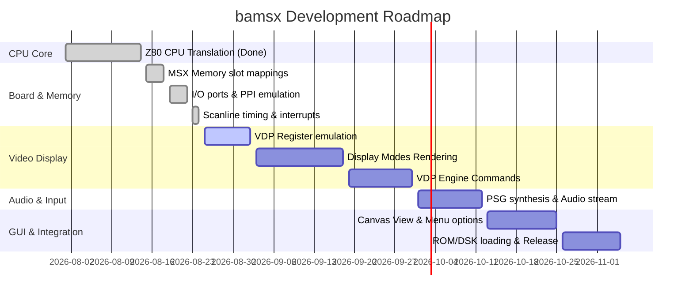

# SPEC.md - bamsx Emulator Specification & Roadmap

This document outlines the conversion of Marat Fayzullin's **fMSX** emulator from C to PureBasic (project name **bamsx**). It details what has been completed, what remains, estimated effort, and the technical roadmap to achieve a fully functional emulator.

---

## 1. Project Overview & Architecture

**bamsx** is a port of the fMSX emulator to PureBasic. The objective is to compile a native, dependency-free MSX/MSX2/MSX2+ emulator leveraging PureBasic's clean syntax, cross-platform capabilities, and lightweight runtime.

### Component Architecture:
```
+--------------------------------------------------------------+
|                         bamsx.pb                             |
|          (Window/Canvas UI, Audio, Keyboard/Mouse Input)     |
+--------------------------------------------------------------+
                               |
+------------------------------+-------------------------------+
|                              |                               |
V                              V                               V
+---------------+     +-----------------+             +----------------+
|    MSX.pbi    |     |    V9938.pbi    |             |   AY8910.pbi   |
| (Board Logic, |     | (VDP Graphics & |             |  (PSG Sound &  |
| Slots, RAM)   |     |    VRAM)        |             |  Audio Buffers)|
+---------------+     +-----------------+             +----------------+
       |
       V
+---------------+
|    Z80.pbi    |
| (CPU Emulator)|
+---------------+
```

---

## 2. Component-by-Component Translation Analysis

### Phase 1: Z80 CPU Core (COMPLETED)
- **Files translated**: `Z80.c`, `Z80.h`, `Tables.h`, `Codes.h`, `CodesCB.h`, `CodesED.h`, `CodesXX.h`, `CodesXCB.h`.
- **PureBasic Files**: `Z80.pbi`, `Z80_Tables.pbi`, `Z80_Codes.pbi`, `Z80_CodesCB.pbi`, `Z80_CodesED.pbi`, `Z80_CodesXX.pbi`, `Z80_CodesXCB.pbi`.
- **Status**: Compiles cleanly and verified using a custom program execution test.
- **Estimated Effort**: ~25 hours (completed).

### Phase 2: MSX Board Logic & Memory Slots (COMPLETED)
- **Description**: Emulates the MSX slot system. MSX features 4 primary slots, each subdividable into 4 subslots. This module maps BIOS, BASIC ROM, Cartridges, Mapper RAM, Disk ROM, and registers. It also handles port mapping (`MSXInZ80()` and `MSXOutZ80()`).
- **Intel 8255 PPI & Keyboard Matrix**: Emulates the Intel 8255 PPI chip (ports `$A8 - $AB`) controlling slot selection, key matrices row read, Caps Lock led, and tape motor. The matrix correctly translates keyboard codes through a `DataSection` layout of 130 `{row, bit}` pairs.
- **MSX BIOS File Loader**: Added `MSXLoadBIOS(FileName.s)` reading 32KB BIOS files, mapping them to Slot 0-0, and updating active page pointers.
- **Status**: Compiles cleanly and verified using a custom double-verification test suite (loading `MSX.ROM` and checking for Z80 `DI` header, plus executing PPI keyboard matrix scan bytecodes).
- **Estimated Effort**: ~30-40 hours (completed).

### Phase 3: V9938/V9958 VDP Video Processor (`V9938.c` / `V9938.h`)
- **Description**: Emulates screen rendering, VRAM access, sprites, VDP commands (block copy, fill, etc.), and scanline/horizontal interrupts.
- **Complexity**: High. This is the largest and most complex module. It contains optimization-heavy C code for rendering individual display modes (Text, Graphic 1-7, Sprite modes).
- **PureBasic Implementation**:
  - Define `V9938` structure for VDP registers and VRAM.
  - Render directly to a memory buffer or a PureBasic `Image` / `CanvasGadget` using Direct drawing or custom fast copy operations.
  - *Current Status*: Basic Port I/O skeletons (`$98 - $99`) and address latch write routing implemented in `MSX.pbi`.
- **Estimated Effort**: ~50-70 hours.

### Phase 4: AY-3-8910 PSG Sound Chip (`AY8910.c` / `AY8910.h`)
- **Description**: Emulates 3 channels of square wave sound, 1 noise generator, and volume envelopes.
- **Complexity**: Low-Medium. Sound synthesis is mathematical; it involves filling a sound buffer with samples based on register frequency/envelope values.
- **PureBasic Implementation**:
  - Implement PSG register updates.
  - Integrate sound generation with PureBasic's built-in sound stream capabilities or using DirectSound/OpenAL bindings to play generated audio buffers.
  - *Current Status*: Basic Port I/O skeletons (`$A0 - $A2`) and address selection registers implemented in `MSX.pbi`.
- **Estimated Effort**: ~15-25 hours.

### Phase 5: GUI, Tape/Disk Loading, & Platform Interface
- **Description**: File loading dialogs (ROM, DSK, CAS files), configuration menu, and native keyboard/joystick mapping.
- **Complexity**: Low. PureBasic excels at building user interfaces.
- **PureBasic Implementation**:
  - Use `Window`, `Menu`, `CanvasGadget`, and system shortcuts.
  - Native window events thread for non-blocking emulation.
- **Estimated Effort**: ~20-30 hours.

---

## 3. Implementation Roadmap



---

## 4. Work Summary & Statistics

| Component | Status | Code Lines (C) | Code Lines (PB) | Complexity |
|---|---|---|---|---|
| **Z80 CPU** | Completed | ~4,200 | ~2,500 | Medium-High |
| **MSX Board** | Completed | ~2,800 | ~450 | Medium |
| **V9938 VDP** | Planned | ~6,500 | ~4,500 (Est) | High |
| **AY8910 PSG**| Planned | ~1,200 | ~800 (Est) | Low-Medium |
| **UI / Glue** | Planned | N/A (EMULib) | ~1,500 (Est) | Low |

---

*This specification is a living document and should be updated as milestones are achieved.*
