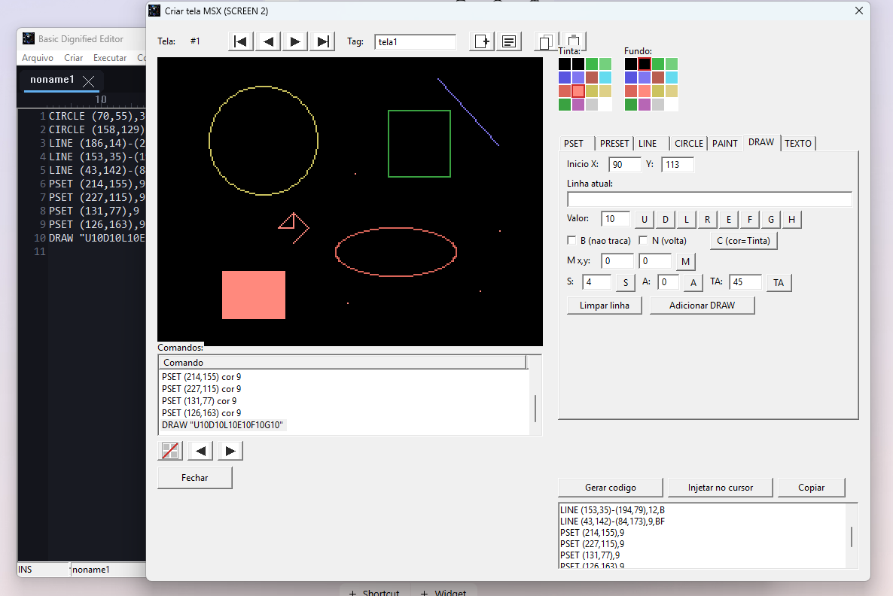

# Manual da IDE — MSX BASIC + Z80

> Manual de uso da ferramenta em si (compilar, executar, editor de texto, telas de
> configuração). Para a linguagem **Basic Dignified** (o que você escreve dentro do
> editor), veja [`BADIG-USER.md`](BADIG-USER.md), [`DIGNIFIER-USER.md`](DIGNIFIER-USER.md)
> e [`BATOKEN-USER.md`](BATOKEN-USER.md). Para a especificação/arquitetura do projeto,
> veja [`SPEC.md`](SPEC.md).
>
> Documento vivo — cresce conforme novas partes da IDE (assembler Z80, editores visuais,
> etc.) forem ficando prontas. Hoje cobre o editor de texto, o gerenciador de disco, o
> editor de sprites, o editor de alfabetos (Graphos III e Aquarela), o editor de som, o
> editor de música, o editor de DRAW Screen 2, o sistema de projeto e o processo de build.

---

## Índice

1. [Compilação](#compilação)
2. [Execução](#execução)
3. [O editor de texto](#o-editor-de-texto)
   - [Teclado estilo WordStar/JOE](#teclado-estilo-wordstarjoe)
   - [Movimento do cursor](#movimento-do-cursor)
   - [Apagar texto](#apagar-texto)
   - [Bloco marcado (selecionar/copiar/mover/apagar)](#bloco-marcado-selecionarcopiarmoverapagar)
   - [Arquivo](#arquivo)
   - [Desfazer / refazer](#desfazer--refazer)
   - [Ajuda embutida (Ctrl+K H)](#ajuda-embutida-ctrlk-h)
   - [Barra de status](#barra-de-status)
   - [O que ainda não está implementado](#o-que-ainda-não-está-implementado)
4. [Telas de configuração](#telas-de-configuração)
5. [Gerenciador de disco MSX](#gerenciador-de-disco-msx)
   - [Menu Criar → Disco... (gerenciador gráfico)](#menu-criar--disco-gerenciador-gráfico)
   - [Linha de comando (`--diskmanipulator`)](#linha-de-comando---diskmanipulator)
6. [Sistema de projeto (arquivo `.msxproject`)](#sistema-de-projeto-arquivo-msxproject)
   - [Projeto implícito "noname"](#projeto-implícito-noname)
   - [Menu Arquivo → Novo projeto... / Abrir projeto...](#menu-arquivo--novo-projeto--abrir-projeto)
   - [Menu Arquivo → Salvar projeto / Salvar projeto como...](#menu-arquivo--salvar-projeto--salvar-projeto-como)
   - [Cópia das abas de texto e diretório de trabalho](#cópia-das-abas-de-texto-e-diretório-de-trabalho)
   - [Ao sair](#ao-sair)
7. [Editor de sprites](#editor-de-sprites)
   - [Grade, tamanho e modo de cor](#grade-tamanho-e-modo-de-cor)
   - [Ferramentas de desenho](#ferramentas-de-desenho)
   - [Barra de projeto (registrar, navegar, copiar/colar)](#barra-de-projeto-registrar-navegar-copiarcolar)
8. [Editor de alfabetos](#editor-de-alfabetos)
   - [Tabela de caracteres e grade de edição](#tabela-de-caracteres-e-grade-de-edição)
   - [Marcar bloco (aplicar um efeito num intervalo de caracteres de uma vez)](#marcar-bloco-aplicar-um-efeito-num-intervalo-de-caracteres-de-uma-vez)
   - [Desfazer / refazer](#desfazer--refazer-1)
   - [Efeitos de glifo (espelhar, girar, estreitar, itálico, negrito, largo)](#efeitos-de-glifo-espelhar-girar-estreitar-itálico-negrito-largo)
   - [Copiar/colar um alfabeto inteiro](#copiarcolar-um-alfabeto-inteiro)
   - [Arquivo .ALF (Graphos III)](#arquivo-alf-graphos-iii)
   - [Barra de projeto e o alfabeto padrão ("projeto 0")](#barra-de-projeto-e-o-alfabeto-padrão-projeto-0)
9. [Editor de som (PSG)](#editor-de-som-psg)
   - [Canais A/B/C, ruído e envelope](#canais-abc-ruído-e-envelope)
   - [Sequência de passos](#sequência-de-passos)
   - [Tocar / Parar](#tocar--parar)
   - [Gerar código e injetar no editor](#gerar-código-e-injetar-no-editor)
   - [Barra de projeto](#barra-de-projeto)
10. [Editor de música (MML/PLAY)](#editor-de-música-mmlplay)
    - [Montando uma linha](#montando-uma-linha)
    - [Lista de linhas por canal](#lista-de-linhas-por-canal)
    - [Tocar / Parar](#tocar--parar-1)
    - [Gerar código e injetar no editor](#gerar-código-e-injetar-no-editor-1)
    - [Barra de projeto](#barra-de-projeto-1)
11. [Editor de alfabetos Aquarela](#editor-de-alfabetos-aquarela)
    - [Tabela de 46 caracteres e grade 16x16](#tabela-de-46-caracteres-e-grade-16x16)
    - [Arquivo .FNT](#arquivo-fnt)
12. [Editor de DRAW Screen 2](#editor-de-draw-screen-2)
    - [Canvas, paleta e cor de tinta/fundo](#canvas-paleta-e-cor-de-tintafundo)
    - [Ferramentas de desenho](#ferramentas-de-desenho-1)
    - [Parâmetros STEP e LINE -(x,y)](#parâmetros-step-e-line--xy)
    - [Ferramenta TEXTO — quadro elástico arrastável](#ferramenta-texto--quadro-elástico-arrastável)
    - [Lista de comandos e mini buffers](#lista-de-comandos-e-mini-buffers)
    - [Gerar código e injetar no editor](#gerar-código-e-injetar-no-editor-2)
    - [Barra de projeto](#barra-de-projeto-2)

---

## Compilação

O executável é gerado pelo compilador do PureBasic (`pbcompiler.exe`) através do script
[`build.ps1`](../build.ps1), na raiz do projeto. Não é necessário abrir a IDE do
PureBasic — o script cuida de tudo pelo PowerShell.

```powershell
.\build.ps1
```

Isso compila `editor\BadigEditor.pb` e gera `editor\BadigEditor.exe`.

### Onde o script encontra o `pbcompiler.exe`

Nesta ordem de prioridade:

1. Opção `-C` / `--compiler` na linha de comando.
2. Valor salvo em `build.config.json` (criado automaticamente ao lado do script, na
   primeira vez que `-C`/`--compiler` é usado — não versionado no git, é específico de
   cada máquina).
3. Caminho padrão: `%PROGRAMFILES%\PureBasic\Compilers\pbcompiler.exe`.

```powershell
# Primeira vez numa maquina nova (caminho fica salvo para as proximas execucoes)
.\build.ps1 -C "C:\Basic\Compilers\pbcompiler.exe"

# Depois, basta:
.\build.ps1
```

### Parâmetros

`-H`/`--help`, `-C`/`--compiler` e `-R`/`--run` seguem o formato Unix (letra curta +
nome longo com `--`). Os demais ficam no estilo nativo do PowerShell (só forma longa,
um traço).

| Parâmetro | Descrição |
|---|---|
| `-C`, `--compiler <caminho>` | Caminho para o `pbcompiler.exe`. |
| `-R`, `--run` | Executa o programa automaticamente após uma compilação sem erros. |
| `-H`, `--help` | Mostra a lista de opções e sai. |
| `-V`, `--version <versão>` | Versão embutida no executável (padrão `7.1.1`). |
| `-i`, `--sourcefile <arquivo>` | Arquivo fonte a compilar (padrão `editor\BadigEditor.pb`). |
| `-o`, `--outputexe <arquivo>` | Caminho do executável de saída (padrão `editor\BadigEditor.exe`). |

```powershell
# Compila e ja abre o programa
.\build.ps1 -R
.\build.ps1 --run

# Marca uma nova versao
.\build.ps1 -V "5.8.0" -R

# Lista as opcoes
.\build.ps1 -H
```

### Versão e build

A cada compilação, o script grava no executável (via `/CONSTANT` do `pbcompiler.exe`):

- **Versão** — string livre (`-V`/`--version`, padrão `7.1.1`).
- **Build** — data/hora **UTC** do momento da compilação, convertida para **hexadecimal**
  (segundos desde a época Unix, ex.: `6A57EA80`). Cada build tem um identificador único e
  ordenável.

Essas informações aparecem dentro do programa em **Ajuda → Sobre...**.

---

## Execução

Depois de compilado, basta rodar o executável gerado:

```powershell
.\editor\BadigEditor.exe
```

ou usar `.\build.ps1 -Run` para compilar e abrir em um único passo.

Na primeira execução vale abrir **Configurar → Editor...** para escolher fonte e tema, e
**Configurar → Basic Dignified...** para apontar (ou baixar) o toolchain Python de
referência — ver [Telas de configuração](#telas-de-configuração).

---

## O editor de texto

### Teclado estilo WordStar/JOE

O editor é baseado no [**JOE** (Joe's Own Editor)](https://joe-editor.sourceforge.io/),
que por sua vez reproduz o teclado clássico do **WordStar** (modo `jstar` do JOE) — os
comandos usam `Ctrl` + uma letra, muitos deles em **duas teclas** (ex.: `Ctrl+K` seguido
de `B`), sem precisar do mouse nem das setas.

Esta primeira leva implementa o conjunto **básico** do JOE (a "Basic Help Screen" que ele
mesmo mostra com `Ctrl+J`): movimento do cursor, apagar texto, bloco marcado, arquivo e
desfazer/refazer. Mais comandos (busca, reformatar parágrafo, etc.) entram depois — ver
[O que ainda não está implementado](#o-que-ainda-não-está-implementado).

> **Importante:** como no WordStar de verdade, `Ctrl+S` **não salva** — move o cursor para
> a esquerda. Salvar é `Ctrl+K D` (ver [Arquivo](#arquivo)).

Nos comandos de duas teclas (`Ctrl+K x`, `Ctrl+Q x`), a segunda tecla pode ser digitada
**com ou sem** `Ctrl` — `Ctrl+K` depois `B` funciona igual a `Ctrl+K` depois `Ctrl+B`.

### Movimento do cursor

| Tecla | Ação |
|---|---|
| `Ctrl+S` | Um caractere para a esquerda |
| `Ctrl+D` | Um caractere para a direita |
| `Ctrl+E` | Uma linha para cima |
| `Ctrl+X` | Uma linha para baixo |
| `Ctrl+A` | Palavra anterior |
| `Ctrl+F` | Próxima palavra |
| `Ctrl+R` | Tela anterior (Page Up) |
| `Ctrl+C` | Próxima tela (Page Down) |
| `Ctrl+Q S` | Início da linha |
| `Ctrl+Q D` | Fim da linha |
| `Ctrl+Q R` | Início do arquivo |
| `Ctrl+Q C` | Fim do arquivo |

### Apagar texto

| Tecla | Ação |
|---|---|
| `Ctrl+G` | Apaga o caractere sob o cursor (para a frente) |
| `Ctrl+H` / `Backspace` | Apaga o caractere anterior |
| `Ctrl+T` | Apaga a palavra à direita |
| `Ctrl+Y` | Apaga a linha inteira |
| `Ctrl+Q Y` | Apaga até o fim da linha |

### Bloco marcado (selecionar/copiar/mover/apagar)

Diferente de uma seleção comum (arrastar o mouse ou Shift+setas), o bloco do
WordStar/JOE é marcado por **dois pontos fixos** no texto — `Ctrl+K B` (início) e
`Ctrl+K K` (fim) — e continua destacado mesmo depois que o cursor se move para outro
lugar (é assim que dá para marcar, navegar até o destino, e só então copiar/mover).

| Tecla | Ação |
|---|---|
| `Ctrl+K B` | Marca o **início** do bloco na posição do cursor |
| `Ctrl+K K` | Marca o **fim** do bloco na posição do cursor |
| `Ctrl+K C` | **Copia** o bloco para a posição atual do cursor (o bloco original continua marcado — dá para repetir `Ctrl+K C` em vários lugares) |
| `Ctrl+K V` | **Move** o bloco para a posição atual do cursor (cursor precisa estar fora do bloco) |
| `Ctrl+K Y` | **Apaga** o bloco marcado |

`Ctrl+K C` e `Ctrl+K V` também colocam o texto do bloco na área de transferência do
Windows, para colar em outros programas. Não há tecla dedicada para desmarcar — marcar de
novo (`Ctrl+K B` seguido de `Ctrl+K K` na mesma posição) produz uma marca de tamanho zero,
que fica sem destaque.

### Arquivo

| Tecla | Ação |
|---|---|
| `Ctrl+K D` | Salva o arquivo |
| `Ctrl+K E` | Abre um arquivo |
| `Ctrl+K X` | Salva e fecha a aba atual |
| `Ctrl+K Q` | Fecha a aba atual (avisa se há alterações não salvas) |

Esses comandos também estão disponíveis pelo menu **Arquivo**.

**Tipos de arquivo**: o menu **Arquivo** tem dois comandos de "criar novo" — **Novo** (`Ctrl+N`) cria
uma aba MSX-BASIC/Dignified (`.dmx`), **Novo Assembly** (`Ctrl+Shift+N`) cria uma aba Z80 Assembly
(`.asm`). Cada aba lembra seu próprio tipo (detectado automaticamente pela extensão ao abrir um
arquivo existente — `.asm`/`.z80`/`.mac` viram Assembly, o resto vira Dignified) e aplica o destaque
de sintaxe certo: o dialeto Dignified numa aba `.dmx`, ou o vocabulário do assembler
**N80/Nestor80** (mnemônicos, registradores, diretivas, literais numéricos em qualquer radix) numa
aba `.asm`. O motor que monta `.asm` em binário Z80 ainda não existe — por enquanto a aba `.asm` é só
edição com destaque de sintaxe, ver [`SPEC.md`](SPEC.md#2-assembler-z80).

### Desfazer / refazer

| Tecla | Ação |
|---|---|
| `Ctrl+U` | Desfazer |
| `Ctrl+Shift+6` (`Ctrl+^`) | Refazer |
| `Ctrl+V` | Alterna entre inserção e sobrescrita (Insert/Overtype) |

### Ajuda embutida (Ctrl+K H)

`Ctrl+K H` mostra, dentro da própria área do editor (como no JOE/WordStar), uma tela com
os atalhos acima organizados por seção (Cursor, Apagar, Bloco marcado, Arquivo, Outros).
**Qualquer tecla** (ou clique) fecha a ajuda e devolve o foco para o texto — não precisa
ser a mesma combinação que abriu.

### Barra de status

O rodapé da janela mostra, sempre atualizado:

| Campo | Conteúdo |
|---|---|
| Modo | `INS` (inserção) ou `SBR` (sobrescrita — `Ctrl+V`). Enquanto um comando de duas teclas está pendente (`Ctrl+K`/`Ctrl+Q` já apertado, esperando a segunda tecla), mostra `^K`/`^Q` no lugar. |
| Nome do arquivo | Nome da aba ativa, com `*` se houver alterações não salvas. |
| Linha/Coluna | Posição atual do cursor no documento ativo. |

### O que ainda não está implementado

Fica para uma próxima etapa (o JOE tem bem mais comandos que isso — veja a referência em
[joe-editor.sourceforge.io](https://joe-editor.sourceforge.io/)):

- Busca e substituição (`Ctrl+Q F`, `Ctrl+L`)
- Reformatar parágrafo (`Ctrl+B`)
- Salvar bloco marcado direto num arquivo (`Ctrl+K W`)
- Menu de opções do editor (`Ctrl+O`, no JOE — não confundir com o `Ctrl+O` de "Abrir" já
  usado pelo menu **Arquivo** desta IDE)

---

## Telas de configuração

- **Configurar → Editor...** — fonte (só monoespaçadas, com botão para baixar fontes
  [Nerd Fonts](https://www.nerdfonts.com/) direto de dentro da IDE), tema claro/escuro,
  estilo de abas, caminho de instalação do editor.
- **Configurar → Basic Dignified...** — três abas:
  - **Basic Dignified** — opções do pré-processador/tokenizador e diretório de instalação do
    toolchain Python de referência (com botão para baixar via `git clone` ou `.zip` do GitHub).
  - **MSX** — opções específicas do dialeto/tokenizador MSX.
  - **Emulador** — caminho do executável do openMSX, **Máquina** e **Extensão de disco** (cada
    campo tem um botão "..." que lista as máquinas/extensões disponíveis em `share/machines`/
    `share/extensions` a partir do caminho do openMSX configurado, sem precisar digitar o nome de
    cabeça), e a opção **"Abrir o openMSX e rodar o código após gerar"**: quando marcada, o menu
    **Arquivo → Dignified → tokenizado nativo (.bmx)...** passa a montar um disquete com o programa
    gerado (mais um `AUTOEXEC.BAS` para rodar automaticamente) e abrir o openMSX direto nele, já
    com a máquina/extensão escolhidas.
- **Ajuda → Sobre...** — versão, build e data de compilação (ver
  [Versão e build](#versão-e-build)).

---

## Gerenciador de disco MSX

### Menu Criar → Disco... (gerenciador gráfico)

O menu **Criar → Disco...** abre uma janela com dois painéis (estilo Norton/Total Commander) para
montar imagens de disco MSX (`.dsk`) sem sair do editor:

- **Campo "Arquivo do disco"** (topo) — o botão **"..."** abre o diálogo padrão do Windows para
  escolher um `.dsk` já existente (abre para edição) ou digitar um caminho novo (cria um disco em
  branco de 720 KB).
- **Painel esquerdo** — sistema de arquivos local, começando no diretório onde o `BadigEditor.exe`
  está rodando. Duplo-clique numa pasta entra nela; duplo-clique em `..` sobe um nível.
- **Painel direito** — conteúdo do disco aberto/em criação.
- **`Adicionar >>` / `<< Extrair`** — transferem os arquivos selecionados (seleção múltipla suportada)
  entre os dois painéis. **Sempre por cópia** — o arquivo de origem nunca é apagado.
- **`Remover local` / `Remover disco`** — excluem de verdade os arquivos selecionados (do sistema de
  arquivos do Windows ou de dentro do disco, respectivamente), pedindo confirmação antes por serem
  ações destrutivas. `Remover disco` fica desabilitado até que um disco esteja aberto.
- **Salvar / Salvar como... / Duplicar... / Excluir disco... / Cancelar** — todas as operações acima
  acontecem numa **cópia de rascunho temporária**; o arquivo `.dsk` escolhido no topo só é gravado de
  verdade num destes botões:
  - **Salvar** — grava no arquivo escolhido e fecha a janela.
  - **Salvar como...** — pergunta um caminho novo e grava lá (a janela continua fechando ao final).
  - **Duplicar...** — grava uma cópia extra num caminho escolhido **sem** fechar a sessão — o
    trabalho continua no disco original.
  - **Excluir disco...** — apaga o arquivo `.dsk` de destino (se já existir) e reinicia a janela do
    zero, pronta para outro disco.
  - **Cancelar** (ou fechar a janela) — descarta o rascunho sem tocar no arquivo escolhido no topo.

### Linha de comando (`--diskmanipulator`)

O mesmo motor de disco também está disponível como utilitário de linha de comando, sem abrir
nenhuma janela — útil em scripts:

```powershell
BadigEditor.exe --diskmanipulator create disco.dsk
BadigEditor.exe --diskmanipulator list disco.dsk -l
BadigEditor.exe --diskmanipulator add disco.dsk arquivo.bas *.txt
BadigEditor.exe --diskmanipulator extract disco.dsk -d pasta_saida *.bas
BadigEditor.exe --diskmanipulator delete disco.dsk arquivo.bas
```

| Comando | Descrição |
|---|---|
| `create <disco.dsk> [boot.bin]` | Cria uma imagem de disco MSX em branco (720 KB), com setor de boot customizado opcional. |
| `list <disco.dsk> [-l]` | Lista os arquivos do disco (`-l` mostra tamanho e data/hora). |
| `add <disco.dsk> <arquivo...>` | Adiciona um ou mais arquivos locais (aceita curingas como `*.BAS`). |
| `extract <disco.dsk> [-d pasta] [máscara...]` | Extrai arquivos do disco, opcionalmente filtrando por máscara. |
| `delete <disco.dsk> <arquivo>` | Remove um arquivo de dentro do disco. |

Diferente da versão gráfica, a CLI grava direto no arquivo informado (sem cópia de rascunho) — mesmo
comportamento do utilitário `msxdisk.exe` original.

---

## Sistema de projeto (arquivo `.msxproject`)

Um **projeto** MSX inteiro — os sprites do [editor de sprites](#editor-de-sprites), os alfabetos do
[editor de alfabetos](#editor-de-alfabetos), uma cópia do conteúdo das abas de texto já salvas em disco
e o diretório de trabalho (outros tipos de conteúdo — Basic, Assembly, telas, sons, músicas, listagens
LM — entram conforme ganharem editor próprio) — fica guardado num único arquivo `.msxproject` (um banco
SQLite).

### Projeto implícito "noname"

Ao abrir a IDE **sem passar nenhum parâmetro na linha de comando** (o uso normal, clicando no `.exe`),
um projeto implícito chamado **`noname.msxproject`** já é criado de cara, num arquivo temporário. Não
é preciso criar ou escolher um projeto antes de usar o editor de sprites/alfabetos — tudo que for
registrado vai sendo gravado nesse projeto automaticamente.

### Menu Arquivo → Novo projeto... / Abrir projeto...

- **Novo projeto...** — pede um caminho (diálogo padrão do Windows, escolhe pasta e nome de uma vez) e
  troca para um projeto novo e vazio nesse local. Se o projeto atual ainda for o `noname` temporário e
  já tiver conteúdo registrado, pergunta antes se você quer salvá-lo permanentemente (cancelar esse
  diálogo de salvar cancela a troca de projeto também — nada é descartado sem avisar).
- **Abrir projeto...** — mesma lógica, mas abre um arquivo `.msxproject` já existente em vez de criar
  um novo.

### Menu Arquivo → Salvar projeto / Salvar projeto como...

- **Salvar projeto** — se o projeto atual já tem um caminho permanente, não faz nada visível (o
  `.msxproject` já grava cada sprite/alfabeto/documento registrado na hora, não existe estado "sujo" em
  memória à espera de um save); se ainda for o `noname` temporário, cai no mesmo fluxo do item abaixo.
- **Salvar projeto como...** — sempre pergunta um caminho novo (sugerindo o atual, se já for
  permanente) e promove/copia o projeto pra lá — é como se salva **uma cópia do projeto com outro
  nome**. Se o nome digitado não tiver extensão, `.msxproject` é acrescentada automaticamente.

### Cópia das abas de texto e diretório de trabalho

Além dos sprites e alfabetos, o projeto também guarda automaticamente:

- Uma **cópia sempre atualizada** do conteúdo de cada aba de texto (`.dmx`/`.amx`/`.asm`) já salva em
  disco pelo menos uma vez — sincronizada a cada `Ctrl+K D`/"Salvar como" de uma aba, além do arquivo
  físico que já ia para o disco. Abas ainda não salvas ("nonameN") não entram, por não terem um
  caminho ainda.
- O **diretório de trabalho** — a pasta do último arquivo salvo, ou o diretório corrente enquanto nada
  foi salvo ainda.

### Ao sair

Se o projeto atual ainda for o `noname` temporário **e** já tiver algo registrado (pelo menos um
sprite ou alfabeto), a IDE pergunta, ao fechar, se você quer salvá-lo — respondendo que sim, abre o
mesmo diálogo de "escolher pasta e nome definitivo" do **Novo projeto...**. Se não houver nada
registrado, ou se o projeto já estiver salvo num arquivo permanente, a IDE fecha direto, sem perguntar
nada.

---

## Editor de sprites


O menu **Criar → Sprite...** abre o editor gráfico de sprites MSX, numa janela própria.

### Grade, tamanho e modo de cor

- **Tipo de sprite** — radio **8×8** / **16×16**, os dois tamanhos reais de sprite do VDP do MSX. A
  área de desenho (canvas) tem sempre o mesmo tamanho em pixels; é o tamanho de cada bloco que muda ao
  trocar entre os dois.
- **Modo** — radio **MSX1** / **MSX2**, controla a regra de cor do hardware real:
  - **MSX1**: o sprite inteiro só pode ter **uma cor**. Trocar a cor atual (ou pintar) recolore
    instantaneamente tudo que já estava pintado.
  - **MSX2**: **cada linha** pode ter a sua própria cor (recurso real do VDP do MSX2), mas só uma cor
    dentro da mesma linha — pintar um bloco numa linha recolore automaticamente o resto da linha para
    bater com a cor usada.
- **Cor atual** — seletor com as 16 cores fixas da palheta original do MSX1 (TMS9918); o primeiro
  quadro (com um "X") é o índice 0, transparente.
- **Prévia** — canto da janela mostra o sprite em escala reduzida, mais perto do tamanho real (sem as
  linhas de grade da área de edição).

### Ferramentas de desenho

Barra de ícones logo abaixo da grade — só uma ferramenta fica ativa por vez:

| Ícone | Ferramenta | Como usar |
|---|---|---|
| Lápis | Pinta um bloco por vez | Clique, ou arraste com o botão esquerdo pressionado para riscar continuamente. |
| Borracha | Apaga um bloco por vez | Mesmo gesto do lápis, mas apagando. |
| Pincel | Pinta um bloco 2×2 por vez | Mesmo gesto do lápis, "mais grosso". |
| Balde | Preenche uma área conectada | Clique dentro de uma região fechada — pinta tudo que estiver conectado com a mesma cor. |
| Reta | Traça uma linha reta | Marque o ponto inicial (fica piscando) e o final — veja abaixo. |
| Retângulo (vazio/cheio) | Desenha um retângulo | Marque dois cantos opostos. |
| Elipse/círculo (vazio/cheio) | Desenha uma elipse | Marque dois cantos da caixa delimitadora. |

**Ferramentas de dois pontos** (reta, retângulo, elipse): o primeiro clique marca o ponto inicial — um
marcador fica **piscando** nele — e, conforme o mouse se move, a forma que seria traçada aparece **em
prévia** sobre a grade. O segundo clique confirma. Para **cancelar sem traçar nada**, aperte **Esc**
ou clique com o **botão direito** do mouse.

Abaixo das ferramentas de desenho:

- **Rotacionar** (com "quebra" nas bordas — o que sai de um lado reaparece do outro) e **Deslocar**
  (sem quebra — o que sai se perde, o espaço liberado vira transparente), nas quatro direções.
- **Inverter** todos os pontos, **Limpar** tudo.

### Barra de projeto (registrar, navegar, copiar/colar)

Barra no topo da janela, ligada ao [sistema de projeto](#sistema-de-projeto-arquivo-msxproject):

- **Número do sprite** — mostrado como `#N`; cada sprite registrado tem um número sequencial.
- **Tag** — nome curto (até 16 caracteres) para identificar o sprite.
- **Navegação** — botões **Primeiro** / **Anterior** / **Próximo** / **Último**, andam entre os
  sprites já registrados no projeto atual (param nas pontas, não dão volta).
- **Novo** — cria o próximo sprite da sequência (maior número já registrado + 1), com a grade em
  branco.
- **Registrar** — grava (ou atualiza, se já existir) o sprite atual no projeto.
- **Copiar** / **Colar** — copiam o sprite atual (grade, tamanho e modo) para colar em outro número —
  útil para duplicar um sprite parecido antes de fazer variações.

Alterações feitas num sprite e ainda não registradas pedem confirmação antes de trocar de sprite ou
fechar a janela, para não perder trabalho sem querer.

---

## Editor de alfabetos

O menu **Criar → Alfabeto...** abre o editor de charsets (fontes de caracteres 8×8) MSX, no formato
de arquivo **`.ALF` do [Graphos III](https://www.msx.org/wiki/Graphos)**, numa janela própria.

Todos os botões de ação da janela são **ícones monocromáticos** (sem texto) — passe o mouse por cima
para ver uma dica explicando a função exata. Vários botões de escopo diferente reaproveitam o mesmo
desenho (ex.: o ícone de "copiar" é o mesmo para copiar um caractere, um alfabeto inteiro ou um bloco)
— a posição na janela e a dica ao passar o mouse é que indicam o escopo. Nas seções abaixo, os nomes em
**negrito** correspondem ao texto da dica de cada ícone, não a um rótulo visível no botão.

### Tabela de caracteres e grade de edição

- **Tabela** — os 256 caracteres do alfabeto (16 colunas × 16 linhas), cada um mostrado como uma
  miniatura do seu desenho 8×8 atual. O cabeçalho de linha/coluna é hexadecimal — a própria posição na
  grade já é o código do caractere (linha = byte alto, coluna = nibble baixo), como um mapa de
  caracteres clássico. Clicar num caractere carrega o desenho dele na grade grande à direita; o
  selecionado ganha um contorno vermelho.
- **Grade de edição** — versão bem ampliada (8×8 quadrados grandes) do caractere selecionado. Clique
  liga/desliga um pixel; arrastar com o botão esquerdo pressionado pinta uma sequência de pixels com o
  mesmo valor do primeiro clique (não fica alternando a cada pixel passado por cima). Os 8 bytes
  hexadecimais resultantes aparecem ao lado, atualizados a cada pixel alterado.
- **Registrar** — grava os pixels editados de volta nos 8 bytes do caractere selecionado (e atualiza a
  miniatura dele na tabela). **Editar sem clicar em "Registrar" não muda o alfabeto** — trocar de
  caractere ou fechar a janela com edições pendentes pede confirmação.
- **Limpar** — apaga todos os pixels da grade de edição (ainda precisa de "Registrar" para valer).
- **Copiar** / **Colar** (caractere) — copiam o caractere em edição para uma área de transferência da
  sessão (dura enquanto a janela estiver aberta) e colam de volta em qualquer outro caractere, do mesmo
  alfabeto ou de um alfabeto diferente (navegue para outro alfabeto e o valor copiado continua
  disponível). Colar substitui a grade de edição — ainda precisa de "Registrar" para valer no alfabeto.
- **Inverter** — com **nenhum bloco marcado** (ver abaixo), inverte só os pixels da grade de edição do
  caractere atual (ainda precisa de "Registrar"). Com um **bloco marcado**, inverte de uma vez **todos
  os caracteres do intervalo**, direto no alfabeto em memória (não passa pela grade de edição nem
  precisa de "Registrar" por caractere — mas o alfabeto inteiro ainda precisa de "Registrar alfabeto"
  para valer no projeto). Os efeitos de glifo descritos mais abaixo seguem exatamente o mesmo padrão.

### Marcar bloco (aplicar um efeito num intervalo de caracteres de uma vez)

Abaixo da tabela: **Marcar início** / **Marcar fim** marcam o caractere atualmente selecionado na
tabela como início/fim de um intervalo (por exemplo, clique em "A", **Marcar início**, clique em "Z",
**Marcar fim**). O botão **All** faz a mesma coisa de uma vez só, marcando o alfabeto inteiro (todos os
256 caracteres) sem precisar clicar duas vezes. O intervalo marcado aparece com um contorno azul na
tabela, e o texto de status mostra algo como `Bloco: $41..$5A (26 caracteres)`. Com o intervalo
marcado, **todos os botões de efeito** (Inverter, Espelhar, Girar, Apagar, Estreitar, Itálico, Negrito,
Largo e variantes — ver [Efeitos de glifo](#efeitos-de-glifo-espelhar-girar-estreitar-itálico-negrito-largo)
abaixo) passam a aplicar de uma vez em todos os caracteres do intervalo, em vez de só no caractere
atual. **Limpar bloco** desmarca o intervalo, voltando todos os efeitos ao comportamento normal (só o
caractere atual). O intervalo marcado é independente do alfabeto sendo editado no momento — navegar
entre alfabetos não desmarca o bloco, então dá para repetir o mesmo efeito em vários alfabetos sem
remarcar.

- **Copiar bloco** — copia todos os caracteres do intervalo marcado (não só um) para a área de
  transferência da sessão. Precisa de um intervalo marcado primeiro (Marcar início/Marcar fim).
- **Colar bloco** — cola o intervalo copiado a partir do **caractere atualmente selecionado** na
  tabela (o destino), substituindo tantos caracteres quantos foram copiados. Depois de colar, o
  intervalo de destino vira automaticamente o novo bloco marcado — dá pra clicar **Inverter** na
  sequência sem precisar remarcar. Exemplo do fluxo completo: marcar A..Z, **Copiar bloco**, clicar no
  caractere "a" na tabela, **Colar bloco** (a..z passam a ter os mesmos desenhos de A..Z, e o intervalo
  a..z já fica marcado), **Inverter** (inverte só a..z) — resultado: A..Z normais e a..z como a mesma
  fonte invertida, prontos para usar como dois conjuntos diferentes no mesmo alfabeto.

### Desfazer / refazer

**Desfazer** / **Refazer** trabalham sobre o **alfabeto inteiro**, não sobre pixel individual — cada
vez que uma alteração é de fato gravada no alfabeto (Registrar um caractere, qualquer efeito de glifo
aplicado com um bloco/All marcado, Colar bloco, Colar alfabeto), o estado anterior é guardado numa
pilha (até 50 níveis). **Desfazer** volta pro estado anterior; **Refazer** avança de novo, se nada foi
alterado no meio. Pixels ainda não registrados (sem clicar em "Registrar") não entram na pilha — a
mesma regra de sempre: editar sem registrar não muda o alfabeto, então não há o que desfazer ali. Os
botões ficam desabilitados quando não há nada pra desfazer/refazer, e a pilha é zerada ao trocar de
alfabeto (navegar, Novo alfabeto, Carregar do Graphos III) — desfazer não atravessa alfabetos
diferentes.

### Efeitos de glifo (espelhar, girar, estreitar, itálico, negrito, largo)

Uma segunda fileira de botões, ao lado de Registrar/Limpar/Inverter/Copiar/Colar, com mais efeitos que
seguem o **mesmo padrão dual** do Inverter: sem bloco marcado, afetam só o caractere em edição (ainda
precisa de "Registrar"); com um bloco marcado (ou **All**), aplicam de uma vez em todo o intervalo,
direto no alfabeto.

- **Espelhar horizontal** / **Espelhar vertical** — espelham o desenho do glifo na horizontal/vertical.
- **Girar 90°** — gira o glifo 90 graus no sentido horário.
- **Apagar** — mesmo efeito de "Limpar", só que também funciona com bloco/All marcado (apagando todos
  os caracteres do intervalo de uma vez).
- **Estreitar** — condensa as 5 colunas da metade esquerda do glifo em só 3 colunas (colunas 0-1 viram
  a coluna 0, a coluna 2 vira a coluna 1, as colunas 3-4 viram a coluna 2; o resto some) — truque
  clássico de fonte MSX pra caber **64 colunas** de texto na tela onde caberiam só 32.
- **Itálico** — desloca as linhas do glifo pra direita em quantidades decrescentes: as 2 linhas de
  cima deslocam 2 pixels, as 3 seguintes deslocam 1 pixel, e as 3 últimas ficam paradas — resultado é
  um efeito de inclinação.
- **Negrito** — engrossa cada traço vertical em 1 pixel, combinando cada linha do glifo com uma cópia
  dela mesma deslocada 1 pixel pra direita.
- **Largo** — estica o glifo horizontalmente em 1 pixel, combinando a metade esquerda original com uma
  cópia deslocada 1 pixel pra direita.
- **Bold (esquerda)** / **Bold (direita)** — parecidos com "Largo", mas engrossando um lado específico
  do glifo em vez de só esticar (esquerda engrossa o lado esquerdo, direita o lado direito).
- **Largo (bold)** — aplica "Largo" e, em seguida, "Negrito" em cima do resultado — glifo esticado e
  engrossado ao mesmo tempo.

### Copiar/colar um alfabeto inteiro

Acima da tabela: **Copiar alfabeto** / **Colar alfabeto** copiam os 256 caracteres do alfabeto em
edição para uma área de transferência da sessão e colam de volta em outro alfabeto (por exemplo,
"Novo alfabeto" seguido de "Colar alfabeto" duplica um alfabeto inteiro para um número novo). "Copiar
alfabeto" aplica antes qualquer pixel pendente do caractere selecionado, para não deixar nada de fora;
"Colar alfabeto" substitui o alfabeto inteiro em edição — ainda precisa de "Registrar alfabeto" para
valer no projeto.

### Arquivo .ALF (Graphos III)

- **Carregar do Graphos III...** — lê um arquivo `.alf` de verdade, no formato binário clássico do
  MSX: um cabeçalho de 7 bytes (byte de tipo `&HFE`, endereços inicial/final/execução, 2 bytes cada)
  seguido dos 2048 bytes de dados (256 caracteres × 8 bytes) — originalmente carregado no endereço de
  VRAM `&H9200`, a Pattern Generator Table. Um cabeçalho com byte de tipo ou tamanho inválido é
  rejeitado com mensagem de erro, em vez de carregar dados sem sentido silenciosamente. O alfabeto
  importado sempre vira um **alfabeto novo** no projeto (numeração automática, igual a "Novo
  alfabeto") — nunca sobrescreve um banco já registrado sem querer. Depois de carregar, use **Registrar
  alfabeto** (barra de projeto abaixo) pra gravá-lo de fato no `.msxproject`; assim dá pra ter vários
  alfabetos Graphos III diferentes no mesmo projeto.
- **Salvar como...** — grava o alfabeto em edição num arquivo `.alf` de verdade, no mesmo formato. Se o
  nome digitado não tiver extensão, `.alf` é acrescentada automaticamente. Independente do sistema de
  projeto abaixo — serve pra exportar um `.alf` compatível com o Graphos III de verdade, não pra
  guardar o alfabeto no `.msxproject`.

### Barra de projeto e o alfabeto padrão ("projeto 0")

Barra no topo da janela, ligada ao [sistema de projeto](#sistema-de-projeto-arquivo-msxproject) — mesmo
padrão da barra de projeto do editor de sprites:

- **Número do alfabeto** — mostrado como `#N`; cada alfabeto registrado tem um número sequencial.
- **Tag** — nome curto (até 16 caracteres) para identificar o alfabeto.
- **Navegação** — botões **Primeiro** / **Anterior** / **Próximo** / **Último**, andam entre os
  alfabetos já registrados no projeto atual (param nas pontas, não dão volta).
- **Novo alfabeto** — cria o próximo alfabeto da sequência (maior número já registrado + 1), **sempre
  partindo do charset padrão do MSX** (nunca em branco — diferente do "Novo" do editor de sprites).
- **Registrar alfabeto** — grava (ou atualiza, se já existir) o alfabeto inteiro (os 256 caracteres) no
  projeto. Também aplica antes qualquer edição pendente do caractere que estiver selecionado, para não
  deixar pixels não registrados de fora.

O **charset padrão do MSX** usado como ponto de partida (ao abrir a janela sem nenhum alfabeto ainda
registrado no projeto, e sempre em "Novo alfabeto") vem de um **alfabeto embutido no próprio
executável** — não depende de nenhum arquivo externo em tempo de execução. Internamente ele mora num
**"projeto 0"**: um banco de dados separado, sempre em memória, nunca salvo em disco, recriado do zero
a cada vez que a IDE é aberta — só serve como fonte interna de conteúdo padrão.

---

## Editor de som (PSG)


O menu **Criar → Som (PSG)...** abre o editor de efeitos sonoros para o chip de som do MSX
(AY-3-8910/YM2149), numa janela própria. Ele espelha, registrador por registrador, exatamente o que o
comando `SOUND` do MSX-BASIC escreve no chip — o que você ouve na janela é sintetizado pelo mesmo
motor de emulação que gera o código, então o resultado real no MSX/openMSX deve soar muito parecido.

Um **som** é um **mini-sequenciador de passos**: uma lista curta onde cada passo guarda os 14
registradores do PSG (tom, ruído, volume, envelope) mais uma duração em quadros — é o time-line de UM
efeito/instrumento (tiro, explosão, bipe etc.), não um sequenciador multi-canal de música completa
(isso fica para um futuro editor de Tracker, ainda não implementado).

### Canais A/B/C, ruído e envelope

- **Canal A / B / C** — cada um com **Frequência (Hz)** (convertida automaticamente para o período de
  registrador do PSG), **Volume (0-15)**, **Usar envelope** (ignora o campo Volume e usa o gerador de
  envelope compartilhado abaixo) e dois interruptores de mixer: **Tom** (oscilador de onda quadrada) e
  **Ruído** (gerador de ruído, compartilhado pelos 3 canais).
- **Ruído (compartilhado)** — **Período (0-31)**: quanto menor, mais agudo o ruído.
- **Envelope (compartilhado)** — **Período** (1 a 65535) e a **forma** (lista com as 10 formas de
  hardware do chip, cada uma com uma descrição curta — ex. "9 - decai e para", "12 - sobe repetindo").
  Só afeta os canais com **Usar envelope** marcado.

Todos esses campos são digitáveis diretamente (não são controles de "setinha") — digite o valor e
troque de campo ou clique em **Adicionar passo**/**Atualizar passo** para aplicar.

### Sequência de passos

- **Adicionar passo** — acrescenta um novo passo ao fim da sequência, com os valores atuais do painel.
- **Atualizar passo** — aplica os valores atuais do painel ao passo selecionado na lista.
- **Remover** — apaga o passo selecionado.
- **▲** / **▼** — move o passo selecionado para cima/baixo na sequência.
- **Duplicar passo** — insere uma cópia do passo selecionado logo depois dele.

Clicar num passo da lista carrega os valores dele de volta no painel para edição. A lista mostra um
resumo de cada passo (ex. `A=440Hz v12  10q`) — só os canais que realmente produzem som (tom ligado e
volume maior que zero, ou usando envelope) aparecem no resumo.

### Tocar / Parar

**Tocar** sintetiza a sequência inteira em áudio PCM — motor próprio por acumulador de fase (osciladores
de tom dos 3 canais, LFSR de ruído de 17 bits, gerador de envelope com tabela de volume logarítmica de
16 níveis, mesmo clock do PSG do MSX) — e toca via um arquivo `.wav` temporário, sem depender de
nenhuma biblioteca de áudio externa. **Parar** interrompe a reprodução. Cada clique em Tocar renderiza
de novo do zero, então qualquer alteração no painel ou na lista de passos já sai atualizada na próxima
reprodução.

### Gerar código e injetar no editor

- **Gerar código BASIC** — produz linhas `SOUND n,valor` prontas para colar: o primeiro passo escreve
  os 14 registradores, os passos seguintes só escrevem os registradores que **mudaram** em relação ao
  anterior (um registrador não tocado mantém o valor de antes no hardware real). Entre passos, uma
  espera aproximada via `FOR/NEXT` (a constante de calibração é aproximada, não sample-accurate contra
  hardware real — ajuste conforme necessário).
- **Gerar bytes crus** — produz um bloco `DATA` com os 14 bytes de registrador mais a duração de cada
  passo, pensado para uma futura rotina Z80 que escreva direto nas portas do PSG (mais rápido que várias
  chamadas `SOUND` em runtime).
- **Injetar no cursor** — insere o código gerado (mostrado na caixa de texto abaixo dos botões) direto
  no cursor da aba de texto ativa no editor.
- **Copiar** — copia o código gerado para a área de transferência do Windows.

### Barra de projeto

Barra no topo da janela, ligada ao [sistema de projeto](#sistema-de-projeto-arquivo-msxproject) — mesmo
padrão da barra de projeto dos editores de sprite e alfabeto:

- **Número do som** — mostrado como `#N`; cada som registrado tem um número sequencial.
- **Tag** — nome curto (até 16 caracteres) para identificar o som.
- **Navegação** — botões **Primeiro** / **Anterior** / **Próximo** / **Último**, andam entre os sons já
  registrados no projeto atual (param nas pontas, não dão volta).
- **Novo** — cria o próximo som da sequência (maior número já registrado + 1), com a lista de passos
  vazia.
- **Registrar** — grava (ou atualiza, se já existir) o som atual — todos os passos da sequência — no
  projeto.

Alterações feitas num som e ainda não registradas pedem confirmação antes de trocar de som ou fechar a
janela, para não perder trabalho sem querer.

---

## Editor de música (MML/PLAY)


O menu **Criar → Música (PLAY)...** abre o editor de MML (Music Macro Language) para o comando `PLAY`
do MSX-BASIC, numa janela própria com os **3 canais A/B/C lado a lado, em paralelo**. `PLAY` toca até 3
vozes simultâneas, cada uma controlada por uma string MML própria — o motor de áudio deste editor
reaproveita quase por completo o motor do [editor de som](#editor-de-som-psg) (mesmo chip PSG, mesmo
gerador de envelope compartilhado pelos 3 canais), então o que você ouve na prévia deve soar muito
parecido com o `PLAY` real rodando no MSX/openMSX.

### Montando uma linha

Cada canal tem uma **linha atual** (campo de texto editável — os botões abaixo acrescentam nela, mas
também dá pra digitar direto):

- **Notas** — botões `C D E F G A B` e **`R`** (pausa) na mesma fileira. O **acidente** (Natural/
  Sustenido/Bemol), a **duração** (campo `D`, vazio = usa a duração padrão `L`) e os **pontos de
  aumento** (campo `.`, 0-3 — cada ponto multiplica a duração por 1,5×) ficam ao lado e valem para a
  **próxima** nota ou pausa clicada.
- **`N`** — nota absoluta por número (1-96, cromática, cobre as 8 oitavas de uma vez). Campo + botão
  `+` insere.
- **`O`** — define a oitava atual (1-8). Campo + botão `+` define; botões **`>`**/**`<`** sobem/descem
  1 oitava direto, sem precisar digitar.
- **`L`** — duração padrão (1-64) das notas/pausas que não têm duração explícita.
- **`T`** — andamento em BPM (32-255).
- **`V`** — volume do canal (0-15) — volta ao modo de volume fixo (desliga o envelope neste canal).
- **`M`** / **`S`** — período e forma do envelope de hardware (mesmos registradores do editor de som);
  escrever `S` liga o modo envelope neste canal e retrigga o gerador (só existe **um** gerador de
  envelope, compartilhado pelos 3 canais — mesma limitação do hardware real).

Todos os campos parametrizados (N, O, L, T, V, M, S) têm um botão **`+`** compacto ao lado — o rótulo
de uma letra já diz o comando MML, o `+` só confirma "acrescenta na linha atual".

- **Limpar linha** — apaga a linha atual (recomeça do zero).
- **Inserir nova linha** — fecha a linha atual como uma nova entrada na lista do canal (abaixo) e limpa
  o campo pra começar a próxima.
- **Atualizar** — aplica a linha atual sobre a linha selecionada na lista (em vez de criar uma nova).

### Lista de linhas por canal

Cada canal tem sua própria lista — clicar numa linha carrega o texto dela de volta no campo pra
edição. **`-`** remove a linha selecionada; **▲**/**▼** movem a linha selecionada pra cima/baixo.

### Tocar / Parar

**Tocar** sintetiza os **3 canais juntos** (as linhas já inseridas mais a linha em edição de cada
canal, permitindo ouvir uma prévia antes de "Inserir nova linha") e toca via `.wav` temporário, sem
depender de biblioteca de áudio externa. **Parar** interrompe a reprodução.

### Gerar código e injetar no editor

- **Gerar código PLAY** — concatena o texto MML de cada canal (sem separador — cada linha já é um
  trecho válido por si só) no comando final `PLAY "...","...","..."`, omitindo canais vazios à direita
  (ex.: só os canais A e B usados gera `PLAY "...","..."`, sem a terceira string).
- **Injetar no cursor** — insere o código gerado direto no cursor da aba de texto ativa no editor.
- **Copiar** — copia o código gerado para a área de transferência do Windows.

### Barra de projeto

Mesmo padrão de barra de projeto dos demais editores (som, sprite, alfabeto) — número da música (`#N`),
tag, navegação **Primeiro**/**Anterior**/**Próximo**/**Último**, e os botões de ícone **Novo** (cria a
próxima música da sequência, com os 3 canais vazios) e **Registrar** (grava a música atual — todas as
linhas dos 3 canais — no projeto). Alterações ainda não registradas pedem confirmação antes de trocar
de música ou fechar a janela.

---

## Editor de alfabetos Aquarela

O menu **Criar → Alfabeto Aquarela...** abre um segundo editor de charset, para o formato `.FNT` de
outro editor de fonte MSX chamado **Aquarela** (alternativa ao Graphos III do [editor de
alfabetos](#editor-de-alfabetos) acima). O formato foi descoberto por engenharia reversa (documentado
em detalhe em `docs/reference/aquarela.md`) — não há especificação oficial disponível.

Ao contrário do editor de alfabetos Graphos III, este é uma ferramenta **independente do sistema de
projeto**: não existe "Registrar alfabeto" nem número/tag — o fluxo é sempre **Novo**/**Abrir...**/
**Salvar**/**Salvar como...** direto num arquivo `.fnt`, como um editor de imagem comum.

### Tabela de 46 caracteres e grade 16x16

- **Tabela** — 46 caracteres editáveis (grade de 8 colunas × 6 linhas — as 2 últimas células ficam sem
  uso), na ordem `A-Z`, `&`, `?`, `!`, `"`, `0-9`, `.`, `:`, `-`, `(`, `)`, `,`. Essa é a única faixa da
  tabela de caracteres do Aquarela confirmada por teste real contra o programa de verdade rodando num
  emulador — o Aquarela suporta mais caracteres além destes (minúsculas, por exemplo), mas a posição
  exata deles na tabela ainda não foi confirmada, então não são editáveis aqui.
- **Grade de edição** — diferente do editor Graphos III (8×8), aqui o glifo é **16×16 de verdade**: a
  grade de edição sempre mostra as 16 colunas inteiras, mesmo para os glifos "8×8" do Aquarela (a
  maioria das fontes reais) que só desenham na metade esquerda.
- **Registrar** / **Limpar** / **Inverter** / **Copiar** / **Colar** — mesmo comportamento e mesmos
  ícones do editor de alfabetos Graphos III (ver [Tabela de caracteres e grade de
  edição](#tabela-de-caracteres-e-grade-de-edição) acima) — sem os efeitos de bloco/All/desfazer do
  Graphos III, que existem só naquele editor.

### Arquivo .FNT

- **Novo** — começa um alfabeto Aquarela em branco (os 46 caracteres editáveis).
- **Abrir...** — carrega um `.fnt` real do Aquarela (lê só os primeiros 46 caracteres — o restante do
  arquivo, se houver, é ignorado).
- **Salvar** / **Salvar como...** — grava sempre no formato de 2304 bytes (72 registros), a variante
  confirmada carregando sem erro no Aquarela de verdade contra todo o corpus de amostras testado; os
  registros além dos 46 editáveis são preenchidos com o byte de posição-vazia padrão do formato.

## Editor de DRAW Screen 2

O menu **Criar → Draw Screen 2...** abre um editor gráfico WYSIWYG para o modo **SCREEN 2** do MSX
(256×192 pixels), com os comandos `PSET`, `PRESET`, `LINE`, `CIRCLE`, `PAINT`, `DRAW` e texto usando um
alfabeto do banco do projeto. A tela simula o **color clash** de verdade: cada faixa de 8×1 pixels (uma
scanline de uma célula de caractere) só pode mostrar 2 cores — se você desenhar 2 cores diferentes na
mesma faixa, a faixa inteira passa a mostrar a última cor gravada, exatamente como no hardware real
(TMS9918). Isso é intencional: o objetivo do editor é justamente deixar visível, enquanto você desenha,
onde o clash vai acontecer no MSX de verdade.



### Canvas, paleta e cor de tinta/fundo

- O **canvas** (lado esquerdo) mostra a tela 256×192 ampliada 2× para facilitar o clique. Clicar dentro
  dele aciona a ferramenta da aba ativa (ver abaixo).
- As paletas **Tinta** e **Fundo** (topo direito) mostram as 16 cores fixas do MSX1 — clique numa cor
  para selecioná-la. "Tinta" é a cor usada por PSET/LINE/CIRCLE/DRAW/PAINT e pelo texto; "Fundo" é usada
  por PRESET e como cor de fundo do texto.

### Ferramentas de desenho

Sete abas, uma por ferramenta:

- **PSET** / **PRESET** — digite X/Y e clique em "Adicionar", ou simplesmente **clique no canvas**: o
  pixel liga (PSET, cor Tinta) ou apaga (PRESET, cor Fundo) na hora, já vira um comando na lista.
- **LINE** — reta, caixa (contorno) ou caixa cheia, conforme o botão marcado. No canvas, o **primeiro
  clique marca o ponto inicial** e o **segundo traça** a linha/caixa; antes do segundo clique, uma
  **linha elástica** amarela acompanha o mouse (com um marcador vermelho no ponto inicial) para você ver
  exatamente o que vai ser traçado.
- **CIRCLE** — círculo ou elipse, conforme o botão marcado. No **Círculo**, o primeiro clique marca o
  centro e o segundo define o raio (distância até o clique); na **Elipse**, os dois cliques marcam os
  cantos opostos do retângulo que envolve a elipse. Também tem linha elástica antes do segundo clique.
  Ângulo inicial/final e aspecto ficam disponíveis nos campos da aba, para arcos/fatias de pizza.
  Ambos aceitam qualquer aspecto positivo.
- **PAINT** — preenche a partir de um ponto (X,Y) com a cor Tinta, respeitando cor de borda opcional.
  Clicar no canvas só preenche os campos X/Y — o preenchimento em si precisa do botão "Adicionar PAINT".
- **DRAW** — monta uma linha da mini-linguagem `DRAW` do MSX-BASIC clicando nos botões `U D L R E F G H`
  (movimento, usando o valor do campo "Valor"), `B`/`N` (não traça / traça e volta), `M x,y` (move
  absoluto), `C` (cor = Tinta atual), `S` (escala) e `A`/`TA` (ângulo em passos de 90° / ângulo livre em
  graus) — cada clique acrescenta um pedaço à "Linha atual"; "Adicionar DRAW" fecha a linha como um
  comando e limpa o campo para a próxima.
- **TEXTO** — ver seção própria abaixo.

### Parâmetros STEP e LINE -(x,y)

Como no MSX-BASIC real, o editor mantém um **cursor gráfico** interno que cada comando de desenho
atualiza para a sua coordenada de referência ao terminar (LINE deixa no ponto final; CIRCLE/PSET/
PRESET/PAINT deixam no próprio ponto; DRAW deixa na posição final do desenho).

- Marcando a caixa **STEP** de um campo X/Y (disponível em PSET, PRESET, CIRCLE, PAINT e nos dois
  pontos da LINE), o valor digitado — ou o ponto clicado no canvas — passa a ser um **deslocamento a
  partir do cursor gráfico atual**, em vez de coordenada absoluta. No caso da LINE, o STEP do ponto 2 é
  relativo ao **ponto 1 da própria linha**, não ao cursor — igual ao `LINE (x,y)-STEP(dx,dy)` do
  MSX-BASIC de verdade.
- Marcando **"LINE -(x,y): sem ponto inicial"**, a LINE usa o cursor gráfico como estivesse, sem pedir
  um primeiro ponto — equivalente ao `LINE -(x2,y2)` do MSX-BASIC (um clique só já completa a linha).
- **Gerar código** emite `STEP(x,y)` e `LINE -(x,y)` literalmente quando essas caixas estão marcadas,
  reproduzindo a sintaxe real do MSX-BASIC.

### Ferramenta TEXTO — quadro elástico arrastável

Escolha o **Alfabeto** (um dos registrados em **Criar → Alfabeto Graphos III...**), o **Terço** (Cima/
Meio/Baixo — só define onde o quadro começa) e digite o **Texto**, depois clique em **"Posicionar
TEXTO..."**. Um quadro com o texto de verdade (os glifos reais do alfabeto escolhido, já nas cores
Tinta/Fundo selecionadas) passa a seguir o mouse pelo canvas:

- Por padrão, o quadro move **8 em 8 pixels**, encaixando sempre num tile de caractere (a única forma
  de o texto depois virar `LOCATE`/`PRINT` de verdade).
- Segurando **Ctrl**, o quadro move **pixel a pixel**, para alinhar fino com um desenho já existente.
- **Clique no canvas** fixa o texto naquele ponto (vira um comando na lista); **botão direito** cancela
  o posicionamento sem adicionar nada.

Se o ponto final cair no grid de 8px, "Gerar código" produz o carregador do alfabeto (`DATA`+`VPOKE` na
Pattern/Color Table do terço) mais `LOCATE`/`PRINT` — o mecanismo real e compacto do MSX-BASIC. Se você
posicionou fora do grid (usando Ctrl), `LOCATE` não consegue endereçar aquele ponto — nesse caso o
código gerado "queima" cada pixel do texto diretamente via `PSET`/`PRESET` (mais linhas de código, mas
funciona em qualquer posição).

### Lista de comandos e mini buffers

A lista **Comandos** (abaixo do canvas) mostra todos os comandos da tela, na ordem em que são
desenhados — **Remover** apaga o selecionado, **▲**/**▼** reordenam (útil quando um comando precisa ser
desenhado antes/depois de outro, por causa do color clash). PSET, PRESET, LINE e CIRCLE também têm um
**mini buffer** próprio na aba da ferramenta (uma lista filtrada só com aquele tipo de comando) com seu
próprio botão de remover — mais rápido que caçar um PSET específico no meio de uma lista grande e mista.

### Gerar código e injetar no editor

- **Gerar código** monta o BASIC final (`PSET`/`PRESET`/`LINE`/`CIRCLE`/`PAINT`/`DRAW`, mais o
  carregador de alfabeto e `LOCATE`/`PRINT` ou o pixel-a-pixel do texto), um comando por linha, na
  mesma ordem da lista.
- **Injetar no cursor** cola o código gerado na aba de texto ativa do editor, na posição do cursor.
- **Copiar** coloca o código gerado na área de transferência.

### Barra de projeto

Mesma barra dos demais editores (sprites, alfabetos, som, música): número da tela, tag, navegação
**Primeira/Anterior/Próxima/Última**, **Novo** (começa uma tela em branco, numerada automaticamente),
**Registrar** (grava a lista de comandos no projeto), **Copiar**/**Colar** (clipboard de sessão para
duplicar uma tela inteira). Diferente do editor de sprites/alfabetos, o que fica salvo é a **lista de
comandos** (não uma imagem/framebuffer) — permitindo reabrir a tela depois e continuar editando,
reordenando ou removendo comandos individuais.
