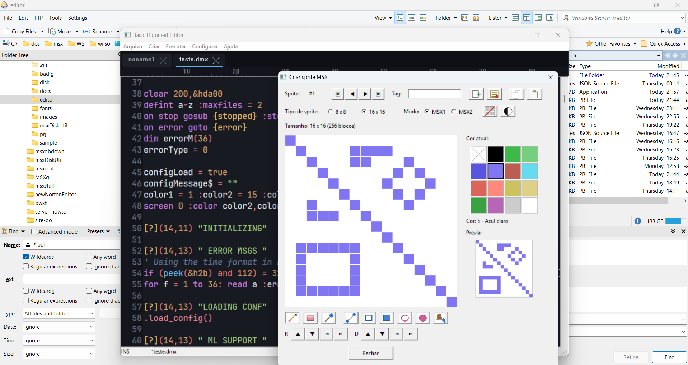

# Manual da IDE — MSX BASIC + Z80

> Manual de uso da ferramenta em si (compilar, executar, editor de texto, telas de
> configuração). Para a linguagem **Basic Dignified** (o que você escreve dentro do
> editor), veja [`BADIG-USER.md`](BADIG-USER.md), [`DIGNIFIER-USER.md`](DIGNIFIER-USER.md)
> e [`BATOKEN-USER.md`](BATOKEN-USER.md). Para a especificação/arquitetura do projeto,
> veja [`SPEC.md`](SPEC.md).
>
> Documento vivo — cresce conforme novas partes da IDE (assembler Z80, editores visuais,
> etc.) forem ficando prontas. Hoje cobre o editor de texto, o gerenciador de disco, o
> editor de sprites, o editor de alfabetos, o sistema de projeto e o processo de build.

---

## Índice

1. [Compilação](#compilação)
2. [Execução](#execução)
3. [O editor de texto](#o-editor-de-texto)
   - [Teclado estilo WordStar/JOE](#teclado-estilo-wordstarjoe)
   - [Movimento do cursor](#movimento-do-cursor)
   - [Apagar texto](#apagar-texto)
   - [Bloco marcado (selecionar/copiar/mover/apagar)](#bloco-marcado-selecionarcopiarmoverapagar)
   - [Arquivo](#arquivo)
   - [Desfazer / refazer](#desfazer--refazer)
   - [Ajuda embutida (Ctrl+K H)](#ajuda-embutida-ctrlk-h)
   - [Barra de status](#barra-de-status)
   - [O que ainda não está implementado](#o-que-ainda-não-está-implementado)
4. [Telas de configuração](#telas-de-configuração)
5. [Gerenciador de disco MSX](#gerenciador-de-disco-msx)
   - [Menu Criar → Disco... (gerenciador gráfico)](#menu-criar--disco-gerenciador-gráfico)
   - [Linha de comando (`--diskmanipulator`)](#linha-de-comando---diskmanipulator)
6. [Sistema de projeto (arquivo `.msxproject`)](#sistema-de-projeto-arquivo-msxproject)
   - [Projeto implícito "noname"](#projeto-implícito-noname)
   - [Menu Arquivo → Novo projeto... / Abrir projeto...](#menu-arquivo--novo-projeto--abrir-projeto)
   - [Menu Arquivo → Salvar projeto / Salvar projeto como...](#menu-arquivo--salvar-projeto--salvar-projeto-como)
   - [Cópia das abas de texto e diretório de trabalho](#cópia-das-abas-de-texto-e-diretório-de-trabalho)
   - [Ao sair](#ao-sair)
7. [Editor de sprites](#editor-de-sprites)
   - [Grade, tamanho e modo de cor](#grade-tamanho-e-modo-de-cor)
   - [Ferramentas de desenho](#ferramentas-de-desenho)
   - [Barra de projeto (registrar, navegar, copiar/colar)](#barra-de-projeto-registrar-navegar-copiarcolar)
8. [Editor de alfabetos](#editor-de-alfabetos)
   - [Tabela de caracteres e grade de edição](#tabela-de-caracteres-e-grade-de-edição)
   - [Arquivo .ALF (Graphos III)](#arquivo-alf-graphos-iii)
   - [Barra de projeto e o alfabeto padrão ("projeto 0")](#barra-de-projeto-e-o-alfabeto-padrão-projeto-0)

---

## Compilação

O executável é gerado pelo compilador do PureBasic (`pbcompiler.exe`) através do script
[`build.ps1`](../build.ps1), na raiz do projeto. Não é necessário abrir a IDE do
PureBasic — o script cuida de tudo pelo PowerShell.

```powershell
.\build.ps1
```

Isso compila `editor\BadigEditor.pb` e gera `editor\BadigEditor.exe`.

### Onde o script encontra o `pbcompiler.exe`

Nesta ordem de prioridade:

1. Opção `-C` / `--compiler` na linha de comando.
2. Valor salvo em `build.config.json` (criado automaticamente ao lado do script, na
   primeira vez que `-C`/`--compiler` é usado — não versionado no git, é específico de
   cada máquina).
3. Caminho padrão: `%PROGRAMFILES%\PureBasic\Compilers\pbcompiler.exe`.

```powershell
# Primeira vez numa maquina nova (caminho fica salvo para as proximas execucoes)
.\build.ps1 -C "C:\Basic\Compilers\pbcompiler.exe"

# Depois, basta:
.\build.ps1
```

### Parâmetros

`-H`/`--help`, `-C`/`--compiler` e `-R`/`--run` seguem o formato Unix (letra curta +
nome longo com `--`). Os demais ficam no estilo nativo do PowerShell (só forma longa,
um traço).

| Parâmetro | Descrição |
|---|---|
| `-C`, `--compiler <caminho>` | Caminho para o `pbcompiler.exe`. |
| `-R`, `--run` | Executa o programa automaticamente após uma compilação sem erros. |
| `-H`, `--help` | Mostra a lista de opções e sai. |
| `-V`, `--version <versão>` | Versão embutida no executável (padrão `5.7.3`). |
| `-i`, `--sourcefile <arquivo>` | Arquivo fonte a compilar (padrão `editor\BadigEditor.pb`). |
| `-o`, `--outputexe <arquivo>` | Caminho do executável de saída (padrão `editor\BadigEditor.exe`). |

```powershell
# Compila e ja abre o programa
.\build.ps1 -R
.\build.ps1 --run

# Marca uma nova versao
.\build.ps1 -V "5.8.0" -R

# Lista as opcoes
.\build.ps1 -H
```

### Versão e build

A cada compilação, o script grava no executável (via `/CONSTANT` do `pbcompiler.exe`):

- **Versão** — string livre (`-V`/`--version`, padrão `5.7.3`).
- **Build** — data/hora **UTC** do momento da compilação, convertida para **hexadecimal**
  (segundos desde a época Unix, ex.: `6A57EA80`). Cada build tem um identificador único e
  ordenável.

Essas informações aparecem dentro do programa em **Ajuda → Sobre...**.

---

## Execução

Depois de compilado, basta rodar o executável gerado:

```powershell
.\editor\BadigEditor.exe
```

ou usar `.\build.ps1 -Run` para compilar e abrir em um único passo.

Na primeira execução vale abrir **Configurar → Editor...** para escolher fonte e tema, e
**Configurar → Basic Dignified...** para apontar (ou baixar) o toolchain Python de
referência — ver [Telas de configuração](#telas-de-configuração).

---

## O editor de texto

### Teclado estilo WordStar/JOE

O editor é baseado no [**JOE** (Joe's Own Editor)](https://joe-editor.sourceforge.io/),
que por sua vez reproduz o teclado clássico do **WordStar** (modo `jstar` do JOE) — os
comandos usam `Ctrl` + uma letra, muitos deles em **duas teclas** (ex.: `Ctrl+K` seguido
de `B`), sem precisar do mouse nem das setas.

Esta primeira leva implementa o conjunto **básico** do JOE (a "Basic Help Screen" que ele
mesmo mostra com `Ctrl+J`): movimento do cursor, apagar texto, bloco marcado, arquivo e
desfazer/refazer. Mais comandos (busca, reformatar parágrafo, etc.) entram depois — ver
[O que ainda não está implementado](#o-que-ainda-não-está-implementado).

> **Importante:** como no WordStar de verdade, `Ctrl+S` **não salva** — move o cursor para
> a esquerda. Salvar é `Ctrl+K D` (ver [Arquivo](#arquivo)).

Nos comandos de duas teclas (`Ctrl+K x`, `Ctrl+Q x`), a segunda tecla pode ser digitada
**com ou sem** `Ctrl` — `Ctrl+K` depois `B` funciona igual a `Ctrl+K` depois `Ctrl+B`.

### Movimento do cursor

| Tecla | Ação |
|---|---|
| `Ctrl+S` | Um caractere para a esquerda |
| `Ctrl+D` | Um caractere para a direita |
| `Ctrl+E` | Uma linha para cima |
| `Ctrl+X` | Uma linha para baixo |
| `Ctrl+A` | Palavra anterior |
| `Ctrl+F` | Próxima palavra |
| `Ctrl+R` | Tela anterior (Page Up) |
| `Ctrl+C` | Próxima tela (Page Down) |
| `Ctrl+Q S` | Início da linha |
| `Ctrl+Q D` | Fim da linha |
| `Ctrl+Q R` | Início do arquivo |
| `Ctrl+Q C` | Fim do arquivo |

### Apagar texto

| Tecla | Ação |
|---|---|
| `Ctrl+G` | Apaga o caractere sob o cursor (para a frente) |
| `Ctrl+H` / `Backspace` | Apaga o caractere anterior |
| `Ctrl+T` | Apaga a palavra à direita |
| `Ctrl+Y` | Apaga a linha inteira |
| `Ctrl+Q Y` | Apaga até o fim da linha |

### Bloco marcado (selecionar/copiar/mover/apagar)

Diferente de uma seleção comum (arrastar o mouse ou Shift+setas), o bloco do
WordStar/JOE é marcado por **dois pontos fixos** no texto — `Ctrl+K B` (início) e
`Ctrl+K K` (fim) — e continua destacado mesmo depois que o cursor se move para outro
lugar (é assim que dá para marcar, navegar até o destino, e só então copiar/mover).

| Tecla | Ação |
|---|---|
| `Ctrl+K B` | Marca o **início** do bloco na posição do cursor |
| `Ctrl+K K` | Marca o **fim** do bloco na posição do cursor |
| `Ctrl+K C` | **Copia** o bloco para a posição atual do cursor (o bloco original continua marcado — dá para repetir `Ctrl+K C` em vários lugares) |
| `Ctrl+K V` | **Move** o bloco para a posição atual do cursor (cursor precisa estar fora do bloco) |
| `Ctrl+K Y` | **Apaga** o bloco marcado |

`Ctrl+K C` e `Ctrl+K V` também colocam o texto do bloco na área de transferência do
Windows, para colar em outros programas. Não há tecla dedicada para desmarcar — marcar de
novo (`Ctrl+K B` seguido de `Ctrl+K K` na mesma posição) produz uma marca de tamanho zero,
que fica sem destaque.

### Arquivo

| Tecla | Ação |
|---|---|
| `Ctrl+K D` | Salva o arquivo |
| `Ctrl+K E` | Abre um arquivo |
| `Ctrl+K X` | Salva e fecha a aba atual |
| `Ctrl+K Q` | Fecha a aba atual (avisa se há alterações não salvas) |

Esses comandos também estão disponíveis pelo menu **Arquivo**.

**Tipos de arquivo**: o menu **Arquivo** tem dois comandos de "criar novo" — **Novo** (`Ctrl+N`) cria
uma aba MSX-BASIC/Dignified (`.dmx`), **Novo Assembly** (`Ctrl+Shift+N`) cria uma aba Z80 Assembly
(`.asm`). Cada aba lembra seu próprio tipo (detectado automaticamente pela extensão ao abrir um
arquivo existente — `.asm`/`.z80`/`.mac` viram Assembly, o resto vira Dignified) e aplica o destaque
de sintaxe certo: o dialeto Dignified numa aba `.dmx`, ou o vocabulário do assembler
**N80/Nestor80** (mnemônicos, registradores, diretivas, literais numéricos em qualquer radix) numa
aba `.asm`. O motor que monta `.asm` em binário Z80 ainda não existe — por enquanto a aba `.asm` é só
edição com destaque de sintaxe, ver [`SPEC.md`](SPEC.md#2-assembler-z80).

### Desfazer / refazer

| Tecla | Ação |
|---|---|
| `Ctrl+U` | Desfazer |
| `Ctrl+Shift+6` (`Ctrl+^`) | Refazer |
| `Ctrl+V` | Alterna entre inserção e sobrescrita (Insert/Overtype) |

### Ajuda embutida (Ctrl+K H)

`Ctrl+K H` mostra, dentro da própria área do editor (como no JOE/WordStar), uma tela com
os atalhos acima organizados por seção (Cursor, Apagar, Bloco marcado, Arquivo, Outros).
**Qualquer tecla** (ou clique) fecha a ajuda e devolve o foco para o texto — não precisa
ser a mesma combinação que abriu.

### Barra de status

O rodapé da janela mostra, sempre atualizado:

| Campo | Conteúdo |
|---|---|
| Modo | `INS` (inserção) ou `SBR` (sobrescrita — `Ctrl+V`). Enquanto um comando de duas teclas está pendente (`Ctrl+K`/`Ctrl+Q` já apertado, esperando a segunda tecla), mostra `^K`/`^Q` no lugar. |
| Nome do arquivo | Nome da aba ativa, com `*` se houver alterações não salvas. |
| Linha/Coluna | Posição atual do cursor no documento ativo. |

### O que ainda não está implementado

Fica para uma próxima etapa (o JOE tem bem mais comandos que isso — veja a referência em
[joe-editor.sourceforge.io](https://joe-editor.sourceforge.io/)):

- Busca e substituição (`Ctrl+Q F`, `Ctrl+L`)
- Reformatar parágrafo (`Ctrl+B`)
- Salvar bloco marcado direto num arquivo (`Ctrl+K W`)
- Menu de opções do editor (`Ctrl+O`, no JOE — não confundir com o `Ctrl+O` de "Abrir" já
  usado pelo menu **Arquivo** desta IDE)

---

## Telas de configuração

- **Configurar → Editor...** — fonte (só monoespaçadas, com botão para baixar fontes
  [Nerd Fonts](https://www.nerdfonts.com/) direto de dentro da IDE), tema claro/escuro,
  estilo de abas, caminho de instalação do editor.
- **Configurar → Basic Dignified...** — três abas:
  - **Basic Dignified** — opções do pré-processador/tokenizador e diretório de instalação do
    toolchain Python de referência (com botão para baixar via `git clone` ou `.zip` do GitHub).
  - **MSX** — opções específicas do dialeto/tokenizador MSX.
  - **Emulador** — caminho do executável do openMSX, **Máquina** e **Extensão de disco** (cada
    campo tem um botão "..." que lista as máquinas/extensões disponíveis em `share/machines`/
    `share/extensions` a partir do caminho do openMSX configurado, sem precisar digitar o nome de
    cabeça), e a opção **"Abrir o openMSX e rodar o código após gerar"**: quando marcada, o menu
    **Arquivo → Dignified → tokenizado nativo (.bmx)...** passa a montar um disquete com o programa
    gerado (mais um `AUTOEXEC.BAS` para rodar automaticamente) e abrir o openMSX direto nele, já
    com a máquina/extensão escolhidas.
- **Ajuda → Sobre...** — versão, build e data de compilação (ver
  [Versão e build](#versão-e-build)).

---

## Gerenciador de disco MSX

### Menu Criar → Disco... (gerenciador gráfico)

O menu **Criar → Disco...** abre uma janela com dois painéis (estilo Norton/Total Commander) para
montar imagens de disco MSX (`.dsk`) sem sair do editor:

- **Campo "Arquivo do disco"** (topo) — o botão **"..."** abre o diálogo padrão do Windows para
  escolher um `.dsk` já existente (abre para edição) ou digitar um caminho novo (cria um disco em
  branco de 720 KB).
- **Painel esquerdo** — sistema de arquivos local, começando no diretório onde o `BadigEditor.exe`
  está rodando. Duplo-clique numa pasta entra nela; duplo-clique em `..` sobe um nível.
- **Painel direito** — conteúdo do disco aberto/em criação.
- **`Adicionar >>` / `<< Extrair`** — transferem os arquivos selecionados (seleção múltipla suportada)
  entre os dois painéis. **Sempre por cópia** — o arquivo de origem nunca é apagado.
- **`Remover local` / `Remover disco`** — excluem de verdade os arquivos selecionados (do sistema de
  arquivos do Windows ou de dentro do disco, respectivamente), pedindo confirmação antes por serem
  ações destrutivas. `Remover disco` fica desabilitado até que um disco esteja aberto.
- **Salvar / Salvar como... / Duplicar... / Excluir disco... / Cancelar** — todas as operações acima
  acontecem numa **cópia de rascunho temporária**; o arquivo `.dsk` escolhido no topo só é gravado de
  verdade num destes botões:
  - **Salvar** — grava no arquivo escolhido e fecha a janela.
  - **Salvar como...** — pergunta um caminho novo e grava lá (a janela continua fechando ao final).
  - **Duplicar...** — grava uma cópia extra num caminho escolhido **sem** fechar a sessão — o
    trabalho continua no disco original.
  - **Excluir disco...** — apaga o arquivo `.dsk` de destino (se já existir) e reinicia a janela do
    zero, pronta para outro disco.
  - **Cancelar** (ou fechar a janela) — descarta o rascunho sem tocar no arquivo escolhido no topo.

### Linha de comando (`--diskmanipulator`)

O mesmo motor de disco também está disponível como utilitário de linha de comando, sem abrir
nenhuma janela — útil em scripts:

```powershell
BadigEditor.exe --diskmanipulator create disco.dsk
BadigEditor.exe --diskmanipulator list disco.dsk -l
BadigEditor.exe --diskmanipulator add disco.dsk arquivo.bas *.txt
BadigEditor.exe --diskmanipulator extract disco.dsk -d pasta_saida *.bas
BadigEditor.exe --diskmanipulator delete disco.dsk arquivo.bas
```

| Comando | Descrição |
|---|---|
| `create <disco.dsk> [boot.bin]` | Cria uma imagem de disco MSX em branco (720 KB), com setor de boot customizado opcional. |
| `list <disco.dsk> [-l]` | Lista os arquivos do disco (`-l` mostra tamanho e data/hora). |
| `add <disco.dsk> <arquivo...>` | Adiciona um ou mais arquivos locais (aceita curingas como `*.BAS`). |
| `extract <disco.dsk> [-d pasta] [máscara...]` | Extrai arquivos do disco, opcionalmente filtrando por máscara. |
| `delete <disco.dsk> <arquivo>` | Remove um arquivo de dentro do disco. |

Diferente da versão gráfica, a CLI grava direto no arquivo informado (sem cópia de rascunho) — mesmo
comportamento do utilitário `msxdisk.exe` original.

---

## Sistema de projeto (arquivo `.msxproject`)

Um **projeto** MSX inteiro — os sprites do [editor de sprites](#editor-de-sprites), os alfabetos do
[editor de alfabetos](#editor-de-alfabetos), uma cópia do conteúdo das abas de texto já salvas em disco
e o diretório de trabalho (outros tipos de conteúdo — Basic, Assembly, telas, sons, músicas, listagens
LM — entram conforme ganharem editor próprio) — fica guardado num único arquivo `.msxproject` (um banco
SQLite).

### Projeto implícito "noname"

Ao abrir a IDE **sem passar nenhum parâmetro na linha de comando** (o uso normal, clicando no `.exe`),
um projeto implícito chamado **`noname.msxproject`** já é criado de cara, num arquivo temporário. Não
é preciso criar ou escolher um projeto antes de usar o editor de sprites/alfabetos — tudo que for
registrado vai sendo gravado nesse projeto automaticamente.

### Menu Arquivo → Novo projeto... / Abrir projeto...

- **Novo projeto...** — pede um caminho (diálogo padrão do Windows, escolhe pasta e nome de uma vez) e
  troca para um projeto novo e vazio nesse local. Se o projeto atual ainda for o `noname` temporário e
  já tiver conteúdo registrado, pergunta antes se você quer salvá-lo permanentemente (cancelar esse
  diálogo de salvar cancela a troca de projeto também — nada é descartado sem avisar).
- **Abrir projeto...** — mesma lógica, mas abre um arquivo `.msxproject` já existente em vez de criar
  um novo.

### Menu Arquivo → Salvar projeto / Salvar projeto como...

- **Salvar projeto** — se o projeto atual já tem um caminho permanente, não faz nada visível (o
  `.msxproject` já grava cada sprite/alfabeto/documento registrado na hora, não existe estado "sujo" em
  memória à espera de um save); se ainda for o `noname` temporário, cai no mesmo fluxo do item abaixo.
- **Salvar projeto como...** — sempre pergunta um caminho novo (sugerindo o atual, se já for
  permanente) e promove/copia o projeto pra lá — é como se salva **uma cópia do projeto com outro
  nome**. Se o nome digitado não tiver extensão, `.msxproject` é acrescentada automaticamente.

### Cópia das abas de texto e diretório de trabalho

Além dos sprites e alfabetos, o projeto também guarda automaticamente:

- Uma **cópia sempre atualizada** do conteúdo de cada aba de texto (`.dmx`/`.amx`/`.asm`) já salva em
  disco pelo menos uma vez — sincronizada a cada `Ctrl+K D`/"Salvar como" de uma aba, além do arquivo
  físico que já ia para o disco. Abas ainda não salvas ("nonameN") não entram, por não terem um
  caminho ainda.
- O **diretório de trabalho** — a pasta do último arquivo salvo, ou o diretório corrente enquanto nada
  foi salvo ainda.

### Ao sair

Se o projeto atual ainda for o `noname` temporário **e** já tiver algo registrado (pelo menos um
sprite ou alfabeto), a IDE pergunta, ao fechar, se você quer salvá-lo — respondendo que sim, abre o
mesmo diálogo de "escolher pasta e nome definitivo" do **Novo projeto...**. Se não houver nada
registrado, ou se o projeto já estiver salvo num arquivo permanente, a IDE fecha direto, sem perguntar
nada.

---

## Editor de sprites



O menu **Criar → Sprite...** abre o editor gráfico de sprites MSX, numa janela própria.

### Grade, tamanho e modo de cor

- **Tipo de sprite** — radio **8×8** / **16×16**, os dois tamanhos reais de sprite do VDP do MSX. A
  área de desenho (canvas) tem sempre o mesmo tamanho em pixels; é o tamanho de cada bloco que muda ao
  trocar entre os dois.
- **Modo** — radio **MSX1** / **MSX2**, controla a regra de cor do hardware real:
  - **MSX1**: o sprite inteiro só pode ter **uma cor**. Trocar a cor atual (ou pintar) recolore
    instantaneamente tudo que já estava pintado.
  - **MSX2**: **cada linha** pode ter a sua própria cor (recurso real do VDP do MSX2), mas só uma cor
    dentro da mesma linha — pintar um bloco numa linha recolore automaticamente o resto da linha para
    bater com a cor usada.
- **Cor atual** — seletor com as 16 cores fixas da palheta original do MSX1 (TMS9918); o primeiro
  quadro (com um "X") é o índice 0, transparente.
- **Prévia** — canto da janela mostra o sprite em escala reduzida, mais perto do tamanho real (sem as
  linhas de grade da área de edição).

### Ferramentas de desenho

Barra de ícones logo abaixo da grade — só uma ferramenta fica ativa por vez:

| Ícone | Ferramenta | Como usar |
|---|---|---|
| Lápis | Pinta um bloco por vez | Clique, ou arraste com o botão esquerdo pressionado para riscar continuamente. |
| Borracha | Apaga um bloco por vez | Mesmo gesto do lápis, mas apagando. |
| Pincel | Pinta um bloco 2×2 por vez | Mesmo gesto do lápis, "mais grosso". |
| Balde | Preenche uma área conectada | Clique dentro de uma região fechada — pinta tudo que estiver conectado com a mesma cor. |
| Reta | Traça uma linha reta | Marque o ponto inicial (fica piscando) e o final — veja abaixo. |
| Retângulo (vazio/cheio) | Desenha um retângulo | Marque dois cantos opostos. |
| Elipse/círculo (vazio/cheio) | Desenha uma elipse | Marque dois cantos da caixa delimitadora. |

**Ferramentas de dois pontos** (reta, retângulo, elipse): o primeiro clique marca o ponto inicial — um
marcador fica **piscando** nele — e, conforme o mouse se move, a forma que seria traçada aparece **em
prévia** sobre a grade. O segundo clique confirma. Para **cancelar sem traçar nada**, aperte **Esc**
ou clique com o **botão direito** do mouse.

Abaixo das ferramentas de desenho:

- **Rotacionar** (com "quebra" nas bordas — o que sai de um lado reaparece do outro) e **Deslocar**
  (sem quebra — o que sai se perde, o espaço liberado vira transparente), nas quatro direções.
- **Inverter** todos os pontos, **Limpar** tudo.

### Barra de projeto (registrar, navegar, copiar/colar)

Barra no topo da janela, ligada ao [sistema de projeto](#sistema-de-projeto-arquivo-msxproject):

- **Número do sprite** — mostrado como `#N`; cada sprite registrado tem um número sequencial.
- **Tag** — nome curto (até 16 caracteres) para identificar o sprite.
- **Navegação** — botões **Primeiro** / **Anterior** / **Próximo** / **Último**, andam entre os
  sprites já registrados no projeto atual (param nas pontas, não dão volta).
- **Novo** — cria o próximo sprite da sequência (maior número já registrado + 1), com a grade em
  branco.
- **Registrar** — grava (ou atualiza, se já existir) o sprite atual no projeto.
- **Copiar** / **Colar** — copiam o sprite atual (grade, tamanho e modo) para colar em outro número —
  útil para duplicar um sprite parecido antes de fazer variações.

Alterações feitas num sprite e ainda não registradas pedem confirmação antes de trocar de sprite ou
fechar a janela, para não perder trabalho sem querer.

---

## Editor de alfabetos

O menu **Criar → Alfabeto...** abre o editor de charsets (fontes de caracteres 8×8) MSX, no formato
de arquivo **`.ALF` do [Graphos III](https://www.msx.org/wiki/Graphos)**, numa janela própria.

### Tabela de caracteres e grade de edição

- **Tabela** — os 256 caracteres do alfabeto (16 colunas × 16 linhas), cada um mostrado como uma
  miniatura do seu desenho 8×8 atual. O cabeçalho de linha/coluna é hexadecimal — a própria posição na
  grade já é o código do caractere (linha = byte alto, coluna = nibble baixo), como um mapa de
  caracteres clássico. Clicar num caractere carrega o desenho dele na grade grande à direita; o
  selecionado ganha um contorno vermelho.
- **Grade de edição** — versão bem ampliada (8×8 quadrados grandes) do caractere selecionado. Clique
  liga/desliga um pixel; arrastar com o botão esquerdo pressionado pinta uma sequência de pixels com o
  mesmo valor do primeiro clique (não fica alternando a cada pixel passado por cima). Os 8 bytes
  hexadecimais resultantes aparecem ao lado, atualizados a cada pixel alterado.
- **Registrar** — grava os pixels editados de volta nos 8 bytes do caractere selecionado (e atualiza a
  miniatura dele na tabela). **Editar sem clicar em "Registrar" não muda o alfabeto** — trocar de
  caractere ou fechar a janela com edições pendentes pede confirmação.
- **Limpar** / **Inverter** — limpam ou invertem todos os pixels da grade de edição (ainda precisam de
  "Registrar" para valer).

### Arquivo .ALF (Graphos III)

- **Abrir...** / **Salvar como...** — leem e gravam arquivos `.alf` de verdade, no formato binário
  clássico do MSX: um cabeçalho de 7 bytes (byte de tipo `&HFE`, endereços inicial/final/execução, 2
  bytes cada) seguido dos 2048 bytes de dados (256 caracteres × 8 bytes) — originalmente carregado no
  endereço de VRAM `&H9200`, a Pattern Generator Table. Se o nome digitado não tiver extensão, `.alf` é
  acrescentada automaticamente. Um cabeçalho com byte de tipo ou tamanho inválido é rejeitado com
  mensagem de erro, em vez de carregar dados sem sentido silenciosamente.
- Esses dois botões são **independentes do sistema de projeto** abaixo — servem pra importar/exportar
  arquivos `.alf` compatíveis com o Graphos III de verdade, não pra guardar o alfabeto no
  `.msxproject`.

### Barra de projeto e o alfabeto padrão ("projeto 0")

Barra no topo da janela, ligada ao [sistema de projeto](#sistema-de-projeto-arquivo-msxproject) — mesmo
padrão da barra de projeto do editor de sprites:

- **Número do alfabeto** — mostrado como `#N`; cada alfabeto registrado tem um número sequencial.
- **Tag** — nome curto (até 16 caracteres) para identificar o alfabeto.
- **Navegação** — botões **Primeiro** / **Anterior** / **Próximo** / **Último**, andam entre os
  alfabetos já registrados no projeto atual (param nas pontas, não dão volta).
- **Novo alfabeto** — cria o próximo alfabeto da sequência (maior número já registrado + 1), **sempre
  partindo do charset padrão do MSX** (nunca em branco — diferente do "Novo" do editor de sprites).
- **Registrar alfabeto** — grava (ou atualiza, se já existir) o alfabeto inteiro (os 256 caracteres) no
  projeto. Também aplica antes qualquer edição pendente do caractere que estiver selecionado, para não
  deixar pixels não registrados de fora.

O **charset padrão do MSX** usado como ponto de partida (ao abrir a janela sem nenhum alfabeto ainda
registrado no projeto, e sempre em "Novo alfabeto") vem de um **alfabeto embutido no próprio
executável** — não depende de nenhum arquivo externo em tempo de execução. Internamente ele mora num
**"projeto 0"**: um banco de dados separado, sempre em memória, nunca salvo em disco, recriado do zero
a cada vez que a IDE é aberta — só serve como fonte interna de conteúdo padrão.

Alterações feitas num alfabeto (ou num caractere dele) e ainda não registradas pedem confirmação antes
de navegar para outro alfabeto, criar um novo ou fechar a janela.
