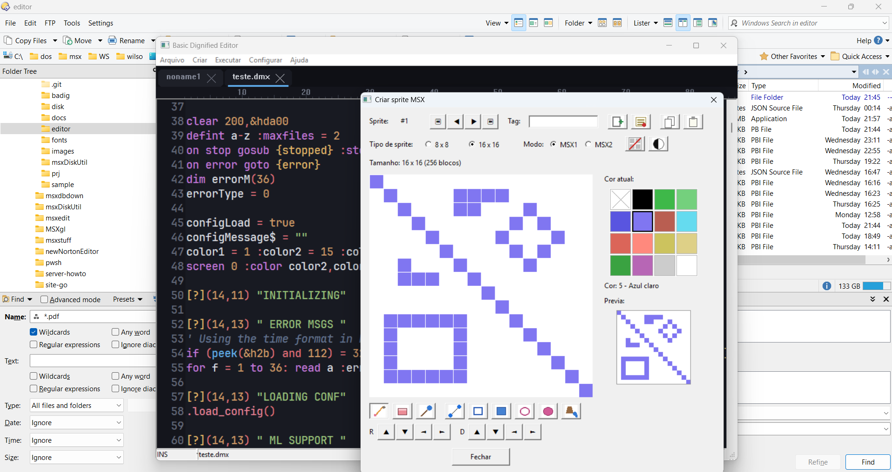
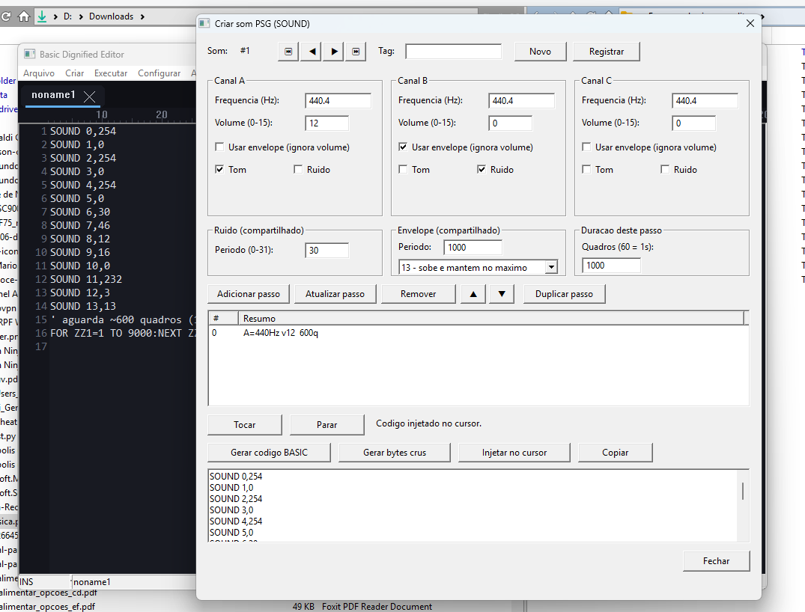
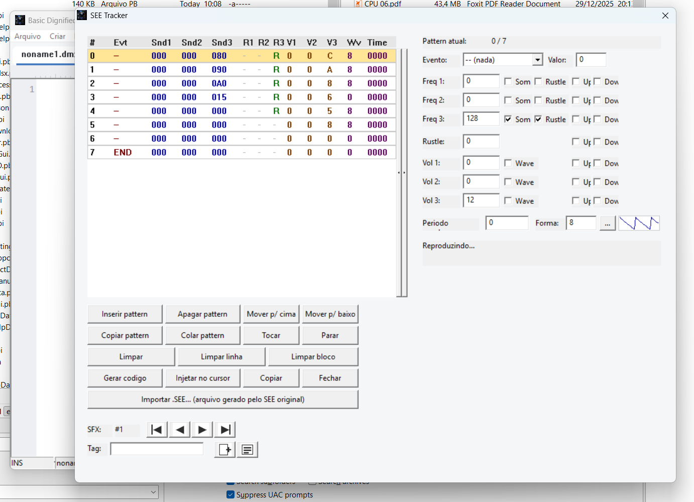
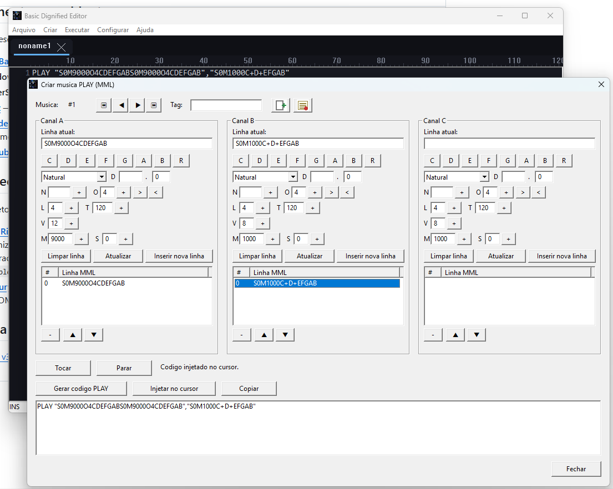
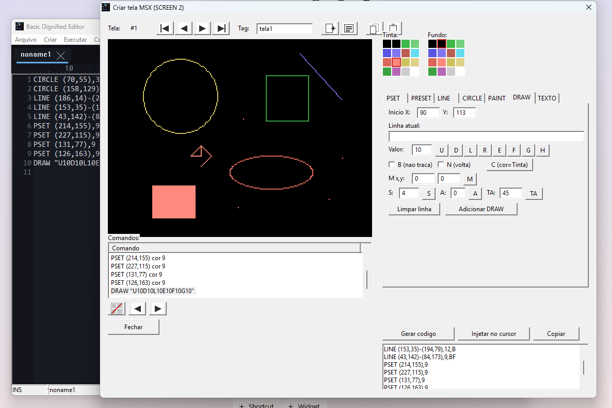
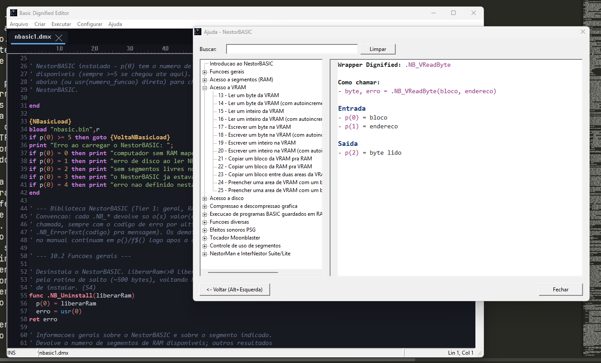
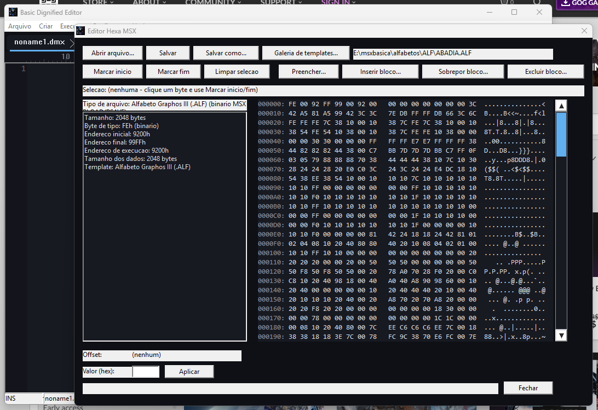

# Manual da IDE — MSX BASIC + Z80

> Manual de uso da ferramenta em si (compilar, executar, editor de texto, telas de
> configuração). Para a linguagem **Basic Dignified** (o que você escreve dentro do
> editor), veja [`BADIG-USER.md`](BADIG-USER.md), [`DIGNIFIER-USER.md`](DIGNIFIER-USER.md)
> e [`BATOKEN-USER.md`](BATOKEN-USER.md). Para a especificação/arquitetura do projeto,
> veja [`SPEC.md`](SPEC.md).
>
> Documento vivo — cresce conforme novas partes da IDE (editores visuais, etc.) forem ficando
> prontas. Hoje cobre o editor de texto, o pipeline de conversão/tokenização/renumeração de
> MSX-BASIC clássico, o gerenciador de disco, o editor de sprites, o editor de alfabetos
> (Graphos III e Aquarela), o editor de som, o editor de música, o editor de DRAW Screen 2, o
> assembler Z80 (nativo e a integração com N80/LinkStor80/LibStor80), o sistema de projeto, a
> ajuda embutida de MSX BASIC/MSX2+, o suporte a NestorBASIC e a MSXBAS2ROM, o editor
> hexadecimal e o processo de build.

---

## Índice

1. [Compilação](#compilação)
2. [Execução](#execução)
3. [O editor de texto](#o-editor-de-texto)
   - [Teclado estilo WordStar/JOE](#teclado-estilo-wordstarjoe)
   - [Movimento do cursor](#movimento-do-cursor)
   - [Apagar texto](#apagar-texto)
   - [Bloco marcado (selecionar/copiar/mover/apagar)](#bloco-marcado-selecionarcopiarmoverapagar)
   - [Arquivo](#arquivo)
   - [Desfazer / refazer](#desfazer--refazer)
   - [Ajuda embutida (Ctrl+K H)](#ajuda-embutida-ctrlk-h)
   - [Barra de status](#barra-de-status)
   - [O que ainda não está implementado](#o-que-ainda-não-está-implementado)
4. [MSX-BASIC clássico: converter, tokenizar e renumerar](#msx-basic-clássico-converter-tokenizar-e-renumerar)
   - [Executar → Renumerar...](#executar--renumerar)
5. [Telas de configuração](#telas-de-configuração)
6. [Gerenciador de disco MSX](#gerenciador-de-disco-msx)
   - [Menu Criar → Disco... (gerenciador gráfico)](#menu-criar--disco-gerenciador-gráfico)
   - [Linha de comando (`--diskmanipulator`)](#linha-de-comando---diskmanipulator)
7. [Sistema de projeto (arquivo `.msxproject`)](#sistema-de-projeto-arquivo-msxproject)
   - [Projeto implícito "noname"](#projeto-implícito-noname)
   - [Menu Arquivo → Novo projeto... / Abrir projeto...](#menu-arquivo--novo-projeto--abrir-projeto)
   - [Menu Arquivo → Salvar projeto / Salvar projeto como...](#menu-arquivo--salvar-projeto--salvar-projeto-como)
   - [Cópia das abas de texto e diretório de trabalho](#cópia-das-abas-de-texto-e-diretório-de-trabalho)
   - [Ao sair](#ao-sair)
8. [Editor de sprites](#editor-de-sprites)
   - [Grade, tamanho e modo de cor](#grade-tamanho-e-modo-de-cor)
   - [Ferramentas de desenho](#ferramentas-de-desenho)
   - [Barra de projeto (registrar, navegar, copiar/colar)](#barra-de-projeto-registrar-navegar-copiarcolar)
9. [Editor de alfabetos](#editor-de-alfabetos)
   - [Tabela de caracteres e grade de edição](#tabela-de-caracteres-e-grade-de-edição)
   - [Marcar bloco (aplicar um efeito num intervalo de caracteres de uma vez)](#marcar-bloco-aplicar-um-efeito-num-intervalo-de-caracteres-de-uma-vez)
   - [Desfazer / refazer](#desfazer--refazer-1)
   - [Efeitos de glifo (espelhar, girar, estreitar, itálico, negrito, largo)](#efeitos-de-glifo-espelhar-girar-estreitar-itálico-negrito-largo)
   - [Copiar/colar um alfabeto inteiro](#copiarcolar-um-alfabeto-inteiro)
   - [Arquivo .ALF (Graphos III)](#arquivo-alf-graphos-iii)
   - [Barra de projeto e o alfabeto padrão ("projeto 0")](#barra-de-projeto-e-o-alfabeto-padrão-projeto-0)
10. [Editor de som (PSG)](#editor-de-som-psg)
    - [Canais A/B/C, ruído e envelope](#canais-abc-ruído-e-envelope)
    - [Sequência de passos](#sequência-de-passos)
    - [Tocar / Parar](#tocar--parar)
    - [Gerar código e injetar no editor](#gerar-código-e-injetar-no-editor)
    - [Barra de projeto](#barra-de-projeto)
11. [Editor SEE Tracker](#editor-see-tracker)
    - [A grade e o painel de edição](#a-grade-e-o-painel-de-edição)
    - [Patterns: inserir, apagar, mover, copiar](#patterns-inserir-apagar-mover-copiar)
    - [Tocar / Parar](#tocar--parar-1)
    - [Gerar código, Injetar no cursor, Copiar](#gerar-código-injetar-no-cursor-copiar)
    - [Importar .SEE...](#importar-see)
    - [Barra de projeto](#barra-de-projeto-1)
12. [Editor de música (MML/PLAY)](#editor-de-música-mmlplay)
    - [Montando uma linha](#montando-uma-linha)
    - [Lista de linhas por canal](#lista-de-linhas-por-canal)
    - [Tocar / Parar](#tocar--parar-2)
    - [Gerar código e injetar no editor](#gerar-código-e-injetar-no-editor-1)
    - [Barra de projeto](#barra-de-projeto-2)
13. [Editor de alfabetos Aquarela](#editor-de-alfabetos-aquarela)
    - [Tabela de 46 caracteres e grade 16x16](#tabela-de-46-caracteres-e-grade-16x16)
    - [Arquivo .FNT](#arquivo-fnt)
14. [Editor de DRAW Screen 2](#editor-de-draw-screen-2)
    - [Canvas, paleta e cor de tinta/fundo](#canvas-paleta-e-cor-de-tintafundo)
    - [Ferramentas de desenho](#ferramentas-de-desenho-1)
    - [Parâmetros STEP e LINE -(x,y)](#parâmetros-step-e-line--xy)
    - [Ferramenta TEXTO — quadro elástico arrastável](#ferramenta-texto--quadro-elástico-arrastável)
    - [Lista de comandos e mini buffers](#lista-de-comandos-e-mini-buffers)
    - [Gerar código e injetar no editor](#gerar-código-e-injetar-no-editor-2)
    - [Barra de projeto](#barra-de-projeto-3)
15. [Graphos III — Tela SCREEN 2](#graphos-iii--tela-screen-2)
    - [Canvas e color clash](#canvas-e-color-clash)
    - [Paleta INK/PAPER e ferramentas](#paleta-inkpaper-e-ferramentas)
16. [Assembler Z80](#assembler-z80)
    - [Aba Assembly (.asm)](#aba-assembly-asm)
    - [Montar (Ctrl+F5)](#montar-ctrlf5)
    - [O que já é suportado](#o-que-já-é-suportado)
    - [Montar relocável (.REL)](#montar-relocável-rel)
    - [Linkar (.REL) → binário](#linkar-rel--binário)
    - [Biblioteca Z80 (.LIB)](#biblioteca-z80-lib)
    - [Assembly Sub Project (Makefile primitivo)](#assembly-sub-project-makefile-primitivo)
    - [O que ainda não é suportado](#o-que-ainda-não-é-suportado)
17. [Ajuda MSX BASIC (dicionário e manual, MSX1 e MSX2+)](#ajuda-msx-basic-dicionário-e-manual-msx1-e-msx2)
    - [Abrindo e navegando](#abrindo-e-navegando)
    - [O que está coberto](#o-que-está-coberto)
18. [Suporte a NestorBASIC](#suporte-a-nestorbasic)
    - [Arquivo → Novo Nestor Basic...](#arquivo--novo-nestor-basic)
    - [Executar → Nestor Basic](#executar--nestor-basic)
    - [Ajuda → Nestor Basic...](#ajuda--nestor-basic)
19. [Suporte a MSXBAS2ROM](#suporte-a-msxbas2rom)
    - [Arquivo → Novo MSXBas2Rom...](#arquivo--novo-msxbas2rom)
    - [Configurar → MSXBas2Rom...](#configurar--msxbas2rom)
    - [Ajuda → MSXBas2Rom...](#ajuda--msxbas2rom)
20. [N80, LinkStor80 e LibStor80](#n80-linkstor80-e-libstor80)
    - [Configurar → N80...](#configurar--n80)
    - [Ajuda → N80...](#ajuda--n80)
21. [Ajuda Basic Dignified (sintaxe da linguagem e configurações desta IDE)](#ajuda-basic-dignified-sintaxe-da-linguagem-e-configurações-desta-ide)
    - [O que está coberto](#o-que-está-coberto-1)
22. [Ajuda SEE Tracker (manual original e formato de arquivo)](#ajuda-see-tracker-manual-original-e-formato-de-arquivo)
    - [O que está coberto](#o-que-está-coberto-2)
23. [Editor Hexa](#editor-hexa)
    - [Abrir/Salvar e a grade hex/ASCII](#abrirsalvar-e-a-grade-hexascii)
    - [Reconhecimento de formato](#reconhecimento-de-formato)
    - [Galeria de templates](#galeria-de-templates)
    - [Intervalo marcado e operações de bloco](#intervalo-marcado-e-operações-de-bloco)
    - [Barra de rolagem](#barra-de-rolagem)
24. [Inserir → Caractere Especial](#inserir--caractere-especial)
    - [A grade e a prévia](#a-grade-e-a-prévia)
    - [Campo acumulador e o botão Inserir](#campo-acumulador-e-o-botão-inserir)
25. [Editor de tela SCREEN 0](#editor-de-tela-screen-0)
    - [Largura, fonte e cor (INK/PAPER único pra tela inteira)](#largura-fonte-e-cor-inkpaper-único-pra-tela-inteira)
    - [Ferramentas](#ferramentas)
    - [Gerar código e injetar no editor](#gerar-código-e-injetar-no-editor-3)
    - [Barra de projeto](#barra-de-projeto-4)
26. [Editor de tela SCREEN 1](#editor-de-tela-screen-1)
    - [Fonte e a tabela ASCII do alfabeto (cor por octeto)](#fonte-e-a-tabela-ascii-do-alfabeto-cor-por-octeto)
    - [Ferramentas](#ferramentas-2)
    - [Gerar código e injetar no editor](#gerar-código-e-injetar-no-editor-4)
    - [Barra de projeto](#barra-de-projeto-5)
27. [Editor de tela SCREEN 1+2](#editor-de-tela-screen-12)
    - [3 alfabetos, um por terço da tela](#3-alfabetos-um-por-terço-da-tela)
    - [Cor por linha de scanline (o modo mais complexo)](#cor-por-linha-de-scanline-o-modo-mais-complexo)
    - [Ferramentas](#ferramentas-3)
    - [Gerar código e injetar no editor](#gerar-código-e-injetar-no-editor-5)
    - [Barra de projeto](#barra-de-projeto-6)

---

## Compilação

O executável é gerado pelo compilador do PureBasic (`pbcompiler.exe`) através do script
[`build.ps1`](../build.ps1), na raiz do projeto. Não é necessário abrir a IDE do
PureBasic — o script cuida de tudo pelo PowerShell.

```powershell
.\build.ps1
```

Isso compila `editor\BadigEditor.pb` e gera `editor\BadigEditor.exe`.

### Onde o script encontra o `pbcompiler.exe`

Nesta ordem de prioridade:

1. Opção `-C` / `--compiler` na linha de comando.
2. Valor salvo em `build.config.json` (criado automaticamente ao lado do script, na
   primeira vez que `-C`/`--compiler` é usado — não versionado no git, é específico de
   cada máquina).
3. Caminho padrão: `%PROGRAMFILES%\PureBasic\Compilers\pbcompiler.exe`.

```powershell
# Primeira vez numa maquina nova (caminho fica salvo para as proximas execucoes)
.\build.ps1 -C "C:\Basic\Compilers\pbcompiler.exe"

# Depois, basta:
.\build.ps1
```

### Parâmetros

`-H`/`--help`, `-C`/`--compiler` e `-R`/`--run` seguem o formato Unix (letra curta +
nome longo com `--`). Os demais ficam no estilo nativo do PowerShell (só forma longa,
um traço).

| Parâmetro | Descrição |
|---|---|
| `-C`, `--compiler <caminho>` | Caminho para o `pbcompiler.exe`. |
| `-R`, `--run` | Executa o programa automaticamente após uma compilação sem erros. |
| `-H`, `--help` | Mostra a lista de opções e sai. |
| `-V`, `--version <versão>` | Versão embutida no executável (padrão `7.1.1`). |
| `-i`, `--sourcefile <arquivo>` | Arquivo fonte a compilar (padrão `editor\BadigEditor.pb`). |
| `-o`, `--outputexe <arquivo>` | Caminho do executável de saída (padrão `editor\BadigEditor.exe`). |

```powershell
# Compila e ja abre o programa
.\build.ps1 -R
.\build.ps1 --run

# Marca uma nova versao
.\build.ps1 -V "5.8.0" -R

# Lista as opcoes
.\build.ps1 -H
```

### Versão e build

A cada compilação, o script grava no executável (via `/CONSTANT` do `pbcompiler.exe`):

- **Versão** — string livre (`-V`/`--version`, padrão `7.1.1`).
- **Build** — data/hora **UTC** do momento da compilação, convertida para **hexadecimal**
  (segundos desde a época Unix, ex.: `6A57EA80`). Cada build tem um identificador único e
  ordenável.

Essas informações aparecem dentro do programa em **Ajuda → Sobre...**.

---

## Execução

Depois de compilado, basta rodar o executável gerado:

```powershell
.\editor\BadigEditor.exe
```

ou usar `.\build.ps1 -Run` para compilar e abrir em um único passo.

Na primeira execução vale abrir **Configurar → Editor...** para escolher fonte e tema, e
**Configurar → Basic Dignified...** para apontar (ou baixar) o toolchain Python de
referência — ver [Telas de configuração](#telas-de-configuração).

---

## O editor de texto

### Teclado estilo WordStar/JOE

O editor é baseado no [**JOE** (Joe's Own Editor)](https://joe-editor.sourceforge.io/),
que por sua vez reproduz o teclado clássico do **WordStar** (modo `jstar` do JOE) — os
comandos usam `Ctrl` + uma letra, muitos deles em **duas teclas** (ex.: `Ctrl+K` seguido
de `B`), sem precisar do mouse nem das setas.

Esta primeira leva implementa o conjunto **básico** do JOE (a "Basic Help Screen" que ele
mesmo mostra com `Ctrl+J`): movimento do cursor, apagar texto, bloco marcado, arquivo e
desfazer/refazer. Mais comandos (busca, reformatar parágrafo, etc.) entram depois — ver
[O que ainda não está implementado](#o-que-ainda-não-está-implementado).

> **Importante:** como no WordStar de verdade, `Ctrl+S` **não salva** — move o cursor para
> a esquerda. Salvar é `Ctrl+K D` (ver [Arquivo](#arquivo)).

Nos comandos de duas teclas (`Ctrl+K x`, `Ctrl+Q x`), a segunda tecla pode ser digitada
**com ou sem** `Ctrl` — `Ctrl+K` depois `B` funciona igual a `Ctrl+K` depois `Ctrl+B`.

### Movimento do cursor

| Tecla | Ação |
|---|---|
| `Ctrl+S` | Um caractere para a esquerda |
| `Ctrl+D` | Um caractere para a direita |
| `Ctrl+E` | Uma linha para cima |
| `Ctrl+X` | Uma linha para baixo |
| `Ctrl+A` | Palavra anterior |
| `Ctrl+F` | Próxima palavra |
| `Ctrl+R` | Tela anterior (Page Up) |
| `Ctrl+C` | Próxima tela (Page Down) |
| `Ctrl+Q S` | Início da linha |
| `Ctrl+Q D` | Fim da linha |
| `Ctrl+Q R` | Início do arquivo |
| `Ctrl+Q C` | Fim do arquivo |

### Apagar texto

| Tecla | Ação |
|---|---|
| `Ctrl+G` | Apaga o caractere sob o cursor (para a frente) |
| `Ctrl+H` / `Backspace` | Apaga o caractere anterior |
| `Ctrl+T` | Apaga a palavra à direita |
| `Ctrl+Y` | Apaga a linha inteira |
| `Ctrl+Q Y` | Apaga até o fim da linha |

### Bloco marcado (selecionar/copiar/mover/apagar)

Diferente de uma seleção comum (arrastar o mouse ou Shift+setas), o bloco do
WordStar/JOE é marcado por **dois pontos fixos** no texto — `Ctrl+K B` (início) e
`Ctrl+K K` (fim) — e continua destacado mesmo depois que o cursor se move para outro
lugar (é assim que dá para marcar, navegar até o destino, e só então copiar/mover).

| Tecla | Ação |
|---|---|
| `Ctrl+K B` | Marca o **início** do bloco na posição do cursor |
| `Ctrl+K K` | Marca o **fim** do bloco na posição do cursor |
| `Ctrl+K C` | **Copia** o bloco para a posição atual do cursor (o bloco original continua marcado — dá para repetir `Ctrl+K C` em vários lugares) |
| `Ctrl+K V` | **Move** o bloco para a posição atual do cursor (cursor precisa estar fora do bloco) |
| `Ctrl+K Y` | **Apaga** o bloco marcado |

`Ctrl+K C` e `Ctrl+K V` também colocam o texto do bloco na área de transferência do
Windows, para colar em outros programas. Não há tecla dedicada para desmarcar — marcar de
novo (`Ctrl+K B` seguido de `Ctrl+K K` na mesma posição) produz uma marca de tamanho zero,
que fica sem destaque.

### Arquivo

| Tecla | Ação |
|---|---|
| `Ctrl+K D` | Salva o arquivo |
| `Ctrl+K E` | Abre um arquivo |
| `Ctrl+K X` | Salva e fecha a aba atual |
| `Ctrl+K Q` | Fecha a aba atual (avisa se há alterações não salvas) |

Esses comandos também estão disponíveis pelo menu **Arquivo**.

**Tipos de arquivo**: o menu **Arquivo** tem três comandos de "criar novo" que definem o tipo da aba —
**Novo** (`Ctrl+N`, MSX-BASIC/Dignified, `.dmx`), **Novo Assembly** (`Ctrl+Shift+N`, Z80 Assembly,
`.asm`) e **Novo MSXBas2Rom...** (ASCII clássico numerado, `.bas` — ver [Suporte a
MSXBAS2ROM](#suporte-a-msxbas2rom)). Cada aba lembra seu próprio tipo (detectado automaticamente pela
extensão ao abrir um arquivo existente — `.asm`/`.z80`/`.mac` viram Assembly, `.bas` vira MSXBas2Rom, o
resto vira Dignified) e aplica o destaque de sintaxe certo: o dialeto Dignified numa aba `.dmx`
(estendido com os comandos/funções do MSXBAS2ROM — `CMD TURBO`, `SCREEN LOAD`, `HEAP()`,
`COLLISION()` etc. — só numa aba `.bas`, pra não confundir uma variável comum chamada `TURBO` num
programa Dignified qualquer), ou o vocabulário do assembler **N80/Nestor80** (mnemônicos, registradores,
diretivas, literais numéricos em qualquer radix) numa aba `.asm`. O motor que monta `.asm` em binário
Z80 é nativo desta IDE (compatível M80/L80) — ver [Assembler Z80](#assembler-z80). A IDE também consegue
baixar o **N80/LinkStor80/LibStor80** de terceiro (mesmo dialeto, mesmo autor do NestorBASIC) pra uso
via linha de comando fora da IDE — ver [N80, LinkStor80 e LibStor80](#n80-linkstor80-e-libstor80); ainda
não há um botão que monte usando esses binários em vez do motor nativo.

### Desfazer / refazer

| Tecla | Ação |
|---|---|
| `Ctrl+U` | Desfazer |
| `Ctrl+Shift+6` (`Ctrl+^`) | Refazer |
| `Ctrl+V` | Alterna entre inserção e sobrescrita (Insert/Overtype) |

### Ajuda embutida (Ctrl+K H)

`Ctrl+K H` mostra, dentro da própria área do editor (como no JOE/WordStar), uma tela com
os atalhos acima organizados por seção (Cursor, Apagar, Bloco marcado, Arquivo, Outros).
**Qualquer tecla** (ou clique) fecha a ajuda e devolve o foco para o texto — não precisa
ser a mesma combinação que abriu.

### Barra de status

O rodapé da janela mostra, sempre atualizado:

| Campo | Conteúdo |
|---|---|
| Modo | `INS` (inserção) ou `SBR` (sobrescrita — `Ctrl+V`). Enquanto um comando de duas teclas está pendente (`Ctrl+K`/`Ctrl+Q` já apertado, esperando a segunda tecla), mostra `^K`/`^Q` no lugar. |
| Nome do arquivo | Nome da aba ativa, com `*` se houver alterações não salvas. |
| Linha/Coluna | Posição atual do cursor no documento ativo. |

### O que ainda não está implementado

Fica para uma próxima etapa (o JOE tem bem mais comandos que isso — veja a referência em
[joe-editor.sourceforge.io](https://joe-editor.sourceforge.io/)):

- Busca e substituição (`Ctrl+Q F`, `Ctrl+L`)
- Reformatar parágrafo (`Ctrl+B`)
- Salvar bloco marcado direto num arquivo (`Ctrl+K W`)
- Menu de opções do editor (`Ctrl+O`, no JOE — não confundir com o `Ctrl+O` de "Abrir" já
  usado pelo menu **Arquivo** desta IDE)

---

## MSX-BASIC clássico: converter, tokenizar e renumerar

Além do fluxo principal (Dignified → ASCII → tokenizado, disparado por **Executar → BASIC**/`F5`, ver
[Execução](#execução)), o menu **Arquivo** tem quatro comandos pra gerar/editar diretamente os formatos
intermediários — úteis pra inspecionar o resultado, gerar um `.bmx`/`.amx` sem abrir o openMSX, ou
trabalhar com um listing MSX-BASIC clássico (numerado, sem Dignified) que já existia antes, vindo de
uma revista/outro editor:

- **Dignified → ASCII nativo (.amx)...** — roda só o pré-processador (resolve labels/loops/`DEFINE`/
  `DECLARE`/`INCLUDE`/remtags) e salva o resultado como ASCII clássico numerado, sem tokenizar.
- **Dignified → tokenizado nativo (.bmx)...** — encadeia pré-processador + tokenizador nativo, gera o
  binário `.bmx` direto a partir do Dignified da aba atual.
- **ASCII clássico já aberto → tokenizado nativo (.bmx)...** — para quando a aba **já é** ASCII clássico
  (não Dignified): tokeniza direto, sem passar pelo pré-processador. Se a aba parecer Dignified (não
  começa com número), avisa e sugere o comando acima no lugar.
- **ASCII clássico já aberto → renumerar e criar .BAS...** — pega o mesmo tipo de aba e **renumera** as
  linhas para a sequência mais compacta possível (`1,2,3...` — números baixos ocupam menos bytes no
  `.bmx` final), corrigindo automaticamente todo `GOTO`/`GOSUB`/`THEN`/`ELSE`/`RESTORE`/`RESUME`/
  `RETURN`/`RUN` (inclusive listas `ON...GOTO`/`ON...GOSUB`) para apontar pra linha renumerada certa, e
  removendo espaços redundantes. Deixa salvar como `.bas` (extensão padrão que o MSX-DOS/MSX-BASIC
  reconhece), `.amx` (convenção interna desta IDE) ou, encadeando com o tokenizador, `.bmx`.

**Detecção automática**: os dois últimos comandos (e o F5 normal) reconhecem sozinhos se a aba é ASCII
clássico — a primeira linha com conteúdo começa com um número. Um `.bas` do MSXBAS2ROM (ver [Suporte a
MSXBAS2ROM](#suporte-a-msxbas2rom)) já é reconhecido assim, sem precisar de nenhum comando especial.

### Executar → Renumerar...

Equivalente nativo do comando `RENUM` real do MSX-BASIC — ao contrário dos comandos de **Arquivo**
acima (que sempre exportam pra um arquivo novo), este **renumera o programa digitado na própria aba, no
lugar**, exatamente como o `RENUM` faz ao vivo na máquina. Pede os mesmos 3 parâmetros do comando
original, um de cada vez:

1. **Nova linha inicial** (padrão `10`)
2. **Incremento entre as linhas** (padrão `10`)
3. **Renumerar a partir de qual linha** (número antigo — deixe em branco pra renumerar o programa
   inteiro)

Linhas antes da "linha a partir de qual renumerar" mantêm o número **original**, mas continuam entrando
na resolução de `GOTO`/`GOSUB` — uma referência que aponte pra uma dessas linhas preservadas continua
correta. Se a nova numeração escolhida for colidir com a faixa preservada (ficar fora de ordem), o
comando recusa com um erro em vez de gerar um programa quebrado — mesma recusa que o `RENUM` real faz.
O resultado fica no editor normalmente (desfazer com `Ctrl+U` funciona, e a aba é marcada como
modificada) — não salva sozinho, revise e salve como de costume.

---

## Telas de configuração

- **Configurar → Editor...** — fonte (só monoespaçadas, com botão para baixar fontes
  [Nerd Fonts](https://www.nerdfonts.com/) direto de dentro da IDE), tema claro/escuro,
  estilo de abas, caminho de instalação do editor.
- **Configurar → Basic Dignified...** — três abas:
  - **Basic Dignified** — opções do pré-processador/tokenizador e diretório de instalação do
    toolchain Python de referência (com botão para baixar via `git clone` ou `.zip` do GitHub).
  - **MSX** — opções específicas do dialeto/tokenizador MSX.
  - **Emulador** — caminho do executável do openMSX, **Máquina** e **Extensão de disco** (cada
    campo tem um botão "..." que lista as máquinas/extensões disponíveis em `share/machines`/
    `share/extensions` a partir do caminho do openMSX configurado, sem precisar digitar o nome de
    cabeça), e a opção **"Abrir o openMSX e rodar o código após gerar"**: quando marcada, o menu
    **Arquivo → Dignified → tokenizado nativo (.bmx)...** passa a montar um disquete com o programa
    gerado (mais um `AUTOEXEC.BAS` para rodar automaticamente) e abrir o openMSX direto nele, já
    com a máquina/extensão escolhidas.
- **Configurar → MSXBas2Rom...** — baixa a versão mais recente do compilador de terceiro
  [MSXBAS2ROM](https://github.com/amaurycarvalho/msxbas2rom) e gera a Ajuda a partir do que foi
  baixado (ver [Suporte a MSXBAS2ROM](#suporte-a-msxbas2rom)).
- **Configurar → N80...** — baixa as versões mais recentes do N80/LinkStor80/LibStor80 de terceiro
  (e o manual M80L80) e gera a Ajuda a partir do que foi baixado (ver [N80, LinkStor80 e
  LibStor80](#n80-linkstor80-e-libstor80)).
- **Ajuda → Sobre...** — versão, build e data de compilação (ver
  [Versão e build](#versão-e-build)).

---

## Gerenciador de disco MSX

### Menu Criar → Disco... (gerenciador gráfico)

O menu **Criar → Disco...** abre uma janela com dois painéis (estilo Norton/Total Commander) para
montar imagens de disco MSX (`.dsk`) sem sair do editor:

- **Campo "Arquivo do disco"** (topo) — o botão **"..."** abre o diálogo padrão do Windows para
  escolher um `.dsk` já existente (abre para edição) ou digitar um caminho novo (cria um disco em
  branco de 720 KB).
- **Painel esquerdo** — sistema de arquivos local, começando no diretório onde o `BadigEditor.exe`
  está rodando. Duplo-clique numa pasta entra nela; duplo-clique em `..` sobe um nível.
- **Painel direito** — conteúdo do disco aberto/em criação.
- **`Adicionar >>` / `<< Extrair`** — transferem os arquivos selecionados (seleção múltipla suportada)
  entre os dois painéis. **Sempre por cópia** — o arquivo de origem nunca é apagado.
- **`Remover local` / `Remover disco`** — excluem de verdade os arquivos selecionados (do sistema de
  arquivos do Windows ou de dentro do disco, respectivamente), pedindo confirmação antes por serem
  ações destrutivas. `Remover disco` fica desabilitado até que um disco esteja aberto.
- **Salvar / Salvar como... / Duplicar... / Excluir disco... / Cancelar** — todas as operações acima
  acontecem numa **cópia de rascunho temporária**; o arquivo `.dsk` escolhido no topo só é gravado de
  verdade num destes botões:
  - **Salvar** — grava no arquivo escolhido e fecha a janela.
  - **Salvar como...** — pergunta um caminho novo e grava lá (a janela continua fechando ao final).
  - **Duplicar...** — grava uma cópia extra num caminho escolhido **sem** fechar a sessão — o
    trabalho continua no disco original.
  - **Excluir disco...** — apaga o arquivo `.dsk` de destino (se já existir) e reinicia a janela do
    zero, pronta para outro disco.
  - **Cancelar** (ou fechar a janela) — descarta o rascunho sem tocar no arquivo escolhido no topo.

### Linha de comando (`--diskmanipulator`)

O mesmo motor de disco também está disponível como utilitário de linha de comando, sem abrir
nenhuma janela — útil em scripts:

```powershell
BadigEditor.exe --diskmanipulator create disco.dsk
BadigEditor.exe --diskmanipulator list disco.dsk -l
BadigEditor.exe --diskmanipulator add disco.dsk arquivo.bas *.txt
BadigEditor.exe --diskmanipulator extract disco.dsk -d pasta_saida *.bas
BadigEditor.exe --diskmanipulator delete disco.dsk arquivo.bas
```

| Comando | Descrição |
|---|---|
| `create <disco.dsk> [boot.bin]` | Cria uma imagem de disco MSX em branco (720 KB), com setor de boot customizado opcional. |
| `list <disco.dsk> [-l]` | Lista os arquivos do disco (`-l` mostra tamanho e data/hora). |
| `add <disco.dsk> <arquivo...>` | Adiciona um ou mais arquivos locais (aceita curingas como `*.BAS`). |
| `extract <disco.dsk> [-d pasta] [máscara...]` | Extrai arquivos do disco, opcionalmente filtrando por máscara. |
| `delete <disco.dsk> <arquivo>` | Remove um arquivo de dentro do disco. |

Diferente da versão gráfica, a CLI grava direto no arquivo informado (sem cópia de rascunho) — mesmo
comportamento do utilitário `msxdisk.exe` original.

---

## Sistema de projeto (arquivo `.msxproject`)

Um **projeto** MSX inteiro — os sprites do [editor de sprites](#editor-de-sprites), os alfabetos do
[editor de alfabetos](#editor-de-alfabetos), uma cópia do conteúdo das abas de texto já salvas em disco
e o diretório de trabalho (outros tipos de conteúdo — Basic, Assembly, telas, sons, músicas, listagens
LM — entram conforme ganharem editor próprio) — fica guardado num único arquivo `.msxproject` (um banco
SQLite).

### Projeto implícito "noname"

Ao abrir a IDE **sem passar nenhum parâmetro na linha de comando** (o uso normal, clicando no `.exe`),
um projeto implícito chamado **`noname.msxproject`** já é criado de cara, num arquivo temporário. Não
é preciso criar ou escolher um projeto antes de usar o editor de sprites/alfabetos — tudo que for
registrado vai sendo gravado nesse projeto automaticamente.

### Menu Arquivo → Novo projeto... / Abrir projeto...

- **Novo projeto...** — pede um caminho (diálogo padrão do Windows, escolhe pasta e nome de uma vez) e
  troca para um projeto novo e vazio nesse local. Se o projeto atual ainda for o `noname` temporário e
  já tiver conteúdo registrado, pergunta antes se você quer salvá-lo permanentemente (cancelar esse
  diálogo de salvar cancela a troca de projeto também — nada é descartado sem avisar).
- **Abrir projeto...** — mesma lógica, mas abre um arquivo `.msxproject` já existente em vez de criar
  um novo.

### Menu Arquivo → Salvar projeto / Salvar projeto como...

- **Salvar projeto** — se o projeto atual já tem um caminho permanente, não faz nada visível (o
  `.msxproject` já grava cada sprite/alfabeto/documento registrado na hora, não existe estado "sujo" em
  memória à espera de um save); se ainda for o `noname` temporário, cai no mesmo fluxo do item abaixo.
- **Salvar projeto como...** — sempre pergunta um caminho novo (sugerindo o atual, se já for
  permanente) e promove/copia o projeto pra lá — é como se salva **uma cópia do projeto com outro
  nome**. Se o nome digitado não tiver extensão, `.msxproject` é acrescentada automaticamente.

### Cópia das abas de texto e diretório de trabalho

Além dos sprites e alfabetos, o projeto também guarda automaticamente:

- Uma **cópia sempre atualizada** do conteúdo de cada aba de texto (`.dmx`/`.amx`/`.asm`) já salva em
  disco pelo menos uma vez — sincronizada a cada `Ctrl+K D`/"Salvar como" de uma aba, além do arquivo
  físico que já ia para o disco. Abas ainda não salvas ("nonameN") não entram, por não terem um
  caminho ainda.
- O **diretório de trabalho** — a pasta do último arquivo salvo, ou o diretório corrente enquanto nada
  foi salvo ainda.

### Ao sair

Se o projeto atual ainda for o `noname` temporário **e** já tiver algo registrado (pelo menos um
sprite ou alfabeto), a IDE pergunta, ao fechar, se você quer salvá-lo — respondendo que sim, abre o
mesmo diálogo de "escolher pasta e nome definitivo" do **Novo projeto...**. Se não houver nada
registrado, ou se o projeto já estiver salvo num arquivo permanente, a IDE fecha direto, sem perguntar
nada.

---

## Editor de sprites



O menu **Criar → Sprite...** abre o editor gráfico de sprites MSX, numa janela própria.

### Grade, tamanho e modo de cor

- **Tipo de sprite** — radio **8×8** / **16×16**, os dois tamanhos reais de sprite do VDP do MSX. A
  área de desenho (canvas) tem sempre o mesmo tamanho em pixels; é o tamanho de cada bloco que muda ao
  trocar entre os dois.
- **Modo** — radio **MSX1** / **MSX2**, controla a regra de cor do hardware real:
  - **MSX1**: o sprite inteiro só pode ter **uma cor**. Trocar a cor atual (ou pintar) recolore
    instantaneamente tudo que já estava pintado.
  - **MSX2**: **cada linha** pode ter a sua própria cor (recurso real do VDP do MSX2), mas só uma cor
    dentro da mesma linha — pintar um bloco numa linha recolore automaticamente o resto da linha para
    bater com a cor usada.
- **Cor atual** — seletor com as 16 cores fixas da palheta original do MSX1 (TMS9918); o primeiro
  quadro (com um "X") é o índice 0, transparente.
- **Prévia** — canto da janela mostra o sprite em escala reduzida, mais perto do tamanho real (sem as
  linhas de grade da área de edição).

### Ferramentas de desenho

Barra de ícones logo abaixo da grade — só uma ferramenta fica ativa por vez:

| Ícone | Ferramenta | Como usar |
|---|---|---|
| Lápis | Pinta um bloco por vez | Clique, ou arraste com o botão esquerdo pressionado para riscar continuamente. |
| Borracha | Apaga um bloco por vez | Mesmo gesto do lápis, mas apagando. |
| Pincel | Pinta um bloco 2×2 por vez | Mesmo gesto do lápis, "mais grosso". |
| Balde | Preenche uma área conectada | Clique dentro de uma região fechada — pinta tudo que estiver conectado com a mesma cor. |
| Reta | Traça uma linha reta | Marque o ponto inicial (fica piscando) e o final — veja abaixo. |
| Retângulo (vazio/cheio) | Desenha um retângulo | Marque dois cantos opostos. |
| Elipse/círculo (vazio/cheio) | Desenha uma elipse | Marque dois cantos da caixa delimitadora. |

**Ferramentas de dois pontos** (reta, retângulo, elipse): o primeiro clique marca o ponto inicial — um
marcador fica **piscando** nele — e, conforme o mouse se move, a forma que seria traçada aparece **em
prévia** sobre a grade. O segundo clique confirma. Para **cancelar sem traçar nada**, aperte **Esc**
ou clique com o **botão direito** do mouse.

Abaixo das ferramentas de desenho:

- **Rotacionar** (com "quebra" nas bordas — o que sai de um lado reaparece do outro) e **Deslocar**
  (sem quebra — o que sai se perde, o espaço liberado vira transparente), nas quatro direções.
- **Inverter** todos os pontos, **Limpar** tudo.

### Barra de projeto (registrar, navegar, copiar/colar)

Barra no topo da janela, ligada ao [sistema de projeto](#sistema-de-projeto-arquivo-msxproject):

- **Número do sprite** — mostrado como `#N`; cada sprite registrado tem um número sequencial.
- **Tag** — nome curto (até 16 caracteres) para identificar o sprite.
- **Navegação** — botões **Primeiro** / **Anterior** / **Próximo** / **Último**, andam entre os
  sprites já registrados no projeto atual (param nas pontas, não dão volta).
- **Novo** — cria o próximo sprite da sequência (maior número já registrado + 1), com a grade em
  branco.
- **Registrar** — grava (ou atualiza, se já existir) o sprite atual no projeto.
- **Copiar** / **Colar** — copiam o sprite atual (grade, tamanho e modo) para colar em outro número —
  útil para duplicar um sprite parecido antes de fazer variações.

Alterações feitas num sprite e ainda não registradas pedem confirmação antes de trocar de sprite ou
fechar a janela, para não perder trabalho sem querer.

---

## Editor de alfabetos

O menu **Criar → Alfabeto...** abre o editor de charsets (fontes de caracteres 8×8) MSX, no formato
de arquivo **`.ALF` do [Graphos III](https://www.msx.org/wiki/Graphos)**, numa janela própria.

Todos os botões de ação da janela são **ícones monocromáticos** (sem texto) — passe o mouse por cima
para ver uma dica explicando a função exata. Vários botões de escopo diferente reaproveitam o mesmo
desenho (ex.: o ícone de "copiar" é o mesmo para copiar um caractere, um alfabeto inteiro ou um bloco)
— a posição na janela e a dica ao passar o mouse é que indicam o escopo. Nas seções abaixo, os nomes em
**negrito** correspondem ao texto da dica de cada ícone, não a um rótulo visível no botão.

### Tabela de caracteres e grade de edição

- **Tabela** — os 256 caracteres do alfabeto (16 colunas × 16 linhas), cada um mostrado como uma
  miniatura do seu desenho 8×8 atual. O cabeçalho de linha/coluna é hexadecimal — a própria posição na
  grade já é o código do caractere (linha = byte alto, coluna = nibble baixo), como um mapa de
  caracteres clássico. Clicar num caractere carrega o desenho dele na grade grande à direita; o
  selecionado ganha um contorno vermelho.
- **Grade de edição** — versão bem ampliada (8×8 quadrados grandes) do caractere selecionado. Clique
  liga/desliga um pixel; arrastar com o botão esquerdo pressionado pinta uma sequência de pixels com o
  mesmo valor do primeiro clique (não fica alternando a cada pixel passado por cima). Os 8 bytes
  hexadecimais resultantes aparecem ao lado, atualizados a cada pixel alterado.
- **Registrar** — grava os pixels editados de volta nos 8 bytes do caractere selecionado (e atualiza a
  miniatura dele na tabela). **Editar sem clicar em "Registrar" não muda o alfabeto** — trocar de
  caractere ou fechar a janela com edições pendentes pede confirmação.
- **Limpar** — apaga todos os pixels da grade de edição (ainda precisa de "Registrar" para valer).
- **Copiar** / **Colar** (caractere) — copiam o caractere em edição para uma área de transferência da
  sessão (dura enquanto a janela estiver aberta) e colam de volta em qualquer outro caractere, do mesmo
  alfabeto ou de um alfabeto diferente (navegue para outro alfabeto e o valor copiado continua
  disponível). Colar substitui a grade de edição — ainda precisa de "Registrar" para valer no alfabeto.
- **Inverter** — com **nenhum bloco marcado** (ver abaixo), inverte só os pixels da grade de edição do
  caractere atual (ainda precisa de "Registrar"). Com um **bloco marcado**, inverte de uma vez **todos
  os caracteres do intervalo**, direto no alfabeto em memória (não passa pela grade de edição nem
  precisa de "Registrar" por caractere — mas o alfabeto inteiro ainda precisa de "Registrar alfabeto"
  para valer no projeto). Os efeitos de glifo descritos mais abaixo seguem exatamente o mesmo padrão.

### Marcar bloco (aplicar um efeito num intervalo de caracteres de uma vez)

Abaixo da tabela: **Marcar início** / **Marcar fim** marcam o caractere atualmente selecionado na
tabela como início/fim de um intervalo (por exemplo, clique em "A", **Marcar início**, clique em "Z",
**Marcar fim**). O botão **All** faz a mesma coisa de uma vez só, marcando o alfabeto inteiro (todos os
256 caracteres) sem precisar clicar duas vezes. O intervalo marcado aparece com um contorno azul na
tabela, e o texto de status mostra algo como `Bloco: $41..$5A (26 caracteres)`. Com o intervalo
marcado, **todos os botões de efeito** (Inverter, Espelhar, Girar, Apagar, Estreitar, Itálico, Negrito,
Largo e variantes — ver [Efeitos de glifo](#efeitos-de-glifo-espelhar-girar-estreitar-itálico-negrito-largo)
abaixo) passam a aplicar de uma vez em todos os caracteres do intervalo, em vez de só no caractere
atual. **Limpar bloco** desmarca o intervalo, voltando todos os efeitos ao comportamento normal (só o
caractere atual). O intervalo marcado é independente do alfabeto sendo editado no momento — navegar
entre alfabetos não desmarca o bloco, então dá para repetir o mesmo efeito em vários alfabetos sem
remarcar.

- **Copiar bloco** — copia todos os caracteres do intervalo marcado (não só um) para a área de
  transferência da sessão. Precisa de um intervalo marcado primeiro (Marcar início/Marcar fim).
- **Colar bloco** — cola o intervalo copiado a partir do **caractere atualmente selecionado** na
  tabela (o destino), substituindo tantos caracteres quantos foram copiados. Depois de colar, o
  intervalo de destino vira automaticamente o novo bloco marcado — dá pra clicar **Inverter** na
  sequência sem precisar remarcar. Exemplo do fluxo completo: marcar A..Z, **Copiar bloco**, clicar no
  caractere "a" na tabela, **Colar bloco** (a..z passam a ter os mesmos desenhos de A..Z, e o intervalo
  a..z já fica marcado), **Inverter** (inverte só a..z) — resultado: A..Z normais e a..z como a mesma
  fonte invertida, prontos para usar como dois conjuntos diferentes no mesmo alfabeto.

### Desfazer / refazer

**Desfazer** / **Refazer** trabalham sobre o **alfabeto inteiro**, não sobre pixel individual — cada
vez que uma alteração é de fato gravada no alfabeto (Registrar um caractere, qualquer efeito de glifo
aplicado com um bloco/All marcado, Colar bloco, Colar alfabeto), o estado anterior é guardado numa
pilha (até 50 níveis). **Desfazer** volta pro estado anterior; **Refazer** avança de novo, se nada foi
alterado no meio. Pixels ainda não registrados (sem clicar em "Registrar") não entram na pilha — a
mesma regra de sempre: editar sem registrar não muda o alfabeto, então não há o que desfazer ali. Os
botões ficam desabilitados quando não há nada pra desfazer/refazer, e a pilha é zerada ao trocar de
alfabeto (navegar, Novo alfabeto, Carregar do Graphos III) — desfazer não atravessa alfabetos
diferentes.

### Efeitos de glifo (espelhar, girar, estreitar, itálico, negrito, largo)

Uma segunda fileira de botões, ao lado de Registrar/Limpar/Inverter/Copiar/Colar, com mais efeitos que
seguem o **mesmo padrão dual** do Inverter: sem bloco marcado, afetam só o caractere em edição (ainda
precisa de "Registrar"); com um bloco marcado (ou **All**), aplicam de uma vez em todo o intervalo,
direto no alfabeto.

- **Espelhar horizontal** / **Espelhar vertical** — espelham o desenho do glifo na horizontal/vertical.
- **Girar 90°** — gira o glifo 90 graus no sentido horário.
- **Apagar** — mesmo efeito de "Limpar", só que também funciona com bloco/All marcado (apagando todos
  os caracteres do intervalo de uma vez).
- **Estreitar** — condensa as 5 colunas da metade esquerda do glifo em só 3 colunas (colunas 0-1 viram
  a coluna 0, a coluna 2 vira a coluna 1, as colunas 3-4 viram a coluna 2; o resto some) — truque
  clássico de fonte MSX pra caber **64 colunas** de texto na tela onde caberiam só 32.
- **Itálico** — desloca as linhas do glifo pra direita em quantidades decrescentes: as 2 linhas de
  cima deslocam 2 pixels, as 3 seguintes deslocam 1 pixel, e as 3 últimas ficam paradas — resultado é
  um efeito de inclinação.
- **Negrito** — engrossa cada traço vertical em 1 pixel, combinando cada linha do glifo com uma cópia
  dela mesma deslocada 1 pixel pra direita.
- **Largo** — estica o glifo horizontalmente em 1 pixel, combinando a metade esquerda original com uma
  cópia deslocada 1 pixel pra direita.
- **Bold (esquerda)** / **Bold (direita)** — parecidos com "Largo", mas engrossando um lado específico
  do glifo em vez de só esticar (esquerda engrossa o lado esquerdo, direita o lado direito).
- **Largo (bold)** — aplica "Largo" e, em seguida, "Negrito" em cima do resultado — glifo esticado e
  engrossado ao mesmo tempo.

### Copiar/colar um alfabeto inteiro

Acima da tabela: **Copiar alfabeto** / **Colar alfabeto** copiam os 256 caracteres do alfabeto em
edição para uma área de transferência da sessão e colam de volta em outro alfabeto (por exemplo,
"Novo alfabeto" seguido de "Colar alfabeto" duplica um alfabeto inteiro para um número novo). "Copiar
alfabeto" aplica antes qualquer pixel pendente do caractere selecionado, para não deixar nada de fora;
"Colar alfabeto" substitui o alfabeto inteiro em edição — ainda precisa de "Registrar alfabeto" para
valer no projeto.

### Arquivo .ALF (Graphos III)

- **Carregar do Graphos III...** — lê um arquivo `.alf` de verdade, no formato binário clássico do
  MSX: um cabeçalho de 7 bytes (byte de tipo `&HFE`, endereços inicial/final/execução, 2 bytes cada)
  seguido dos 2048 bytes de dados (256 caracteres × 8 bytes) — originalmente carregado no endereço de
  VRAM `&H9200`, a Pattern Generator Table. Um cabeçalho com byte de tipo ou tamanho inválido é
  rejeitado com mensagem de erro, em vez de carregar dados sem sentido silenciosamente. O alfabeto
  importado sempre vira um **alfabeto novo** no projeto (numeração automática, igual a "Novo
  alfabeto") — nunca sobrescreve um banco já registrado sem querer. Depois de carregar, use **Registrar
  alfabeto** (barra de projeto abaixo) pra gravá-lo de fato no `.msxproject`; assim dá pra ter vários
  alfabetos Graphos III diferentes no mesmo projeto.
- **Salvar como...** — grava o alfabeto em edição num arquivo `.alf` de verdade, no mesmo formato. Se o
  nome digitado não tiver extensão, `.alf` é acrescentada automaticamente. Independente do sistema de
  projeto abaixo — serve pra exportar um `.alf` compatível com o Graphos III de verdade, não pra
  guardar o alfabeto no `.msxproject`.

### Barra de projeto e o alfabeto padrão ("projeto 0")

Barra no topo da janela, ligada ao [sistema de projeto](#sistema-de-projeto-arquivo-msxproject) — mesmo
padrão da barra de projeto do editor de sprites:

- **Número do alfabeto** — mostrado como `#N`; cada alfabeto registrado tem um número sequencial.
- **Tag** — nome curto (até 16 caracteres) para identificar o alfabeto.
- **Navegação** — botões **Primeiro** / **Anterior** / **Próximo** / **Último**, andam entre os
  alfabetos já registrados no projeto atual (param nas pontas, não dão volta).
- **Novo alfabeto** — cria o próximo alfabeto da sequência (maior número já registrado + 1), **sempre
  partindo do charset padrão do MSX** (nunca em branco — diferente do "Novo" do editor de sprites).
- **Registrar alfabeto** — grava (ou atualiza, se já existir) o alfabeto inteiro (os 256 caracteres) no
  projeto. Também aplica antes qualquer edição pendente do caractere que estiver selecionado, para não
  deixar pixels não registrados de fora.

O **charset padrão do MSX** usado como ponto de partida (ao abrir a janela sem nenhum alfabeto ainda
registrado no projeto, e sempre em "Novo alfabeto") vem de um **alfabeto embutido no próprio
executável** — não depende de nenhum arquivo externo em tempo de execução. Internamente ele mora num
**"projeto 0"**: um banco de dados separado, sempre em memória, nunca salvo em disco, recriado do zero
a cada vez que a IDE é aberta — só serve como fonte interna de conteúdo padrão.

---

## Editor de som (PSG)



O menu **Criar → Som (PSG)...** abre o editor de efeitos sonoros para o chip de som do MSX
(AY-3-8910/YM2149), numa janela própria. Ele espelha, registrador por registrador, exatamente o que o
comando `SOUND` do MSX-BASIC escreve no chip — o que você ouve na janela é sintetizado pelo mesmo
motor de emulação que gera o código, então o resultado real no MSX/openMSX deve soar muito parecido.

Um **som** é um **mini-sequenciador de passos**: uma lista curta onde cada passo guarda os 14
registradores do PSG (tom, ruído, volume, envelope) mais uma duração em quadros — é o time-line de UM
efeito/instrumento (tiro, explosão, bipe etc.), sem os recursos de loop/eventos de um tracker de
verdade (para isso, ver o **Editor SEE Tracker** logo abaixo).

### Canais A/B/C, ruído e envelope

- **Canal A / B / C** — cada um com **Frequência (Hz)** (convertida automaticamente para o período de
  registrador do PSG), **Volume (0-15)**, **Usar envelope** (ignora o campo Volume e usa o gerador de
  envelope compartilhado abaixo) e dois interruptores de mixer: **Tom** (oscilador de onda quadrada) e
  **Ruído** (gerador de ruído, compartilhado pelos 3 canais).
- **Ruído (compartilhado)** — **Período (0-31)**: quanto menor, mais agudo o ruído.
- **Envelope (compartilhado)** — **Período** (1 a 65535) e a **forma** (lista com as 10 formas de
  hardware do chip, cada uma com uma descrição curta — ex. "9 - decai e para", "12 - sobe repetindo").
  Só afeta os canais com **Usar envelope** marcado.

Todos esses campos são digitáveis diretamente (não são controles de "setinha") — digite o valor e
troque de campo ou clique em **Adicionar passo**/**Atualizar passo** para aplicar.

### Sequência de passos

- **Adicionar passo** — acrescenta um novo passo ao fim da sequência, com os valores atuais do painel.
- **Atualizar passo** — aplica os valores atuais do painel ao passo selecionado na lista.
- **Remover** — apaga o passo selecionado.
- **▲** / **▼** — move o passo selecionado para cima/baixo na sequência.
- **Duplicar passo** — insere uma cópia do passo selecionado logo depois dele.

Clicar num passo da lista carrega os valores dele de volta no painel para edição. A lista mostra um
resumo de cada passo (ex. `A=440Hz v12  10q`) — só os canais que realmente produzem som (tom ligado e
volume maior que zero, ou usando envelope) aparecem no resumo.

### Tocar / Parar

**Tocar** sintetiza a sequência inteira em áudio PCM — motor próprio por acumulador de fase (osciladores
de tom dos 3 canais, LFSR de ruído de 17 bits, gerador de envelope com tabela de volume logarítmica de
16 níveis, mesmo clock do PSG do MSX) — e toca via um arquivo `.wav` temporário, sem depender de
nenhuma biblioteca de áudio externa. **Parar** interrompe a reprodução. Cada clique em Tocar renderiza
de novo do zero, então qualquer alteração no painel ou na lista de passos já sai atualizada na próxima
reprodução.

### Gerar código e injetar no editor

- **Gerar código BASIC** — produz linhas `SOUND n,valor` prontas para colar: o primeiro passo escreve
  os 14 registradores, os passos seguintes só escrevem os registradores que **mudaram** em relação ao
  anterior (um registrador não tocado mantém o valor de antes no hardware real). Entre passos, uma
  espera aproximada via `FOR/NEXT` (a constante de calibração é aproximada, não sample-accurate contra
  hardware real — ajuste conforme necessário).
- **Gerar bytes crus** — produz um bloco `DATA` com os 14 bytes de registrador mais a duração de cada
  passo, pensado para uma futura rotina Z80 que escreva direto nas portas do PSG (mais rápido que várias
  chamadas `SOUND` em runtime).
- **Injetar no cursor** — insere o código gerado (mostrado na caixa de texto abaixo dos botões) direto
  no cursor da aba de texto ativa no editor.
- **Copiar** — copia o código gerado para a área de transferência do Windows.

### Barra de projeto

Barra no topo da janela, ligada ao [sistema de projeto](#sistema-de-projeto-arquivo-msxproject) — mesmo
padrão da barra de projeto dos editores de sprite e alfabeto:

- **Número do som** — mostrado como `#N`; cada som registrado tem um número sequencial.
- **Tag** — nome curto (até 16 caracteres) para identificar o som.
- **Navegação** — botões **Primeiro** / **Anterior** / **Próximo** / **Último**, andam entre os sons já
  registrados no projeto atual (param nas pontas, não dão volta).
- **Novo** — cria o próximo som da sequência (maior número já registrado + 1), com a lista de passos
  vazia.
- **Registrar** — grava (ou atualiza, se já existir) o som atual — todos os passos da sequência — no
  projeto.

Alterações feitas num som e ainda não registradas pedem confirmação antes de trocar de som ou fechar a
janela, para não perder trabalho sem querer.

---

## Editor SEE Tracker



O menu **Criar → SEE Tracker...** abre um tracker de efeitos sonoros **compatível com o formato .SEE**
(Sound Effect Editor, Fuzzy Logic 1991/95 — ver **Ajuda → SEE Tracker...** para o manual original e o
formato de arquivo). Diferente do editor de Som (PSG) acima, um efeito aqui é uma sequência de
**patterns com comandos de controle** (espera, loop, retomada) — o mesmo modelo do SEE original, gerando
um **driver de replay Z80 nativo** desta IDE junto com os dados, pronto pra tocar via NestorBASIC. Um
**cursor de playback** mostra em tempo real qual pattern está tocando (ver **Tocar/Parar** abaixo), e a
**forma do envelope** do PSG pode ser escolhida visualmente numa grade com as 16 curvas reais do chip
(ver o campo **Forma** logo abaixo).

### A grade e o painel de edição

A grade à esquerda mostra uma linha por **pattern** (numerados a partir de 0), com uma prévia compacta
de cada canal nas colunas: `Evt` (evento), `Snd1-3` (frequência dos 3 canais de som, com `^`/`v` se
houver slide de afinação), `R1-3` (`R` = este canal usa o ruído compartilhado, `-` = não usa), `V1-3`
(volume, com `W` se usa o envelope de hardware), `Wv`/`Time` (forma/período do envelope). Clicar numa
linha seleciona aquele pattern para edição completa no painel à direita. As cores da grade seguem o
tema do editor (**Configurar → Editor...**) — fundo claro no tema Light, fundo escuro (mas não preto) com
letras claras no tema Dark, pra manter boa legibilidade nos dois casos:

- **Evento** — combo com os 7 comandos do formato (`HALT`/`FOR`/`NEXT`/`START`/`RERUN`/`TMP`) mais
  `-- (nada)`/`END`, e um campo **Valor** (0-15: quadros do `HALT`, repetições do `FOR`, ou o `TMP`).
- **Freq 1/2/3** — frequência PSG (0-4095) de cada canal, com checkboxes **Som** (liga o oscilador de
  tom), **Rustle** (este canal usa o ruído compartilhado) e **Up**/**Down** (slide de afinação, relativo
  ao valor real do pattern anterior — não ao valor absoluto digitado aqui). Digitar uma frequência ou
  volume diferente de zero **liga "Som" sozinho** se ainda estiver desmarcado (nunca desliga sozinho,
  só desmarcando à mão) — sem isso, seria fácil digitar um valor e não ouvir nada por esquecer desse
  passo extra, diferente do editor SEE original (lá, digitar um valor já liga o canal).
- **Rustle** — período de ruído compartilhado (0-31, só ouvido nos canais com **Rustle** marcado) mais
  **Up**/**Down**.
- **Vol 1/2/3** — volume (0-15) de cada canal, com **Wave** (usa o envelope de hardware do PSG em vez de
  volume fixo — quando marcado, os slides deste canal são ignorados, o hardware manda sozinho) e
  **Up**/**Down**.
- **Período do envelope** / **Forma** — regs. 11/12 (0-65535) e reg. 13 (0-15) do envelope de hardware do
  PSG, usados pelos canais de volume com **Wave** marcado. Ao lado do campo **Forma** fica um preview
  compacto com a curva da forma atual, atualizado a cada seleção/edição; o botão **...** abre uma janela
  com as **16 formas reais do PSG** numa grade (rótulo hex 0-F + a curva de cada uma) — clicar numa
  já escolhe e fecha, mais fácil que decorar o número de cada forma de cabeça.

Mudar qualquer campo aplica na hora (sem botão "Aplicar" separado, mesmo padrão do resto da IDE).

### Patterns: inserir, apagar, mover, copiar

- **Inserir pattern** / **Apagar pattern** — insere um pattern em branco depois do selecionado (ou
  **antes**, se o selecionado tiver evento `END` — um pattern novo depois de um `END` nunca seria
  alcançado, já que o playback sempre começa no pattern 0), ou apaga o selecionado (sempre sobra pelo
  menos 1). Um SFX novo já começa com 2 patterns (um em branco, editável na hora, e um `END` depois
  dele) — nunca só 1 pattern `END`, pelo mesmo motivo.
- **Mover p/ cima** / **Mover p/ baixo** — troca o pattern selecionado de posição com o vizinho.
- **Copiar pattern** / **Colar pattern** — copia os 15 bytes do pattern atual para uma área de
  transferência interna; colar substitui o pattern selecionado por essa cópia (um pattern de cada vez —
  copiar/colar um **intervalo** fica para uma versão futura).
- **Limpar** — apaga **todos** os patterns deste SFX, voltando ao estado inicial (1 pattern em branco +
  `END`) — mantém o número/tag do SFX (diferente de **Novo**, que também zera mas troca pra um número de
  SFX novo). Pede confirmação se houver alterações não registradas.
- **Limpar linha** — zera os 15 bytes do pattern **selecionado**, sem remover a linha nem afetar a ordem
  dos outros patterns (diferente de **Apagar pattern**, que remove a linha de vez e desloca os de baixo
  pra cima).
- **Limpar bloco** — abre uma janelinha pedindo um intervalo (**De**/**Até**, pré-preenchido com o
  pattern selecionado nos dois campos — clicar **Limpar** sem editar equivale a limpar 1 linha só) e zera
  todos os patterns daquele intervalo, também sem remover nenhuma linha. Útil pra apagar um trecho
  inteiro de um efeito de uma vez sem contar clique por clique.

### Tocar / Parar

**Tocar** interpreta a sequência inteira de patterns — inclusive `HALT`/`FOR`/`NEXT`/`START`/`RERUN` —
exatamente como o driver de replay real processaria quadro a quadro, e sintetiza o resultado com o
mesmo motor do editor de Som (PSG) acima. Um efeito com `RERUN` (loop sem fim, a parte "sustain" de um
efeito) é tocado até um teto de segurança (~60s) para não travar a prévia — o código **gerado** continua
fiel ao original (o `RERUN` real só para quando outro código cortar o som). Volume mestre (`Max Volume`
do SEE original) não é aplicado na prévia (sempre toca no volume cheio); o código gerado aplica a escala
de verdade no hardware real.

Enquanto toca, um **cursor de playback** (borda verde + faixa na lateral esquerda da linha, distinto do
realce amarelo/dourado de "pattern selecionado") mostra em tempo real **qual pattern está soando naquele
instante** — útil pra acompanhar visualmente `HALT`s longos, loops de `FOR`/`NEXT` reaplicando o mesmo
pattern várias vezes, ou pra confirmar que um `RERUN` está realmente ficando "preso" no trecho esperado.
A grade rola sozinha se o cursor sair da área visível (efeitos com mais de 18 patterns). O cursor some
sozinho quando a reprodução termina (naturalmente ou por **Parar**).

### Gerar código, Injetar no cursor, Copiar

**Gerar código** monta duas coisas e produz um listing BASIC pronto:

1. O **driver de replay** (Z80 nativo desta IDE, montado na hora pelo assembler embutido) como
   `DATA`+`POKE` carregando em `&HC000`.
2. Os **dados do SFX atual**, já no formato binário `.SEE` real (cabeçalho + tabela de posições +
   patterns), como `DATA`+`POKE` carregando em `&H8000`.

Mais as linhas `DEFUSR`/`USR()` prontas para ligar o driver, tocar o SFX, cortar o som e desligar o
driver — endereços já calculados para o SFX/tela atual. **Injetar no cursor** insere esse listing na aba
de texto ativa; **Copiar** copia para a área de transferência.

### Importar .SEE...

Lê um arquivo `.SEE` de verdade, gerado pelo editor **SEE original** (não um arquivo criado por esta
IDE) — útil pra recuperar efeitos sonoros de projetos antigos. Um arquivo `.SEE` pode conter **vários**
efeitos; depois de escolher o arquivo, uma janela lista todos os SFX que ele define (número + pattern
inicial) — dê duplo-clique ou selecione e confirme em **Importar** para trazer os patterns daquele SFX
pros patterns do SFX atualmente aberto (substituindo o conteúdo dele — pede confirmação se houver
alterações não registradas). A extração segue os patterns sequencialmente a partir do início do efeito
escolhido até encontrar o evento `END` (mesmo jeito que todo exemplo do manual original organiza um
efeito). Se o arquivo escolhido não começar com a identificação `SEE3`, ou não tiver nenhum SFX definido,
a IDE avisa e não importa nada.

### Barra de projeto

Mesmo padrão dos demais editores ([sistema de projeto](#sistema-de-projeto-arquivo-msxproject)): número
do SFX (`#N`), navegação Primeiro/Anterior/Próximo/Último, campo **Tag**, **Novo** (próximo número,
começa com 1 pattern `END`) e **Registrar** (grava o SFX atual, com todos os patterns, no projeto).
Alterações não registradas pedem confirmação antes de trocar de SFX ou fechar a janela.

---

## Editor de música (MML/PLAY)



O menu **Criar → Música (PLAY)...** abre o editor de MML (Music Macro Language) para o comando `PLAY`
do MSX-BASIC, numa janela própria com os **3 canais A/B/C lado a lado, em paralelo**. `PLAY` toca até 3
vozes simultâneas, cada uma controlada por uma string MML própria — o motor de áudio deste editor
reaproveita quase por completo o motor do [editor de som](#editor-de-som-psg) (mesmo chip PSG, mesmo
gerador de envelope compartilhado pelos 3 canais), então o que você ouve na prévia deve soar muito
parecido com o `PLAY` real rodando no MSX/openMSX.

### Montando uma linha

Cada canal tem uma **linha atual** (campo de texto editável — os botões abaixo acrescentam nela, mas
também dá pra digitar direto):

- **Notas** — botões `C D E F G A B` e **`R`** (pausa) na mesma fileira. O **acidente** (Natural/
  Sustenido/Bemol), a **duração** (campo `D`, vazio = usa a duração padrão `L`) e os **pontos de
  aumento** (campo `.`, 0-3 — cada ponto multiplica a duração por 1,5×) ficam ao lado e valem para a
  **próxima** nota ou pausa clicada.
- **`N`** — nota absoluta por número (1-96, cromática, cobre as 8 oitavas de uma vez). Campo + botão
  `+` insere.
- **`O`** — define a oitava atual (1-8). Campo + botão `+` define; botões **`>`**/**`<`** sobem/descem
  1 oitava direto, sem precisar digitar.
- **`L`** — duração padrão (1-64) das notas/pausas que não têm duração explícita.
- **`T`** — andamento em BPM (32-255).
- **`V`** — volume do canal (0-15) — volta ao modo de volume fixo (desliga o envelope neste canal).
- **`M`** / **`S`** — período e forma do envelope de hardware (mesmos registradores do editor de som);
  escrever `S` liga o modo envelope neste canal e retrigga o gerador (só existe **um** gerador de
  envelope, compartilhado pelos 3 canais — mesma limitação do hardware real).

Todos os campos parametrizados (N, O, L, T, V, M, S) têm um botão **`+`** compacto ao lado — o rótulo
de uma letra já diz o comando MML, o `+` só confirma "acrescenta na linha atual".

- **Limpar linha** — apaga a linha atual (recomeça do zero).
- **Inserir nova linha** — fecha a linha atual como uma nova entrada na lista do canal (abaixo) e limpa
  o campo pra começar a próxima.
- **Atualizar** — aplica a linha atual sobre a linha selecionada na lista (em vez de criar uma nova).

### Lista de linhas por canal

Cada canal tem sua própria lista — clicar numa linha carrega o texto dela de volta no campo pra
edição. **`-`** remove a linha selecionada; **▲**/**▼** movem a linha selecionada pra cima/baixo.

### Tocar / Parar

**Tocar** sintetiza os **3 canais juntos** (as linhas já inseridas mais a linha em edição de cada
canal, permitindo ouvir uma prévia antes de "Inserir nova linha") e toca via `.wav` temporário, sem
depender de biblioteca de áudio externa. **Parar** interrompe a reprodução.

### Gerar código e injetar no editor

- **Gerar código PLAY** — concatena o texto MML de cada canal (sem separador — cada linha já é um
  trecho válido por si só) no comando final `PLAY "...","...","..."`, omitindo canais vazios à direita
  (ex.: só os canais A e B usados gera `PLAY "...","..."`, sem a terceira string).
- **Injetar no cursor** — insere o código gerado direto no cursor da aba de texto ativa no editor.
- **Copiar** — copia o código gerado para a área de transferência do Windows.

### Barra de projeto

Mesmo padrão de barra de projeto dos demais editores (som, sprite, alfabeto) — número da música (`#N`),
tag, navegação **Primeiro**/**Anterior**/**Próximo**/**Último**, e os botões de ícone **Novo** (cria a
próxima música da sequência, com os 3 canais vazios) e **Registrar** (grava a música atual — todas as
linhas dos 3 canais — no projeto). Alterações ainda não registradas pedem confirmação antes de trocar
de música ou fechar a janela.

---

## Editor de alfabetos Aquarela

O menu **Criar → Alfabeto Aquarela...** abre um segundo editor de charset, para o formato `.FNT` de
outro editor de fonte MSX chamado **Aquarela** (alternativa ao Graphos III do [editor de
alfabetos](#editor-de-alfabetos) acima). O formato foi descoberto por engenharia reversa (documentado
em detalhe em `docs/reference/aquarela.md`) — não há especificação oficial disponível.

Ao contrário do editor de alfabetos Graphos III, este é uma ferramenta **independente do sistema de
projeto**: não existe "Registrar alfabeto" nem número/tag — o fluxo é sempre **Novo**/**Abrir...**/
**Salvar**/**Salvar como...** direto num arquivo `.fnt`, como um editor de imagem comum.

### Tabela de 46 caracteres e grade 16x16

- **Tabela** — 46 caracteres editáveis (grade de 8 colunas × 6 linhas — as 2 últimas células ficam sem
  uso), na ordem `A-Z`, `&`, `?`, `!`, `"`, `0-9`, `.`, `:`, `-`, `(`, `)`, `,`. Essa é a única faixa da
  tabela de caracteres do Aquarela confirmada por teste real contra o programa de verdade rodando num
  emulador — o Aquarela suporta mais caracteres além destes (minúsculas, por exemplo), mas a posição
  exata deles na tabela ainda não foi confirmada, então não são editáveis aqui.
- **Grade de edição** — diferente do editor Graphos III (8×8), aqui o glifo é **16×16 de verdade**: a
  grade de edição sempre mostra as 16 colunas inteiras, mesmo para os glifos "8×8" do Aquarela (a
  maioria das fontes reais) que só desenham na metade esquerda.
- **Registrar** / **Limpar** / **Inverter** / **Copiar** / **Colar** — mesmo comportamento e mesmos
  ícones do editor de alfabetos Graphos III (ver [Tabela de caracteres e grade de
  edição](#tabela-de-caracteres-e-grade-de-edição) acima) — sem os efeitos de bloco/All/desfazer do
  Graphos III, que existem só naquele editor.

### Arquivo .FNT

- **Novo** — começa um alfabeto Aquarela em branco (os 46 caracteres editáveis).
- **Abrir...** — carrega um `.fnt` real do Aquarela (lê só os primeiros 46 caracteres — o restante do
  arquivo, se houver, é ignorado).
- **Salvar** / **Salvar como...** — grava sempre no formato de 2304 bytes (72 registros), a variante
  confirmada carregando sem erro no Aquarela de verdade contra todo o corpus de amostras testado; os
  registros além dos 46 editáveis são preenchidos com o byte de posição-vazia padrão do formato.

## Editor de DRAW Screen 2

O menu **Criar → Draw Screen 2...** abre um editor gráfico WYSIWYG para o modo **SCREEN 2** do MSX
(256×192 pixels), com os comandos `PSET`, `PRESET`, `LINE`, `CIRCLE`, `PAINT`, `DRAW` e texto usando um
alfabeto do banco do projeto. A tela simula o **color clash** de verdade: cada faixa de 8×1 pixels (uma
scanline de uma célula de caractere) só pode mostrar 2 cores — se você desenhar 2 cores diferentes na
mesma faixa, a faixa inteira passa a mostrar a última cor gravada, exatamente como no hardware real
(TMS9918). Isso é intencional: o objetivo do editor é justamente deixar visível, enquanto você desenha,
onde o clash vai acontecer no MSX de verdade.



### Canvas, paleta e cor de tinta/fundo

- O **canvas** (lado esquerdo) mostra a tela 256×192 ampliada 2× para facilitar o clique. Clicar dentro
  dele aciona a ferramenta da aba ativa (ver abaixo).
- As paletas **Tinta** e **Fundo** (topo direito) mostram as 16 cores fixas do MSX1 — clique numa cor
  para selecioná-la. "Tinta" é a cor usada por PSET/LINE/CIRCLE/DRAW/PAINT e pelo texto; "Fundo" é usada
  por PRESET e como cor de fundo do texto.

### Ferramentas de desenho

Sete abas, uma por ferramenta:

- **PSET** / **PRESET** — digite X/Y e clique em "Adicionar", ou simplesmente **clique no canvas**: o
  pixel liga (PSET, cor Tinta) ou apaga (PRESET, cor Fundo) na hora, já vira um comando na lista.
- **LINE** — reta, caixa (contorno) ou caixa cheia, conforme o botão marcado. No canvas, o **primeiro
  clique marca o ponto inicial** e o **segundo traça** a linha/caixa; antes do segundo clique, uma
  **linha elástica** amarela acompanha o mouse (com um marcador vermelho no ponto inicial) para você ver
  exatamente o que vai ser traçado.
- **CIRCLE** — círculo ou elipse, conforme o botão marcado. No **Círculo**, o primeiro clique marca o
  centro e o segundo define o raio (distância até o clique); na **Elipse**, os dois cliques marcam os
  cantos opostos do retângulo que envolve a elipse. Também tem linha elástica antes do segundo clique.
  Ângulo inicial/final e aspecto ficam disponíveis nos campos da aba, para arcos/fatias de pizza.
  Ambos aceitam qualquer aspecto positivo.
- **PAINT** — preenche a partir de um ponto (X,Y) com a cor Tinta, respeitando cor de borda opcional.
  Clicar no canvas só preenche os campos X/Y — o preenchimento em si precisa do botão "Adicionar PAINT".
- **DRAW** — monta uma linha da mini-linguagem `DRAW` do MSX-BASIC clicando nos botões `U D L R E F G H`
  (movimento, usando o valor do campo "Valor"), `B`/`N` (não traça / traça e volta), `M x,y` (move
  absoluto), `C` (cor = Tinta atual), `S` (escala) e `A`/`TA` (ângulo em passos de 90° / ângulo livre em
  graus) — cada clique acrescenta um pedaço à "Linha atual"; "Adicionar DRAW" fecha a linha como um
  comando e limpa o campo para a próxima.
- **TEXTO** — ver seção própria abaixo.

### Parâmetros STEP e LINE -(x,y)

Como no MSX-BASIC real, o editor mantém um **cursor gráfico** interno que cada comando de desenho
atualiza para a sua coordenada de referência ao terminar (LINE deixa no ponto final; CIRCLE/PSET/
PRESET/PAINT deixam no próprio ponto; DRAW deixa na posição final do desenho).

- Marcando a caixa **STEP** de um campo X/Y (disponível em PSET, PRESET, CIRCLE, PAINT e nos dois
  pontos da LINE), o valor digitado — ou o ponto clicado no canvas — passa a ser um **deslocamento a
  partir do cursor gráfico atual**, em vez de coordenada absoluta. No caso da LINE, o STEP do ponto 2 é
  relativo ao **ponto 1 da própria linha**, não ao cursor — igual ao `LINE (x,y)-STEP(dx,dy)` do
  MSX-BASIC de verdade.
- Marcando **"LINE -(x,y): sem ponto inicial"**, a LINE usa o cursor gráfico como estivesse, sem pedir
  um primeiro ponto — equivalente ao `LINE -(x2,y2)` do MSX-BASIC (um clique só já completa a linha).
- **Gerar código** emite `STEP(x,y)` e `LINE -(x,y)` literalmente quando essas caixas estão marcadas,
  reproduzindo a sintaxe real do MSX-BASIC.

### Ferramenta TEXTO — quadro elástico arrastável

Escolha o **Alfabeto** (um dos registrados em **Criar → Alfabeto Graphos III...**), o **Terço** (Cima/
Meio/Baixo — só define onde o quadro começa) e digite o **Texto**, depois clique em **"Posicionar
TEXTO..."**. Um quadro com o texto de verdade (os glifos reais do alfabeto escolhido, já nas cores
Tinta/Fundo selecionadas) passa a seguir o mouse pelo canvas:

- Por padrão, o quadro move **8 em 8 pixels**, encaixando sempre num tile de caractere (a única forma
  de o texto depois virar `LOCATE`/`PRINT` de verdade).
- Segurando **Ctrl**, o quadro move **pixel a pixel**, para alinhar fino com um desenho já existente.
- **Clique no canvas** fixa o texto naquele ponto (vira um comando na lista); **botão direito** cancela
  o posicionamento sem adicionar nada.

Se o ponto final cair no grid de 8px, "Gerar código" produz o carregador do alfabeto (`DATA`+`VPOKE` na
Pattern/Color Table do terço) mais `LOCATE`/`PRINT` — o mecanismo real e compacto do MSX-BASIC. Se você
posicionou fora do grid (usando Ctrl), `LOCATE` não consegue endereçar aquele ponto — nesse caso o
código gerado "queima" cada pixel do texto diretamente via `PSET`/`PRESET` (mais linhas de código, mas
funciona em qualquer posição).

### Lista de comandos e mini buffers

A lista **Comandos** (abaixo do canvas) mostra todos os comandos da tela, na ordem em que são
desenhados — **Remover** apaga o selecionado, **▲**/**▼** reordenam (útil quando um comando precisa ser
desenhado antes/depois de outro, por causa do color clash). PSET, PRESET, LINE e CIRCLE também têm um
**mini buffer** próprio na aba da ferramenta (uma lista filtrada só com aquele tipo de comando) com seu
próprio botão de remover — mais rápido que caçar um PSET específico no meio de uma lista grande e mista.

### Gerar código e injetar no editor

- **Gerar código** monta o BASIC final (`PSET`/`PRESET`/`LINE`/`CIRCLE`/`PAINT`/`DRAW`, mais o
  carregador de alfabeto e `LOCATE`/`PRINT` ou o pixel-a-pixel do texto), um comando por linha, na
  mesma ordem da lista.
- **Injetar no cursor** cola o código gerado na aba de texto ativa do editor, na posição do cursor.
- **Copiar** coloca o código gerado na área de transferência.

### Barra de projeto

Mesma barra dos demais editores (sprites, alfabetos, som, música): número da tela, tag, navegação
**Primeira/Anterior/Próxima/Última**, **Novo** (começa uma tela em branco, numerada automaticamente),
**Registrar** (grava a lista de comandos no projeto), **Copiar**/**Colar** (clipboard de sessão para
duplicar uma tela inteira). Diferente do editor de sprites/alfabetos, o que fica salvo é a **lista de
comandos** (não uma imagem/framebuffer) — permitindo reabrir a tela depois e continuar editando,
reordenando ou removendo comandos individuais.

## Graphos III — Tela SCREEN 2

**Criar → Graphos III Screen 2...** é o início de uma réplica do **Graphos III**, um editor de vídeo
clássico do MSX (Renato Degiovani, 1987) que só trabalha em SCREEN 2 — o manual original completo está
em `graphos/graphos.txt`. Diferente do **Editor de DRAW Screen 2** (seção anterior), que monta uma
*lista de comandos* `PSET`/`LINE`/`CIRCLE`/etc. pra gerar código BASIC, o Graphos III edita o
**framebuffer diretamente**, pixel a pixel — mais parecido com um editor de bitmap de verdade. Cada
função do Graphos III original ganha sua **própria opção** dentro de "Criar" nesta IDE: o editor de
alfabetos do Graphos III **já existe** (**Alfabeto Graphos III...**, mais atrás neste manual) e não faz
parte desta janela. O programa original usava as teclas **F1** a **F5** pra abrir os menus
DESENHO/TEXTO/TELA/AJUSTE/MISCELANEA — aqui cada operação vai virando um botão/ícone conforme é
implementada, no mesmo espírito do editor de sprites.

> Esta é a **primeira fase**: só a tela e as ferramentas mais básicas. O resto do menu DESENHO (BLOCO,
> LINHA, RETÂNGULO, RAIO, CÍRCULO, PINTURA, SPRAY, FILL), os menus TEXTO/TELA/AJUSTE/MISCELÂNEA, os
> shapes e os formatos de arquivo do Graphos III (`.SCR`/`.LAY`/`.VTC`+`.ATC`) ainda não existem —
> ficam para os próximos cortes. Esta janela ainda não registra nada no `.msxproject`.

### Canvas e color clash

O canvas mostra a tela inteira (256×192 pixels, ampliada 2× pra facilitar o clique) com o **color
clash idêntico ao hardware real do MSX**: cada faixa horizontal de 8 pixels (1 byte da Pattern Table)
só pode mostrar **2 cores ao mesmo tempo** — a cor de tinta (INK) dos pixels ligados e a cor de fundo
(PAPER) dos pixels desligados dessa faixa. Pintar um pixel com uma tinta diferente na mesma faixa muda
a cor de **todos** os pixels ligados da faixa, exatamente como uma TV ligada num MSX de verdade
mostraria. Esse comportamento não foi reescrito para esta janela — é o mesmo motor já usado e testado
pelo **Editor de DRAW Screen 2** (`editor/Screen2Synth.pbi`).

### Paleta INK/PAPER e ferramentas

- **Tinta (INK)** / **Fundo (PAPER)**: dois seletores de paleta com as 16 cores fixas do MSX1 — clique
  numa cor pra selecioná-la.
- **Lápis** (TRAÇO/INS no manual original): liga o pixel sob o cursor com a cor de Tinta selecionada.
  Clique uma vez ou segure o botão esquerdo e arraste pra riscar continuamente.
- **Borracha** (TRAÇO/DEL): apaga o pixel sob o cursor, gravando a cor de Fundo selecionada na faixa —
  mesmo comportamento de arrastar contínuo do Lápis. Lápis e Borracha são mutuamente exclusivos (só um
  fica "pressionado" por vez).
- **Limpar tela** (LIMPA TELA do menu TELA original): apaga a tela inteira e grava as cores de Tinta/
  Fundo atualmente selecionadas em toda ela — equivalente a começar uma tela nova já com as "cores de
  ATRIBUTOS" escolhidas.

## Assembler Z80

Assembler Z80 nativo, **compatível com M80/L80** (o Microsoft MACRO-80/LINK-80 clássico) — a
especificação de comportamento é portada do [Nestor80](https://github.com/Konamiman/Nestor80)
(Konamiman/Nestor Soriano), um assembler moderno 100% compatível com M80/L80. Detalhe técnico completo
de como foi construído (decisões, testes, limitações) em
[`docs/resumo-asm.md`](resumo-asm.md); este é o guia de uso.

### Aba Assembly (.asm)

**Arquivo → Novo Assembly** (`Ctrl+Shift+N`) abre uma aba de código Z80 assembly, com realce de
sintaxe próprio (mnemônicos, registradores, condições de desvio, diretivas, rótulos, números em
qualquer base, strings). Abrir um arquivo `.asm`/`.z80`/`.mac` já existente também entra automaticamente
nesse modo. As caixas de diálogo de Abrir/Salvar já filtram/sugerem a extensão certa pra esse tipo de
aba.

### Montar (Ctrl+F5)

Com uma aba `.asm` ativa, **Executar → Montar Assembly (.bin)...** (atalho `Ctrl+F5`) monta o código em
modo **absoluto**. Se houver um erro, uma mensagem mostra a **linha** e a **descrição do problema** em
vez de travar ou dar um erro genérico. Se der certo, abre a janela **"Saída da montagem"** com quatro
caminhos (a mesma janela usada depois de **Linkar** e depois do **Assembly Sub Project**, ver seções
seguintes):

- **Salvar .bin no PC...**: pergunta o formato do arquivo antes do diálogo de salvar —
  - **Sim — com cabeçalho MSX BLOAD**: grava os 7 bytes clássicos (`0FEh` + endereço inicial + endereço
    final + endereço de execução, este último igual ao inicial) antes do código — é o formato que
    `BLOAD "ARQUIVO.BIN",R` do MSX-BASIC espera.
  - **Não — binário cru**: só os bytes montados, sem cabeçalho nenhum.
- **Gerar .COM (MSX-DOS, independente do BASIC)...**: grava o binário cru (sem cabeçalho, sem
  perguntar — um `.COM` clássico CP/M/MSX-DOS nunca tem cabeçalho) direto com extensão `.com`. Se o
  fonte usa `ORG 100h`, o resultado é idêntico ao "binário cru" acima; se o endereço de montagem for
  outro, avisa (sem bloquear) que o código provavelmente não vai rodar certo, já que o MSX-DOS sempre
  carrega um `.COM` em `0100h` independente do `ORG` do fonte. Este é o caminho pra rodar o código
  montado **sem passar pelo MSX-BASIC nenhum** — direto do prompt do MSX-DOS.
- **Gravar disco MSX (.dsk, BLOAD)...**: monta um disquete `.dsk` (reaproveitando `MSXDisk.pbi`, o mesmo
  mecanismo do "Rodar no openMSX") já com o binário (sempre com cabeçalho BLOAD, senão o `AUTOEXEC.BAS`
  não saberia o endereço de carga) e um `AUTOEXEC.BAS` de autorun (`10 BLOAD"NOME.BIN",R`) — abrir esse
  disco no openMSX já carrega e roda o código sozinho.
- **Gerar listing BASIC (DATA/POKE)...**: abre uma janela com um loop `FOR/READ/POKE` + blocos `DATA` em
  hexadecimal (16 bytes por linha) que carregam o binário no endereço de montagem, mais um comentário
  `DEFUSR=.../A=USR(0)` pronto pra chamar — útil pra colar o código Z80 dentro de um programa BASIC sem
  precisar carregar um arquivo à parte. Botões **Copiar**/**Injetar no cursor** (mesmo padrão dos
  editores de som/música/desenho).

As exportações que produzem um arquivo de verdade (`.bin`/`.com`/`.dsk`, não o listing) ficam
registradas no projeto atual (`.msxproject`) como a "última build" dessa aba — sem janela própria pra
consultar isso ainda, é só metadado interno usado pra futuras integrações (ex.: um "recarregar último
binário").

Pra código que precisa ficar guardado num endereço mas **rodar** em outro (ex.: rotina copiada da ROM
pra RAM antes de executar, ou justamente o próprio cabeçalho BLOAD — o cabeçalho tem que vir ANTES dos
bytes, mas o código dentro dele referencia labels como se já estivesse no endereço final de carga), use
**`.PHASE <endereço>`** / **`.DEPHASE`**: dentro do bloco, rótulos e `$` passam a valer como se o
código já estivesse no endereço indicado, mas os bytes continuam sendo escritos na posição real
(sequencial, sem pular nada) — ao fechar com `.DEPHASE`, volta ao endereço real de onde parou. Exemplo
completo em [`sample/teste3_phase.asm`](../sample/teste3_phase.asm) (o mesmo do manual original do
MACRO-80, seção "Relocation Before Loading").

### O que já é suportado

- **Todo o conjunto de instruções Z80 documentado**, incluindo os modos indexados `(IX+d)`/`(IY+d)` e
  as variantes de bit/rotação indexadas, mais o subconjunto indocumentado de uso comum `IXH`/`IXL`/
  `IYH`/`IYL` (os "meios registradores" de `IX`/`IY`).
- **Rótulos** (`nome:`/`nome::`), **`EQU`/`DEFL`/`ASET`** (constantes — `EQU` não pode ser redefinida,
  `DEFL`/`ASET` podem), **`ORG`** (define o endereço de carga), **`END`**, **`.PHASE`/`.DEPHASE`**
  (código montado num endereço mas com rótulos resolvendo como se rodasse noutro — ver seção "Montar"
  acima).
- **Diretivas de dados**: `DB`/`DEFB`/`DEFM` (bytes ou texto), `DW`/`DEFW` (palavras de 16 bits),
  `DS`/`DEFS` (reserva um bloco, com valor de preenchimento opcional), `DC` (como `DB`, mas o último
  byte marca fim de string com o bit mais alto ligado), `DZ`/`DEFZ` (como `DB`, mas com um `0` no
  final).
- **Condicionais**: `IF`/`IFT`/`IFE`/`IFF`/`IFDEF`/`IFNDEF`/`IF1`/`IF2`/`ELSE`/`ENDIF`.
- **Macros com parâmetros**: `nome MACRO param1,param2` (o `:` depois do nome é opcional) ... corpo
  ... `ENDM`, chamada como se fosse uma instrução (`nome arg1,arg2`), `EXITM` sai da expansão mais
  cedo, `LOCAL rotulo1,rotulo2` (logo na primeira linha do corpo) garante que cada chamada da macro
  gera rótulos internos únicos — sem isso, uma macro chamada duas vezes com um rótulo fixo dentro
  colidiria consigo mesma.
- **Expressões**: os operadores clássicos M80 (`+ - * / MOD SHR SHL AND OR XOR NOT HIGH LOW EQ NE LT
  LE GT GE`, mais os sinônimos `NEQ`/`LTE`/`GTE`), parênteses, números em decimal/hexadecimal
  (sufixo `H`, precisa começar com dígito — `0FFh`, não `FFh` — ou prefixo `0x`/`#`)/octal (`O`/`Q`)/
  binário (`B`, ou prefixo `0b`/`%`), strings de 1-2 caracteres como valor numérico, e `$` para "o
  endereço desta linha".

### Montar relocável (.REL)

**Executar → Montar Assembly relocável (.REL)...** monta a aba `.asm` ativa em código **relocável**
(`.REL`, formato Nestor80/LK80, `ASEG`/`CSEG`/`DSEG`/`COMMON`/`PUBLIC`/`ENTRY`/`GLOBAL`/`EXTRN`/`EXT`/
`EXTERNAL`/`.REQUEST` todos com efeito real) em vez de absoluto. O nome do "programa" dentro do `.REL`
é o nome do arquivo em maiúsculas — é esse nome que aparece depois em **Biblioteca Z80...** e nas
mensagens do linker. Diferente de "Montar Assembly (.bin)...", só pergunta onde salvar o `.rel` — não
faz sentido perguntar cabeçalho BLOAD nem oferecer disco/listing aqui, porque um `.REL` é um artefato
intermediário (não roda sozinho no MSX): o próximo passo é **Linkar** (seção seguinte) ou empacotar numa
biblioteca.

### Linkar (.REL) → binário

**Executar → Linkar (.REL) → binário...** abre a janela do linker: uma lista de arquivos `.REL` **na
ordem em que devem ser linkados** (a ordem importa — é a mesma ordem de concatenação de `CSEG`/`DSEG`/
`COMMON` que o LK80 real usa), com botões **Adicionar...**/**Remover**/**Subir**/**Descer**, mais um
campo opcional de **pasta de biblioteca** (onde um `.REQUEST` dentro de algum `.REL` vai procurar a
`.LIB` correspondente). O botão **Linkar...** resolve `PUBLIC`↔`EXTRN` entre os módulos (incl. `.REQUEST`
contra a biblioteca, trazendo só os programas que realmente resolvem algum símbolo pendente — linkagem
estática seletiva de verdade) e manda o binário final pra mesma janela "Saída da montagem" da seção
"Montar" acima (`.bin`/`.com`/disco `.dsk`/listing BASIC).

### Biblioteca Z80 (.LIB)

**Criar → Biblioteca Z80 (.LIB)...** gerencia bibliotecas de objetos relocáveis: **Nova...**/**Abrir...**
escolhem o arquivo `.lib`, a lista mostra cada programa já empacotado (nome, tamanho, símbolos
públicos), **Adicionar .REL...** empacota um ou mais `.rel` na biblioteca (cria o arquivo se ainda não
existir) e **Remover selecionado** tira um programa específico (apaga o arquivo inteiro se era o
último). Diferente do gerenciador de disco (**Criar → Disco...**), não há rascunho em cópia temporária
nem botão "Salvar" — cada operação já grava direto e de forma atômica no arquivo `.lib` escolhido.

Detalhe técnico completo do motor por trás dessas três janelas (algoritmo, formato de bit-stream,
testes byte a byte contra `N80.exe`/`LK80.exe`/`LB80.exe`) em [`docs/resumo-asm.md`](resumo-asm.md).

> **Nota sobre `.REQUEST`**: o linker sempre procura o arquivo pedido por um `.REQUEST <nome>` como
> `<nome>.rel` dentro da pasta de biblioteca — mesmo que você tenha salvo a biblioteca com extensão
> `.lib` pela janela acima. Chamando o linker/Sub Project diretamente com uma pasta de biblioteca
> manual, salve (ou renomeie) o arquivo com extensão `.rel`; o **Assembly Sub Project** (próxima
> seção) faz essa normalização sozinho, então esse detalhe só importa se você estiver montando a pasta
> de biblioteca manualmente.

### Assembly Sub Project (Makefile primitivo)

**Criar → Assembly Sub Project...** junta o fluxo completo — vários `.asm`, bibliotecas e o binário
final — numa única janela, "como um Makefile primitivo". Mesma barra de projeto dos demais editores
(número/tag/**Primeiro**/**Anterior**/**Próximo**/**Último**/**Novo**/**Registrar**).

- **Lista de arquivos .ASM** (esquerda): a ordem importa — é a ordem de link. **Adicionar...** (aceita
  selecionar vários de uma vez), **Remover**, **Subir**/**Descer** reordenam.
- **Lista de bibliotecas** (direita): bibliotecas `.rel`/`.lib` que algum `.asm` da lista referencia via
  `.REQUEST nome` — o nome do arquivo (sem extensão) precisa bater com o nome pedido. **Adicionar
  biblioteca...**/**Remover biblioteca**.
- **Gerar biblioteca a partir dos .ASM selecionados...**: marque algumas linhas na lista de `.asm`
  (clique com Ctrl/Shift pra selecionar várias) e clique aqui para montar só essas e empacotar numa
  biblioteca nova ou existente — sem nada marcado, usa a lista inteira do subprojeto. Depois de gerar,
  pergunta se quer adicionar essa biblioteca de volta à lista do subprojeto (útil pro caso comum de
  "algumas rotinas viram uma lib interna que o resto do próprio subprojeto usa via `.REQUEST`").
- **Montar tudo (Build)...**: monta cada `.asm` em `.REL`, resolve as bibliotecas da lista e linka tudo
  num binário final — mesma janela "Saída da montagem" das seções anteriores (`.bin`/`.com`, disco
  `.dsk` ou listing BASIC). Diferente de "Montar Assembly (.bin)..." (uma aba só), aqui não precisa ter
  nenhum arquivo aberto no editor — os `.asm` são lidos direto do disco pelos caminhos da lista.

Detalhe técnico completo (algoritmo de staging de biblioteca, achado sobre a extensão `.rel`, suíte de
testes) em [`docs/resumo-asm.md`](resumo-asm.md), seção "Assembly Sub Project".

### O que ainda não é suportado

- **`--code`/`--data`/`--align-code`/`--align-data`/`--code-before-data` do linker**, detecção de
  sobreposição de segmento entre programas e saída Intel HEX — fora do escopo dos cortes já feitos.
- **Consulta ao histórico de builds no projeto** — o `.msxproject` já guarda a última exportação de
  binário/disco por origem (ver seção "Montar" acima), mas ainda não existe uma janela pra navegar esse
  histórico (diferente de sprites/alfabetos/sons/músicas/telas, que têm barra de navegação própria).
- `REPT`/`IRP`/`IRPC`/`IRPS` (macros de repetição), `MODULE`/rótulos locais, saída em Intel HEX,
  arquivo de listagem `.LST`, R800/Z280 (só Z80 puro por enquanto).

## Ajuda MSX BASIC (dicionário e manual, MSX1 e MSX2+)

Menu **Ajuda → MSX BASIC...** abre uma janela de referência com todo o dicionário de comandos/
funções/instruções do MSX BASIC mais os capítulos de prosa dos manuais originais, pesquisável e
navegável sem sair do editor.

### Abrindo e navegando

A janela **não é modal** — pode ficar aberta do lado do editor enquanto você escreve código,
igual a **Ajuda → Nestor Basic...** (mesmo layout: busca no topo, árvore à esquerda, conteúdo à
direita).

- **Buscar**: digite parte do nome de um comando ou de um tópico — a árvore filtra em tempo real.
- **Árvore**: agrupada por seção (Parte I/III/Apêndices do manual MSX1, dicionário completo, manual
  MSX 2+, FM-Music, Cores do MSX). Clicar num item mostra o conteúdo à direita.
- **Voltar** (botão ou `Alt+seta-esquerda`): volta ao tópico anterior, empilhado num histórico —
  útil depois de seguir uma referência cruzada dentro do texto.

### O que está coberto

- **Dicionário MSX1** — as 141 palavras reservadas do livro *"Linguagem BASIC MSX"* (Denise
  Santoro Cruz, Editora Aleph/Gradiente, 1986): sintaxe, descrição, exemplos, página do livro de
  origem.
- **Manual MSX1** — tópicos de prosa e tabelas do mesmo livro (Parte I — estrutura do BASIC MSX;
  Parte III — aplicações especiais; Apêndices).
- **Dicionário MSX 2+** — 45 verbetes do cartucho MSX2+ FM (ACVS Eletrônica): comandos totalmente
  novos (`COLOR=`, `COLORSPRITE`, `COPY`, `SETPAGE`, os comandos de música FM como `CALL MUSIC`/
  `CALL VOICE`, etc.) e comandos do MSX1 que ganham comportamento extra no MSX2+ — esses aparecem
  como um **segundo verbete** logo depois do original, com o sufixo `(MSX2+)` no nome (ex.:
  `SCREEN` e depois `SCREEN (MSX2+)`).
- **Manual MSX 2+** — apresentação do cartucho, legenda de sintaxe do manual (com a categoria
  COMANDO, além de INSTRUÇÃO/FUNÇÃO), apresentação do FM-Music e os 4 apêndices (programação de
  instrumentos, dicas e macetes, relação dos 64 instrumentos, exemplos de música — as duas músicas
  completas do apêndice D são **descritas**, não transcritas nota a nota, por segurança contra erro
  de transcrição em strings de notas muito densas).
- **Cores do MSX** — página com as 16 cores do VDP em faixas coloridas, aproximando os lápis de cor
  da contracapa do livro Gradiente.

## Suporte a NestorBASIC

Integração com o **NestorBASIC 1.11** (Nestor Soriano/Konami Man): uma biblioteca de rotinas em
código de máquina que dá acesso, direto do BASIC, a memória mapeada, VRAM, disco, compressão
gráfica, execução de programas/código guardados em RAM, efeitos sonoros PSG e ao tocador
Moonblaster.

### Arquivo → Novo Nestor Basic...

Cria uma aba nova de Basic Dignified já com:

- O **loader**: código que carrega `NBASIC.BIN` (`BLOAD"NBASIC.BIN",R`) e checa se a instalação
  deu certo antes de continuar.
- A **biblioteca inteira de wrappers** `.NB_NomeDaFuncao(...)` — as 87 funções do NestorBASIC já
  prontas para chamar por nome, sem precisar decorar números de função nem mexer direto nos arrays
  `p()`/`f$()` que o NestorBASIC usa internamente. Cada wrapper devolve o(s) valor(es) principal(is)
  da chamada mais o código de erro por último; `.NB_ErrorText(codigo)` traduz esse código para uma
  mensagem legível.

O texto vem todo colado na aba (sem `INCLUDE`) — pode apagar as funções que não for usar, é só um
ponto de partida.

### Executar → Nestor Basic

Equivalente a **Executar → BASIC** (gera o disco, abre o openMSX já rodando o programa), mas
também copia `NBASIC.BIN`/`NBASIC.DAT` para o disco gerado — sem esses dois arquivos presentes, o
`BLOAD` do loader falha assim que o programa roda no emulador. Use este item (em vez de **Executar
→ BASIC**) sempre que a aba ativa usar alguma função `.NB_*`.

### Ajuda → Nestor Basic...

Janela de referência não-modal (mesma UI de busca/árvore/histórico da Ajuda MSX BASIC acima) com
as 87 funções do NestorBASIC organizadas pelas seções do manual original. Cada função mostra o nome
do wrapper Dignified e um exemplo de chamada pronto, antes da descrição completa dos parâmetros de
entrada e saída — útil para conferir rapidamente a assinatura de uma função sem procurar no manual
original.



---

## Suporte a MSXBAS2ROM

Integração com o [**MSXBAS2ROM**](https://github.com/amaurycarvalho/msxbas2rom) (Amaury Carvalho) — um
compilador de terceiro que transforma um programa **MSX-BASIC clássico** (`.bas`, numerado, sem
Dignified) direto num arquivo **`.rom`**, sem precisar do interpretador BASIC da máquina. A IDE não
embute o compilador — ela baixa a versão oficial mais recente e usa o conteúdo baixado pra gerar a
Ajuda; compilar o `.rom` em si ainda é feito rodando o `msxbas2rom` baixado pela linha de comando (fora
da IDE).

### Arquivo → Novo MSXBas2Rom...

Cria uma aba nova já em modo `.bas` (ASCII clássico numerado — ver [MSX-BASIC clássico: converter,
tokenizar e renumerar](#msx-basic-clássico-converter-tokenizar-e-renumerar)) com um esqueleto mínimo
pronto pra compilar:

```basic
10 REM ------------------------------------------------------------
20 REM  Projeto MSXBAS2ROM
30 REM  Compile com: msxbas2rom NOMEDOARQUIVO.BAS
40 REM  https://github.com/amaurycarvalho/msxbas2rom
50 REM ------------------------------------------------------------
60 SCREEN 0
70 PRINT "HELLO, MSX!"
80 END
```

O destaque de sintaxe numa aba `.bas` reconhece, além do MSX-BASIC clássico, os comandos e funções
**estendidos** do MSXBAS2ROM — `CMD TURBO`, `SCREEN LOAD`, `SET TILE PATTERN`, `HEAP()`, `MSX()`,
`COLLISION()`, `RESOURCE()`, as diretivas de recurso `FILE`/`TEXT` e por aí vai — sem misturar essas
palavras-chave nas abas Dignified comuns (onde `TURBO`, por exemplo, pode perfeitamente ser o nome de
uma variável).

### Configurar → MSXBas2Rom...

Único botão por enquanto: **Baixar versão mais recente**, que:

1. Consulta o GitHub e baixa o binário certo pro seu sistema operacional (Windows ou Linux);
2. Roda `msxbas2rom -h` e busca as páginas principais da wiki oficial (instalação, primeiros passos,
   uso, comandos/funções estendidos, diretivas de recurso...);
3. Monta a Ajuda a partir disso (ver abaixo).

Os arquivos baixados ficam em `tools/msxbas2rom/` (pasta irmã de `editor/BadigEditor.exe`) — o binário
em si e a pasta `help/` com o conteúdo já convertido. Clicar em "Baixar" de novo no futuro atualiza os
dois.

### Ajuda → MSXBas2Rom...

Mesmo layout de busca/árvore/conteúdo dos outros helps da IDE, mas com uma diferença importante: o
conteúdo **não vem fixo dentro do `.exe`** — é lido ao vivo da pasta `tools/msxbas2rom/help/` baixada
acima. Sem nada baixado ainda, o menu avisa e pede pra usar **Configurar → MSXBas2Rom... → Baixar**
primeiro. O renderizador de Markdown reconhece títulos, blocos de código e **links clicáveis**
(`[texto](url)` abre no navegador padrão).

---

## N80, LinkStor80 e LibStor80

Downloads de terceiro do [**Nestor80**](https://github.com/Konamiman/Nestor80) (Konamiman/Nestor
Soriano — mesmo autor do NestorBASIC, ver seção acima): **N80** (assembler Z80/R800/Z280 compatível com
MACRO-80), **LinkStor80** (`LK80`, substituto do `LINK-80`) e **LibStor80** (`LB80`, substituto do
`LIB-80`). É o mesmo dialeto que o [assembler Z80 nativo desta IDE](#assembler-z80) porta o
comportamento de — os dois convivem lado a lado, o N80/LinkStor80/LibStor80 baixado aqui **não**
substitui o motor nativo (`Ctrl+F5`), é uma opção pra quem quiser rodá-los direto por fora, por
linha de comando.

### Configurar → N80...

Único botão: **Baixar versões mais recentes**. Diferente do MSXBas2Rom (uma release só), N80/LinkStor80/
LibStor80 vivem no mesmo repositório mas em **releases separadas** — o download resolve as 3 mais
recentes automaticamente (uma consulta só ao histórico de releases do GitHub) e baixa os 3 binários
standalone pra `tools/n80/`. Também baixa e monta a Ajuda:

- Saída de `--help` de cada um dos 3 programas;
- A referência de linguagem e o guia de código relocável do N80;
- O **manual M80L80** (`docs/MACRO-80.txt` do próprio repositório do Nestor80 — o manual original da
  Microsoft pro MACRO-80/LINK-80/CREF-80/LIB-80), convertido com uma normalização leve (linhas em CAIXA
  ALTA viram título; o resto do texto de largura fixa fica como está, pra não bagunçar o alinhamento
  dos exemplos de código).

### Ajuda → N80...

Mesmo motor de Ajuda do MSXBas2Rom (conteúdo lido ao vivo de `tools/n80/help/`, links clicáveis,
"Baixar" de novo atualiza sozinho), com 4 grupos na árvore: **N80**, **LinkStor80**, **LibStor80** e
**M80L80** (o manual completo).

---

## Controle remoto do openMSX

> Validado ao vivo (2026-07-30) contra um openMSX 21.0 real: pipe conecta, o boot automático
> (`unset renderer`/`set power on`) funciona e comandos manuais recebem resposta. Ver `docs/SPEC.md`,
> módulo 12, para os detalhes técnicos da validação.

### Executar → openMSX (console de comandos)

Abre uma instância do openMSX **separada** do fluxo normal de **Executar → BASIC**/**Nestor Basic**
(aquelas continuam gerando um disco e abrindo o openMSX do jeito de sempre, sem nenhuma mudança) — o
objetivo aqui é controlar manualmente uma instância já aberta, digitando comandos do próprio openMSX
(os mesmos que funcionam no console interno dele, F10) direto de uma janela da IDE:

- **Indicador de estado** no topo ("Ligado/Desligado | Rodando/Pausado") — atualiza sozinho, mesmo se o
  estado mudar por outro caminho que não um comando mandado por esta janela (ex. você pausando pela
  janela do próprio openMSX).
- Campo de comando (Enter ou botão **Enviar**) + log de respostas.
- **Área de colar/digitar texto** + botão **Inserir no openMSX**: cole ou digite qualquer texto ali
  (inclusive um listing BASIC inteiro) e clique no botão — o texto é digitado no MSX como se fosse
  teclado de verdade, quebra de linha vira Enter. Útil pra colar um programa direto na linha de comando
  do BASIC sem precisar montar um disco. Botão **Limpar** ao lado só esvazia essa área (não afeta o
  openMSX).
- Botões rápidos: **Reset**, **Pausar**, **Continuar**, **Ligar**, **Desligar**, **Mostrar janela**
  (o `-control` do openMSX sobe sem nenhuma janela visível por padrão; este botão manda o comando que
  restaura isso) e **Ajuda** (abre a Ajuda → openMSX ao lado, para consultar comandos/configurações
  sem sair do console).
- Fechar esta janela **não** fecha o openMSX — abrir o menu de novo reconecta na mesma instância.

A comunicação usa um mecanismo próprio do openMSX (`-control`) espelhado no do Catapult (a GUI
oficial do projeto), documentado com mais detalhe em `docs/SPEC.md`. Configure o caminho do openMSX
em **Configurar → Basic Dignified... → aba Emulador** antes de usar, se ainda não tiver feito isso
para o fluxo normal de **Executar → BASIC**.

> **Nota**: esta janela controla uma instância própria do openMSX, separada da que **Executar → BASIC**
> abre para rodar seu programa — não são a mesma sessão a menos que uma tenha sido aberta a partir da
> outra.

### Ajuda → openMSX...

Janela de referência não-modal (mesma UI de busca/árvore/histórico das outras janelas de Ajuda) com
os 5 manuais originais do openMSX — Guia de Configuração, Manual do Usuário, Using Diskmanipulator,
Controlling openMSX from External Applications e a Referência de Comandos/Configurações completa
(mais de 250 tópicos). Diferente do console acima, esta janela é só consulta de texto — não depende
do openMSX estar aberto nem do controle remoto funcionar.

## Ajuda Basic Dignified (sintaxe da linguagem e configurações desta IDE)

Menu **Ajuda → Basic Dignified...** abre uma janela de referência (mesma UI não-modal de
busca/árvore/histórico das outras duas janelas de Ajuda) compilada a partir da documentação oficial
do Basic Dignified Suite original, cruzada com o código desta IDE para dizer o que realmente se
aplica aqui.

### O que está coberto

- **Sintaxe Dignified** — as regras do dialeto que você escreve no editor: labels e loop labels
  (`{rotulo}`, `nome{ ... }`, `exit`), defines (`define [nome][conteúdo]`), variáveis de nome longo
  e `DECLARE`, proto-funções `FUNC`/`RET` (incluindo o aviso de que a definição precisa ficar
  **depois** do `end` do fluxo principal, senão o programa executa a função sem ela ter sido
  chamada), separação/junção de linha com `:`/`_`, comentários exclusivos e toggles (`##`, `#nome`),
  tradução de caracteres Unicode especiais, `INCLUDE` de arquivos externos e `TRUE`/`FALSE`/
  operadores compostos.
- **Configurar → Basic Dignified...** — cada campo das 3 abas da tela de configuração, explicado
  campo a campo. Importante: os tópicos dizem explicitamente **quais campos afetam a conversão de
  verdade** (numeração de linha, TAB, cabeçalho REM, espaços, maiúsculas, tradução Unicode,
  converter `?`/`PRINT`, remover `THEN`/`GOTO`, rodar no openMSX com máquina/extensão) e **quais
  existem só por compatibilidade** com o `.ini` do toolchain Python original, sem efeito nenhum
  nesta IDE hoje (os 6 checkboxes de relatório e a verbosidade da primeira aba, as opções de
  listagem do tokenizador na aba MSX, e monitor/nothrottle/setting/verbosidade do emulador na aba
  Emulador).
- **Remtags** — o que são as diretivas `##BB:comando=valor` no código, e a lista exata de flags que
  `##BB:arguments=` de fato aplica nesta IDE, mais `export_file=` (troca o destino sugerido ao
  salvar) e `help=`.
- **Sobre a suíte original** — ferramentas do Basic Dignified Suite em Python que **não foram
  portadas** para esta IDE (o conversor reverso DignifieR, a integração com Sublime Text/VSCode, o
  suporte a Tandy CoCo), mais uma referência rápida do formato binário tokenizado `.bmx`.

## Ajuda SEE Tracker (manual original e formato de arquivo)

Menu **Ajuda → SEE Tracker...** abre uma janela de referência (mesma UI não-modal de busca/árvore/
histórico das outras janelas de Ajuda) sobre o **SEE** (Sound Effect Editor), um editor de efeitos
sonoros PSG shareware para MSX (Fuzzy Logic, 1991/95) que gera arquivos `.SEE`/`.SFX` tocáveis via um
pequeno driver Z80 — o mesmo tipo de integração `BLOAD`+`DEFUSR`/`USR()` já usado pelo NestorBASIC
desta IDE. É material de **estudo**: ainda não existe nenhum editor/gerador `.SEE` nesta IDE, mas o
objetivo é construir um tracker de SFX nativo compatível com o formato, para uso via NestorBASIC.

### O que está coberto

- **Manual original (v3.10a)** — telas, menus, teclas de atalho, os 11 canais de um pattern (event/
  som/rustle/volume/wave/time), os comandos do canal `event` (`HALT`/`FOR`/`NEXT`/`START`/`RERUN`/
  `TMP`/`END`), efeitos de slide (`D:`/`U:`) e edição em bloco.
- **Formato de arquivo `.SEE`** — cabeçalho, tabela de posições de SFX e o registro de pattern de 15
  bytes, campo a campo, cruzando o manual com o código-fonte do driver de replay (`see/SEE3PLAY.ASC`)
  para corrigir/precisar pontos que o manual só descreve por alto (ex.: quantos bits do byte de
  evento o player realmente testa, o mapeamento exato pros 14 registradores do PSG).
- **Motor de replay** — a API de vetores do driver, o mecanismo real de `FOR`/`NEXT`/`START`/`RERUN`
  (não é só "volta pro pattern" — só dispara uma vez, ver o tópico dedicado) e as fórmulas exatas de
  slide de afinação/volume e da escala por `Max Volume`.
- **Rumo a um tracker compatível** — o que já está confirmado com segurança versus o que ainda
  precisa de um teste controlado antes de implementar de verdade (ex.: o significado exato de um dos
  campos do cabeçalho, que não bateu de forma conclusiva contra os 4 arquivos `.SEE` de exemplo desta
  sessão de estudo).

## Editor Hexa

Menu **Executar → Editor Hexa...** (`editor/HexEditorGui.pbi`) abre um editor hexadecimal genérico —
diferente dos outros editores visuais da IDE, ele não trabalha com a aba de texto ativa: abre
**qualquer arquivo** do disco (até 8 MB) e mostra offset/hex/ASCII numa grade rolável, com
reconhecimento automático dos formatos binários que a própria IDE produz e consome.

### Abrir/Salvar e a grade hex/ASCII

- **Abrir arquivo...** / **Salvar** / **Salvar como...** — mesmo fluxo de qualquer editor da IDE;
  o rótulo ao lado do caminho ganha um `*` quando há bytes editados ainda não salvos, e fechar a
  janela com alterações pendentes pergunta antes de descartar.
- A grade mostra 16 bytes por linha (endereço à esquerda, hex agrupado 8+8, ASCII à direita —
  bytes não imprimíveis aparecem como `.`). Clicar num byte (hex ou ASCII) seleciona um "cursor":
  o byte ganha uma borda na cor de destaque e a linha inteira tem o endereço pintado na mesma cor,
  pra localizar de longe mesmo com a grade rolada. Editar esse byte é digitar 1-2 dígitos
  hexadecimais no campo **Valor (hex)** e clicar **Aplicar**.
- Todo valor hex nesta janela (grade, endereços, campos) sempre aparece com largura fixa (`00`, não
  `0`) — o PureBasic usado aqui não completa zero à esquerda automaticamente em `Hex()`, então isso
  é forçado manualmente para não confundir `00` com `0`, `0C` com `C`, etc.

### Reconhecimento de formato

O painel à esquerda mostra o tipo de arquivo detectado e os campos relevantes, reconhecendo:

- **Binário MSX BLOAD/BSAVE** — primeiro byte `FEh`, seguido de endereço inicial/final/execução (2
  bytes cada, little-endian) — mesmo cabeçalho gerado por **Executar → Montar Assembly (.bin)...**
  e pelos editores de sprite/alfabeto/tela. Mostra os três endereços e o tamanho dos dados
  (fim − início + 1).
- **MSX-BASIC tokenizado** — primeiro byte `FFh`, endereço de carga `8001h` por convenção desta IDE
  (ver `#Tok_Base` em `MsxTokenizer.pbi`) — o formato gerado por **Dignified → tokenizado nativo
  (.bmx)...** e **Executar → BASIC**.
- **Imagem de disco MSX (FAT12)** — extensão `.dsk`: lê o boot sector (setor 0) e mostra bytes por
  setor, setores por cluster, número de FATs, entradas do diretório raiz, total de setores, descritor
  de mídia e setores por FAT — os mesmos offsets que `MSXDisk.pbi` lê/escreve internamente.
- **Texto ASCII** ou, se nada bater, **binário desconhecido/dados crus**.

### Galeria de templates

Binários BLOAD/BSAVE reconhecidos passam por uma segunda checagem contra uma **galeria de
templates**: cada template tem nome, extensão, byte de tipo, endereço inicial e tamanho dos dados
(qualquer campo em branco/−1 significa "qualquer valor") — se um arquivo bater com um template, o
painel mostra o nome amigável (ex.: "Alfabeto Graphos III (.ALF)") em vez do genérico "Binário MSX
(BLOAD/BSAVE)", mais uma linha "Template: ...".

A galeria persiste em `editor/hexeditor_templates.json` (mesmo estilo de persistência de
`editor_settings.json`/`badig_settings.json` — arquivo local da máquina, não versionado) e já vem
semeada com os três formatos nativos do Graphos III (ver `GraphosNativeIO.pbi`/
`CharsetEditorGui.pbi`):

| Template | Extensão | Byte | Endereço | Tamanho dos dados |
| --- | --- | --- | --- | --- |
| Alfabeto Graphos III (.ALF) | `alf` | `FEh` | `9200h` | 2048 bytes (exato) |
| Layout Graphos III (.LAY) | `lay` | `FEh` | `9200h` | qualquer (RLE comprimido) |
| Tela Graphos III (.SCR) | `scr` | `FEh` | qualquer (`9200h` ou `9000h`) | qualquer |

O botão **Galeria de templates...** abre uma janela própria para adicionar (nome + campos, cada um
opcional) ou remover templates da lista — toda alteração é salva no JSON na hora.

### Intervalo marcado e operações de bloco

Além de editar um byte por vez, a barra de operações de bloco trabalha sobre um **intervalo**:

- **Marcar início** / **Marcar fim** — usam o byte selecionado na grade (clique) como limite do
  intervalo; **Limpar seleção** desmarca. O intervalo marcado aparece na grade com um preenchimento
  mais suave que o cursor de byte único, e um rótulo acima da grade mostra o intervalo atual
  (endereço inicial/final e tamanho em bytes).
- **Preencher...** — preenche o intervalo marcado com um valor hex escolhido; se nada estiver
  marcado, pergunta endereço inicial e final antes do valor.
- **Inserir bloco...** — insere bytes numa posição (o byte selecionado, ou perguntada se nada
  estiver selecionado), **deslocando** o resto do arquivo pra frente (o arquivo cresce).
- **Sobrepor bloco...** — mesma escolha de posição, mas **sem deslocar** o que já existe depois — só
  cresce o arquivo se o bloco novo passar do fim atual.
- Tanto **Inserir** quanto **Sobrepor** perguntam a origem dos dados: um **arquivo inteiro**
  escolhido na hora, ou **bytes em branco** (quantidade + valor, ambos escolhidos pelo usuário).
- **Excluir bloco...** — usa o intervalo marcado (ou pergunta início/fim); depois pergunta se
  **desloca de verdade** (remove os bytes e desloca o restante pra trás, o arquivo encolhe) ou só
  **sobrescreve com `00`** no lugar (tamanho do arquivo não muda).

Qualquer operação que mude o tamanho do arquivo (Inserir/Sobrepor além do fim/Excluir deslocando)
limpa a seleção e o intervalo marcado, já que os offsets antigos deixam de fazer sentido.

### Barra de rolagem

A rolagem vertical é uma barra customizada (não o `ScrollBarGadget` nativo do PureBasic, que nesta
configuração renderizava enorme/esticado e com os botões trocados — esquerda subindo, direita
descendo): uma seta tradicional no topo, outra na base, e uma trilha no meio desenhando um "thumb"
proporcional ao trecho do arquivo visível na grade no momento — clicar na trilha pula direto pra
posição proporcional clicada. A grade também rola pela roda do mouse.

## Inserir → Caractere Especial

Menu **Inserir → Caractere Especial...** abre um mapa de caracteres parecido com o "Mapa de
Caracteres" do Windows (`charmap.exe`), pros **159 caracteres especiais** que a opção **Traduzir
caracteres Unicode** (`-tr`, ver [Telas de configuração](#telas-de-configuração)) traduz pra ASCII
nativo MSX ao converter — acentos, letras gregas, símbolos gráficos, e (a partir desta versão) também
carinhas/naipes de baralho/linhas de caixa estilo CP437. Sem precisar decorar nem copiar/colar esses
caracteres de outro lugar: escreva o código Dignified normalmente usando os próprios símbolos Unicode
(ex. `print "café ☺"`) e ative `-tr` na conversão — esta janela só ajuda a **digitar** os símbolos que
não têm tecla direta no teclado.

### A grade e a prévia

A grade (16 colunas × 10 linhas, a última célula fica vazia) mostra todos os 159 caracteres. Clicar
numa célula **seleciona** (contorno vermelho) e atualiza o painel à direita: o caractere numa fonte
grande, a posição na tabela (`N/159`), o código MSX (`Codigo MSX: 80h`...`FFh` pros 128 primeiros;
`Grafico MSX: CHR$(1);CHR$(N)` pros 31 últimos — esses usam um escape de 2 bytes, não um código único,
ver nota abaixo) e o codepoint Unicode. Duplo clique numa célula **seleciona e já adiciona** o
caractere ao campo acumulador (ver próxima seção), sem precisar do botão "Adicionar" separado.

> Os 31 últimos caracteres da tabela (carinhas, naipes de baralho, linhas de caixa) são especiais: no
> MSX real eles não têm um único código de 0x80 a 0xFF como os demais — são impressos com uma sequência
> de dois bytes, `CHR$(1)` seguido de uma letra, que sinaliza pro driver de tela "desenhe um dos 31
> gráficos especiais" sem colidir com os códigos de controle de verdade (posicionar cursor etc.) que
> ocupam a mesma faixa. Isso é feito automaticamente pelo conversor quando `-tr` está ativo — não muda
> nada no jeito de usar esta janela, só explica por que o painel de prévia mostra um formato diferente
> pra esses 31 caracteres.

### Campo acumulador e o botão Inserir

Abaixo da grade fica um campo de texto (até **80 caracteres**) onde os caracteres escolhidos vão se
acumulando — pode digitar/editar nele normalmente também, não só clicar na grade. Botões:

- **Adicionar** — acrescenta o caractere selecionado no momento ao campo (mesmo efeito do duplo clique
  na grade).
- **Remover último** — apaga o último caractere do campo.
- **Limpar** — esvazia o campo inteiro.
- **Inserir** — copia o conteúdo do campo pra posição do cursor na aba de texto ativa, e fecha a
  janela. Se o campo estiver vazio, só fecha sem inserir nada.
- **Fechar** — fecha a janela sem inserir nada, mesmo se o campo tiver conteúdo.



## Editor de tela SCREEN 0

Este é o primeiro de uma família de 3 editores de tela de texto MSX (**Criar → Screen 0.../Screen 1.../
Screen 1+2...**), cada um cobrindo um modo de cor de texto diferente do hardware: **SCREEN 0** (1 cor
pra tela inteira, com um modo **MSX2+** de 80 colunas que ganha uma segunda cor real de texto — ambos
neste mesmo editor, ver "Cor 2" abaixo), **SCREEN 1** (1 cor por grupo de 8 caracteres, seção seguinte) e
**SCREEN 1+2** (SCREEN 2 de verdade — 3 alfabetos e cor por linha de scanline, duas seções à frente). Os
três compartilham a grade fixa (32×24, ou 40/80×24 no SCREEN 0) e a maioria das ferramentas — só o
modelo de cor muda entre eles.

Menu **Criar → Screen 0...** abre um editor gráfico de telas de texto do modo **SCREEN 0** do MSX, no
espírito dos clássicos editores de tela ANSI da era BBS (TheDraw/AcidDraw/DarkDraw) — mas fiel ao
hardware MSX de verdade: uma tela SCREEN 0 real não tem cor por caractere como um editor ANSI de PC,
só **uma** cor de tinta e **uma** de fundo pra tela inteira (o mesmo que o comando `COLOR` faz).

### Largura, fonte e cor (INK/PAPER único pra tela inteira)

- **Largura** — escolhida ao criar uma tela nova (botão "Novo" na barra de projeto, pergunta 40 ou 80
  colunas): 40 é o padrão do MSX1; 80 precisa de MSX2+. Cada tela grava sua própria largura; trocar a
  largura de uma tela já em edição não é possível neste editor (crie uma tela nova).
- **Fonte** — combo "Fonte:" no canto superior direito: **Padrão** usa o alfabeto embutido do MSX, ou
  escolha qualquer alfabeto já cadastrado no banco do projeto (**Criar → Alfabeto Graphos III...**,
  aparece na lista como `#N`). A fonte escolhida só afeta a **prévia** no canvas e, se não-padrão, gera
  um carregador de fonte junto do código (ver abaixo) — o texto em si não depende do bitmap da fonte
  pra funcionar certo.
- **Tinta / Fundo** — duas paletas de 16 cores do MSX1 (mesma paleta dos demais editores gráficos desta
  IDE), aplicadas à tela inteira, não célula por célula.
- **Cor 2 (Tinta2/Fundo2) e Pisca-pisca** — **só tem efeito em telas de 80 colunas**: o MSX2+ tem um
  recurso real de hardware (modo T2 do VDP) que permite um SEGUNDO par de tinta/fundo por caractere,
  marcado com a ferramenta **Atributo** (ver abaixo). Duas paletas extras "Cor 2" escolhem essa segunda
  cor; dois campos "Normal"/"Cor 2" (0-15) controlam quanto tempo cada fase fica visível (cada unidade
  ≈ 1/6 segundo, até 2.5s por fase) — **deixando "Normal" em 0, as células marcadas ficam travadas
  permanentemente na Cor 2, sem piscar**, dando efetivamente 2 cores de texto fixas na tela (coisa que
  40 colunas não tem). Esses controles ficam desabilitados automaticamente numa tela de 40 colunas.
- **Caractere atual** — campo de 1 caractere ao lado da paleta: digite qualquer letra/símbolo ali pra
  usar como "caractere de estampar" nas ferramentas Bloco e Borracha (a ferramenta Caractere também
  atualiza este campo quando você escolhe um glifo na grade dela).

### Ferramentas

Sete abas, uma por ferramenta:

- **Texto** — digite numa caixa de texto e clique no canvas: o texto é posicionado horizontalmente a
  partir da célula clicada (corta se passar do fim da linha, sem quebra automática).
- **Caractere** — a mesma grade de 159 caracteres especiais de **Inserir → Caractere Especial...**
  (acentos, gregas, box-drawing, naipes/carinhas) embutida na aba: clique num caractere pra escolher,
  clique ou arraste no canvas pra estampar.
- **Quadro** — dois cliques (cantos opostos) desenham uma moldura com linhas simples. Se a nova borda
  encostar num quadro já desenhado, a junção vira automaticamente um T ou uma cruz, em vez de sobrepor
  as linhas de qualquer jeito. Botão direito do mouse cancela uma marcação pendente (primeiro clique já
  feito, aguardando o segundo).
- **Sombra** — dois cliques (cantos opostos, tipicamente o mesmo retângulo de um quadro já desenhado)
  estampam uma faixa de sombra deslocada uma célula pra baixo e pra direita, ao longo das bordas direita
  e inferior — o efeito clássico de "sombra" de editor de tela ANSI.
- **Bloco** — dois cliques (cantos opostos) preenchem o retângulo inteiro com o "caractere atual" (campo
  ao lado da paleta, ou escolhido na aba Caractere). Útil pra texturas, fundos ou apagar uma área maior
  de uma vez só.
- **Borracha** — clique ou arraste no canvas apaga (estampa espaço).
- **Atributo** — clique ou arraste liga, botão direito (clique ou arraste) desliga o uso da Cor 2 numa
  célula, sem mexer no caractere que já está lá — funciona como uma "camada" independente, aplicável
  depois de já ter escrito o texto/desenhado o quadro. **Só tem efeito em telas de 80 colunas.** O
  canvas mostra uma prévia estática de "como ficaria a Cor 2" nas células marcadas (o editor não anima
  o pisca-pisca de verdade durante a edição, só no código gerado).

### Gerar código e injetar no editor

Os botões **Injetar no cursor**/**Copiar** (rodapé da janela) montam o código na hora, cada vez que são
clicados — não precisa de um botão "Gerar" separado. O código sempre inclui `SCREEN 0`, `WIDTH` (a
largura da tela), `COLOR tinta,fundo` e um `LOCATE`+`PRINT` por linha não-vazia da tela (linhas
totalmente em branco não geram `PRINT` nenhum). Se uma fonte customizada (não-padrão) estiver escolhida,
um carregador `DATA`+`VPOKE` é adicionado, carregando os 2048 bytes da fonte na posição certa da memória
de vídeo (o endereço muda conforme a largura — o modo de 80 colunas usa parte da memória padrão pra
outra coisa, ver abaixo). Se alguma célula estiver marcada com o atributo de Cor 2 (só em 80 colunas), o
código também inclui `VDP(13)`/`VDP(14)` (cor 2 e duração do pisca-pisca) e o carregador da tabela que
diz ao MSX quais células usam esse recurso.

Os caracteres especiais (acentos, box-drawing etc.) entram no código como o próprio símbolo Unicode —
a opção **Traduzir caracteres Unicode** (`-tr`, ver [Telas de configuração](#telas-de-configuração))
converte pro código nativo MSX automaticamente ao tokenizar, exatamente como qualquer outro texto
digitado com esses símbolos no editor (ver [Inserir → Caractere Especial](#inserir--caractere-especial)).

### Barra de projeto

Mesmo padrão dos demais editores gráficos desta IDE: número da tela, navegação
(primeiro/anterior/próximo/último), campo de tag (até 16 caracteres), **Novo** (pergunta a largura,
numera automaticamente, começa em branco) e **Registrar** (grava a tela atual no projeto). Trocar de
tela ou criar uma nova sem ter registrado avisa antes de descartar as alterações pendentes.

## Editor de tela SCREEN 1

Menu **Criar → Screen 1...** abre um editor gráfico de telas de texto do modo **SCREEN 1** do MSX,
mesmo espírito do editor SCREEN 0 acima — mas com a diferença real de cor do hardware SCREEN 1: em vez
de uma única cor de tinta/fundo pra tela inteira, o SCREEN 1 tem uma **Color Table** de 32 entradas,
cada uma com seu próprio par tinta/fundo, cobrindo um **grupo de 8 códigos de caractere** (código 0-7
usam a mesma cor, 8-15 usam outra, e assim por diante — 32 grupos × 8 códigos = 256). A grade de tela é
fixa em 32×24 células (o SCREEN 1 não tem WIDTH configurável como o SCREEN 0).

### Fonte e a tabela ASCII do alfabeto (cor por octeto)

- **Fonte** — combo "Fonte:" no canto superior direito, mesmo mecanismo do editor SCREEN 0: **Padrão**
  usa o alfabeto embutido do MSX, ou escolha qualquer alfabeto já cadastrado no banco do projeto
  (**Criar → Alfabeto Graphos III...**).
- **Tabela ASCII do alfabeto** — grade de 256 células abaixo das paletas, mostrando o **bitmap real** de
  cada um dos 256 códigos da fonte escolhida. O fundo de cada célula já aparece pintado na cor do
  **octeto** (grupo de 8) daquele código — é aqui que a colorização acontece: clique numa célula pra
  escolher o "byte atual" (usado pelas ferramentas Caractere e Bloco) e as duas paletas **Tinta do
  octeto**/**Fundo do octeto** ao lado mudam a cor dos 8 códigos daquele grupo (não da tela inteira) —
  a mudança aparece imediatamente tanto na própria tabela quanto no canvas, em qualquer célula da tela
  que já use um código daquele grupo.
- **Byte atual** — campo de 1 caractere acima da tabela: digite qualquer letra/símbolo ASCII simples ali
  pra escolher o byte (equivalente a clicar a célula correspondente na tabela); o texto ao lado mostra o
  número do byte, seu octeto e a faixa de códigos daquele grupo.

### Ferramentas

Seis abas, uma por ferramenta (mesmas do editor SCREEN 0, sem "Atributo" — exclusiva do recurso de Cor
2/pisca-pisca do WIDTH 80 do SCREEN 0, que não existe aqui):

- **Texto** — digite numa caixa de texto e clique no canvas: o texto é posicionado horizontalmente a
  partir da célula clicada (corta se passar do fim da linha, sem quebra automática).
- **Caractere** — escolha o byte na tabela ASCII de 256 códigos (ou digite ASCII simples no campo acima
  dela), depois clique ou arraste no canvas pra estampar.
- **Quadro** — dois cliques (cantos opostos) desenham uma moldura com linhas simples, unindo
  automaticamente com quadros já existentes que a nova borda encoste (formando T/cruz na junção). Botão
  direito cancela uma marcação pendente.
- **Sombra** — dois cliques (cantos opostos, tipicamente o mesmo retângulo de um quadro já desenhado)
  estampam uma faixa de sombra deslocada uma célula pra baixo e pra direita, ao longo das bordas direita
  e inferior.
- **Bloco** — dois cliques (cantos opostos) preenchem o retângulo inteiro com o byte atual. Útil pra
  texturas, fundos ou apagar uma área maior de uma vez só.
- **Borracha** — clique ou arraste no canvas apaga (estampa espaço).

### Gerar código e injetar no editor

Os botões **Injetar no cursor**/**Copiar** montam o código na hora. O código sempre inclui `SCREEN 1` e
um carregador `DATA`+`VPOKE` da Tabela de Cores (32 bytes, um por octeto, endereço padrão `&H2000`) —
esse bloco sempre aparece, mesmo sem nenhuma cor customizada, porque é ele que garante que a tela use
exatamente as cores configuradas em cada octeto. Se uma fonte customizada (não-padrão) estiver
escolhida, um segundo carregador `DATA`+`VPOKE` copia os 2048 bytes da fonte pra Pattern Generator Table
(`&H0000`). Por fim, um `LOCATE`+`PRINT` por linha não-vazia da tela (linhas totalmente em branco não
geram `PRINT` nenhum).

Diferente do editor SCREEN 0, o texto gerado aqui não depende da tradução `-tr` — cada célula já é um
byte MSX bruto, então o código sai como uma mistura de texto literal entre aspas e `CHR$(n)` pros bytes
fora do intervalo imprimível simples (a mesma técnica que o resto do pipeline usa pra caracteres
especiais, só que calculada direto pelo editor em vez de esperar a tokenização).

### Barra de projeto

Mesmo padrão dos demais editores gráficos desta IDE: número da tela, navegação
(primeiro/anterior/próximo/último), campo de tag (até 16 caracteres), **Novo** (numera automaticamente,
começa em branco) e **Registrar** (grava a tela atual no projeto). Trocar de tela ou criar uma nova sem
ter registrado avisa antes de descartar as alterações pendentes.

## Editor de tela SCREEN 1+2

Menu **Criar → Screen 1+2...** abre a versão mais completa (e mais complexa) desta família de editores:
mesma grade de tela 32×24 e mesmas ferramentas do editor SCREEN 1 acima, mas gerando **SCREEN 2**
(Graphics II) de verdade, que tem dois recursos de cor que o SCREEN 1 não tem.

### 3 alfabetos, um por terço da tela

O SCREEN 2 real divide a Pattern/Color Table em **3 "terços"** de 2048 bytes cada, escolhidos por qual
terço de LINHAS DE TELA uma célula está (linhas 0-7 = terço 1, 8-15 = terço 2, 16-23 = terço 3). Por
isso a coluna direita tem **3 combos de fonte** ("Fonte T1"/"T2"/"T3"), um por terço, todos começando em
**Padrão** mas trocáveis independentemente uns dos outros.

A **tabela ASCII** (grade de 256 células) mostra 1 terço por vez — o seletor **Terço 1 (0-7)/Terço 2
(8-15)/Terço 3 (16-23)** logo acima da grade escolhe qual terço está sendo visualizado/editado ali,
deixando claro de qual terço é cada célula mostrada. Importante: esse seletor só afeta o que a TABELA
mostra — no canvas, cada célula da tela sempre usa o alfabeto e a cor do seu PRÓPRIO terço real (a linha
onde ela está), não o terço selecionado na tabela. Pra facilitar, esse seletor **acompanha sozinho**
qualquer clique ou arraste no canvas: ao tocar uma linha de um terço diferente, o rádio muda, e a tabela
ASCII/o texto do byte atual atualizam pra mostrar exatamente o terço que você acabou de tocar — assim o
que a tabela mostra nunca fica "atrasado" em relação ao que você está editando na tela. O canvas também
desenha uma linha-guia preto+branco nos limites de cada terço (linhas de tela 8 e 16), sempre visível
não importa a cor do que está desenhado ali.

### Cor por linha de scanline (o modo mais complexo)

Diferente do SCREEN 1 (cor por grupo de 8 códigos), a Color Table real do SCREEN 2 guarda uma cor de
tinta e uma de fundo **para CADA UMA DAS 8 LINHAS de cada glifo** — é o "color clash" de verdade do
hardware: toda vez que o mesmo código de caractere aparece no mesmo terço, ele usa exatamente as mesmas
8 cores por linha, não importa em que posição da tela ele esteja.

- **Byte atual** — mesmo mecanismo do SCREEN 1 (campo de texto ou clique na tabela ASCII).
- **Cores do caractere...** — abre uma janela separada com o glifo do byte atual bem ampliado e 8
  linhas, cada uma com sua própria paleta de Tinta e de Fundo (16 cores MSX1). Clicar numa cor aplica na
  hora — não precisa de um botão "Aplicar" separado.
- **Cores em bloco...** — clique o código inicial e o código final direto na tabela ASCII abaixo (em
  qualquer ordem) e abre a MESMA janela de cores, mas aplicando o padrão de 8 cores escolhido a TODOS os
  códigos do intervalo de uma vez (por exemplo, colorir A-Z inteiro com o mesmo esquema). Enquanto você
  escolhe, os códigos já marcados ganham uma moldura ciano sutil na tabela; botão direito na tabela
  cancela a escolha. Útil pra colorir uma faixa grande sem repetir o processo código por código.
- **Copiar cores** / **Colar cores** — copia as 8 cores por linha do byte atual pra um clipboard interno
  do editor; colar aplica esse padrão a outro byte atual escolhido depois. Rápido pra reaproveitar um
  esquema de cores já pronto em outro caractere.
- **Resetar caractere** / **Resetar bloco...** / **Resetar TODOS os caracteres do terço** — voltam
  Tinta/Fundo pro padrão (letra branca em fundo preto) no byte atual, num intervalo escolhido na tabela
  ASCII do mesmo jeito que "Cores em bloco...", ou nos 256 códigos do terço selecionado de uma vez (esse
  último pede confirmação, pois não pode ser desfeito).

Todas as edições de cor valem só para o **terço selecionado** na tabela ASCII no momento.

### Ferramentas

Mesmas 6 ferramentas do editor SCREEN 1 (Texto, Caractere, Quadro, Sombra, Bloco, Borracha) — ver
descrição na seção anterior. A única diferença de comportamento: a ferramenta **Caractere** estampa o
byte atual normalmente, mas a cor final exibida depende de qual TERÇO REAL a célula clicada está (não do
terço selecionado na tabela ASCII).

### Gerar código e injetar no editor

Os botões **Injetar no cursor**/**Copiar** montam o código na hora. O código sempre inclui `SCREEN 2` e,
para cada um dos 3 terços, um carregador `DATA`+`VPOKE` da Tabela de Cores completa (2048 bytes/terço,
endereços `&H2000`/`&H2800`/`&H3000`) — esse bloco sempre aparece, incondicionalmente, garantindo que a
tela use exatamente as cores configuradas em cada linha de cada código. Só os terços com uma fonte
customizada (não-Padrão) ganham também um carregador da Pattern Generator Table daquele terço. Por fim,
um `LOCATE`+`PRINT` por linha não-vazia da tela, igual ao editor SCREEN 1.

### Barra de projeto

Mesmo padrão dos demais editores gráficos desta IDE: número da tela, navegação
(primeiro/anterior/próximo/último), campo de tag (até 16 caracteres), **Novo** (numera automaticamente,
começa em branco, os 3 alfabetos voltam a Padrão) e **Registrar** (grava a tela atual no projeto). Trocar
de tela ou criar uma nova sem ter registrado avisa antes de descartar as alterações pendentes.
